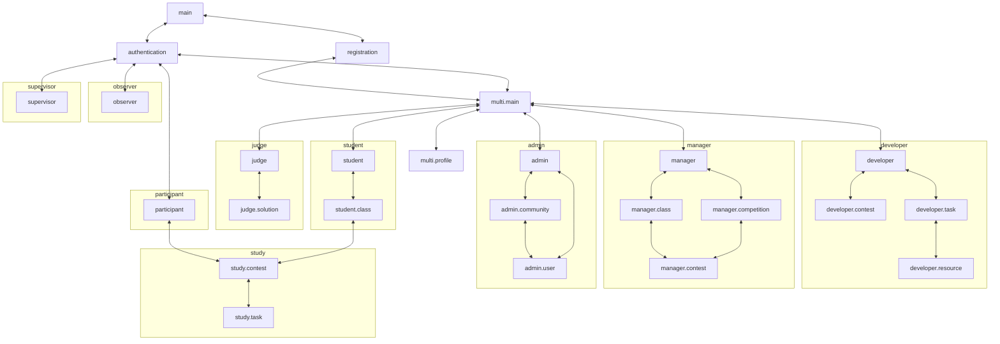

# Фичи

Реестр фич системы TestSys. Документ предназначен для всех, кто так или иначе причастен к разработке TestSys.
Его цель — собрать наиболее полное описание системы в одном месте и упростить коммуникацию.
Документ описывает, *что* делает система; как это реализовано в коде, — в документах из перечня
в [docs.md](../docs.md).
Основной единицей описания системы является *фича* в самом широком смысле этого слова.
Фича может быть описанием функциональности, пользовательского интерфейса и тд.
Конкретные требования к фиче определяются категорией, в которой она находится.
В документе используются определения из [definitions.md](definitions.md).

## Использование документа

Рекомендуется использовать документ следующим образом:
- Использовать в качестве документации к системе
- Использовать кодификаторы фичей в коммуникации для избежания двусмысленности
- Использовать кодификаторы фичей в документации верхнеуровнего кода (контроллеров, web-страниц)
- Использовать кодификаторы фичей в commit message если это применимо

## Работа с документом

Ответственность за актуальность документа лежит на разработчике, который реализует новую фичу или меняет
существующую. Общие правила поддержки документации — в [docs.md](../docs.md).

## Категории

Фичи в данный момент разбиты на следующие категории:
- **testsys.entity** – Фичи, описывающие сущности, представленные в системе
- **testsys.user** – Функциональные фичи, которыми непосредственно пользуется конечный пользователь
- **testsys.web** – Фичи, описывающие представления в web-интерфейсе
- **testsys.docs** – Фичи, описывающие внешнюю пользовательскую документацию
- **testsys.dev** – Фичи, облегчающие разработку/отладку системы, расследование инцидентов


## Структура фичи

Фича имеет кодификатор следующего вида `testsys.префикс.название-фичи`.
Префикс может обладать дополнительной семантикой.

Фичи с суффиксом `authorization` не имеют статуса, поскольку описывают поведение других фичей.

У остальных фич статус указан в скобках рядом с кодификатором:
- **Not implemented** – фича не реализована ни в каком виде
- **Partially implemented** – фича реализована частично
- **Implemented** – фича реализована полностью

Фичи **testsys.entity** и **testsys.user** не ссылаются на фичи **testsys.user**, кроме фич **authorization**:
нужное правило другой фичи записывается в тексте, а не даётся ссылкой. На страницы фича **testsys.user** ссылается
строкой `Page`.

В случае если фича имеет статус **Partially implemented**
в ее описании должно быть зафиксировано что уже сделано
и/или что еще необходимо сделать.

Блок *Не согласовано* в конце фичи перечисляет положения, которые не следуют из требований к Системе
и предложены без согласования. Такие положения требуют подтверждения до реализации фичи.

## Структура документа

Далее текст документа имеет следующую структуру:

```md
## Название категории

Описание категории
Описание семантики префиксов

### Кодификатор фичи1  (Статус фичи1)

Описание фичи1

### Кодификатор фичи2  (Статус фичи2)

Описание фичи2

...
```

## testsys.entity

Фичи, описывающие сущности в системе.
В данном разделе должны быть описаны *нетривиальные* особенности представления, решения по дизайну связанных фичей, и др, 
которые может быть сложно понять из раздела **testsys.user**. 
Описания вида "Участник определяется уникальным идентификатором и Соревнованием" не требуется вносить в данный раздел.

### testsys.entity.textLimits (Implemented)

Названия Классов, Сообществ, Соревнований, Задач, Туров и Ресурсов содержат не более 255 кодовых точек Unicode.
Имя загруженного файла содержит не более 512 кодовых точек Unicode.
Реализованные операции проверяют переданные значения до сохранения. При превышении предела операция возвращает ошибку.
Система не сокращает введённые значения. Нормализация определяется соответствующими фичами.
Эти пределы не ограничивают поисковые подстроки.

### testsys.entity.task

Представляет Задачу. Задача хранит не более двух версий:

- Рабочая версия — содержимое Задачи с текущими незафиксированными изменениями Разработчика.
  Она используется при разработке Задачи и может быть неполной.
- Последняя зафиксированная версия — содержимое Задачи, сохранённое при последней фиксации (коммите).
  Доработка рабочей версии не изменяет зафиксированную; следующая фиксация заменяет её рабочей версией.

В зависимости от наличия версий Задача находится в одном из состояний:

1) **New** – Задача ещё ни разу не была зафиксирована: есть только рабочая версия.
2) **Uncommitted** – есть зафиксированная версия и незафиксированные изменения поверх неё.
3) **Committed** – последние изменения зафиксированы, рабочей версии нет.

Изменение Задачи в состоянии **Committed** переводит её в **Uncommitted**; Задача в состоянии **New**
при изменении остаётся в **New**. Фиксация (коммит) переводит Задачу в **Committed**.

Данные состояния прежде всего предназначены для безопасной доработки задачи, при условии, 
что она уже где-то используется. Предполагается использование последней зафиксированной версии задачи 
во всех фичах, кроме фичей непосредственно связанных с разработкой Задач.

Задача хранит набор загруженных в неё Упражнений, Полигонов, Условий и Авторских Решений, включая ещё не
прикреплённые. Цепочки версий этих Ресурсов описаны в **testsys.entity.resource**.

Ресурс считается прикреплённым, если одна из его версий используется в рабочей или последней зафиксированной
версии Задачи. Загрузка Ресурса без прикрепления не меняет состояние Задачи. Удаление Ресурсов пока не
поддерживается.

### testsys.entity.resource

Упражнения, Полигоны, Условия и Авторские Решения, загруженные в Задачу, хранятся как цепочки версий Ресурсов.
Цепочка объединяет версии одного Ресурса и имеет общий уникальный идентификатор, независимый от идентификаторов
отдельных версий. Идентификатор цепочки уникален среди всех четырёх типов. Цепочка принадлежит только одной
Задаче; перенос в другую Задачу запрещён.

Версия Ресурса — отдельная сохранённая запись в цепочке со своим идентификатором, временем создания,
названием, описанием и файлом. Версия Упражнения также содержит язык, а версия Авторского Решения —
ссылку на Решение и ожидаемый балл; файл и язык Авторского Решения хранятся в связанном Решении.
Разные версии могут использовать один и тот же файл или Решение.

Рабочая и зафиксированная версии Задачи ссылаются на конкретные версии Ресурсов, а не на цепочки целиком.
Поэтому создание новой версии Ресурса само по себе не меняет содержимое зафиксированной версии Задачи.
Изменение файла или ожидаемого балла Авторского Решения создаёт новую версию Ресурса в той же цепочке,
а изменение только названия сохраняется в последней версии на месте. Если рабочая версия Задачи содержит версию
этой цепочки, она заменяется новой версией. Если Задача находится в состоянии **Committed** и цепочка есть
в последней зафиксированной версии, из неё создаётся рабочая версия с новой версией Ресурса.

Версия Ресурса не является неизменяемым снимком всех его данных: метаданные могут изменяться на месте
без создания новой версии. История показывает существующие версии с их текущими метаданными.
Последней считается версия с наибольшим временем создания, а при совпадении времени — с большим идентификатором.

### testsys.entity.taskValidationRequest (Implemented)

Запрос валидации Задачи сохраняет снимок непосредственных входных данных рабочей версии Задачи:
конкретные Полигоны, Авторские Решения с программами и ожидаемыми баллами,
поддерживаемые версии TRIK Studio.
Снимок не меняется после создания.
Условия, Упражнения, метаданные Ресурсов и настройки диагностик в него не входят.

Данные запроса зависят от состояния обработки.

До завершения Диагностик запрос остаётся в одном состоянии.
Сохранённые результаты отдельных Полигонов составляют прогресс.

После завершения Диагностик запрос содержит результат каждого Полигона,
включая пустые списки сообщений.
Error завершает обработку и блокирует Авторские Решения; запрос сохраняет время завершения.
Без Error запрос остаётся активным и ожидает отправки Посылок.

После создания Посылок запрос остаётся активным и хранит завершённые результаты
Диагностик и ссылки на Посылки для тестирования Авторских Решений.
Результаты грейдинга находятся в Посылках.
Список Авторских Посылок сохраняет порядок, соответствующий Авторским Решениям снимка
и версиям TRIK Studio. После завершения всех Посылок запрос сохраняет итог тестирования и время завершения.
Итог — список всех проваленных Посылок в этом порядке с причиной каждой: не совпавшая сумма баллов
с фактической суммой или ошибка проверки либо таймаут. Пустой список означает успех.
Итог фиксируется при завершении и не меняется при последующих изменениях Задачи или Туров.
Копия результатов грейдинга в запросе не хранится.

Техническая остановка хранит описание и время сбоя.
Завершённые результаты Диагностик и созданные ссылки на Посылки сохраняются.
При остановке до завершения Диагностик сохраняется уже записанный прогресс.

Отдельного результата «Проверка неполная» нет.

Повторный запуск того же снимка возвращает активный запрос.
Другой снимок или новый запуск после завершения создают новый запрос.
История сохраняется.

Система обрабатывает запросы по одному. После перезапуска она продолжает обработку активных запросов
и повторно отправляет грейдеру Посылки без результата.
Сохранённые результаты при возобновлении не вычисляются повторно.
Технический сбой обработки фиксируется в запросе и завершает её без автоматических повторов.
Изменение Задачи не меняет снимок.
Запрос создаётся при запуске тестирования Задачи Разработчиком.

### testsys.entity.studyEntry

Система сохраняет первый вход Пользователя в Тур отдельно для каждого контекста:

- Для Ученика — Пользователь, Класс и Тур.
- Для Участника — Участник, Соревнование и Тур.

Запись фиксирует только момент первого входа.
Ограничения времени остаются в текущих данных Тура; их снимок не сохраняется.
Повторный вход возвращает исходную запись, в том числе после истечения времени,
если Пользователь по-прежнему имеет доступ к выбранному контексту.
Одновременные входы в один контекст создают одну запись.
Повторный вход не меняет первый момент.

Первый вход в Тур допускается не раньше даты начала и строго раньше даты конца.
Отсутствующая дата снимает соответствующее ограничение.

При просмотре Туров возвращается первый момент входа в выбранном контексте.
Если записи нет, момент входа отсутствует.
Просмотр не создаёт запись входа.

Удаление членства или связи группы с Туром не удаляет запись входа.
При повторном предоставлении доступа в том же контексте сохраняется первый момент.
Удаление Пользователя, контекстного Класса или Соревнования либо самого Тура
удаляет соответствующие записи входа.

### testsys.entity.submissionQueue (Partially implemented)

Посылки, ожидающие проверки, образуют очередь. Очередь обрабатывается последовательно по мере освобождения
Проверяющих узлов.

Длина очереди ограничена. Если очередь заполнена, в отправке Решения может быть отказано с предупреждением.
При добавлении Посылки из очереди могут удаляться ожидающие Посылки того же автора по той же Задаче.

Реализована последовательная обработка очереди грейдером. Ограничение длины очереди и удаление ожидающих Посылок
не реализованы.

*Не согласовано*:

- Максимальная длина очереди задаётся при развёртывании Системы.
- Ограничение действует только на Посылки Участников и Учеников. Посылки Авторских Решений и Посылки,
  отправленные на повторную проверку после фиксации Задачи, добавляются в очередь без ограничения.
- Удаление ожидающих Посылок включается настройкой при развёртывании Системы и выполняется до проверки
  длины очереди.
- Удаляются только Посылки того же Тура, ещё не взятые на проверку; уже проверяемая Посылка не удаляется.
- Удалённая Посылка остаётся в истории со статусом «Отменена»: она не проверяется, не участвует в выборе лучшей
  Посылки и не может получить Судейский вердикт.

### testsys.entity.invite (Partially implemented)

Представляет Код-приглашение в Класс или в Сообщество. Код-приглашение в Сообщество относится
к одной из Ролей: Организатора или Разработчика. У каждого Класса ровно один Код-приглашение,
у каждого Сообщества — по одному для каждой из этих Ролей. Код-приглашение создаётся вместе с Классом или Сообществом.

Код-приглашение — строка из 12 случайных символов алфавита `abcdefghjkmnpqrstuvwxyz23456789`.
При вводе Кода-приглашения регистр букв не учитывается: прописные буквы равны строчным.
Пробелы и другие символы ввода не изменяются и не удаляются.
Новый Код-приглашение отличается от Кода-приглашения, который он заменяет.
Коды-приглашения в Классы попарно различны, Коды-приглашения в Сообщества — тоже. Если сгенерированный
Код-приглашение совпадает с другим Кодом-приглашением того же вида, создание или замена завершается
технической ошибкой.
Организатору и Администратору Код-приглашение возвращается в исходном виде, в котором он был выдан.

Код-приглашение действует, пока текущее время Системы раньше момента окончания срока.
Момент окончания — момент создания, последней замены или последнего продления Кода-приглашения
плюс срок действия. Срок действия задаётся при развёртывании Системы отдельно для Кодов-приглашений
в Классы и в Сообщества и может меняться во время её работы. Новый срок применяется к Кодам-приглашениям,
созданным, заменённым или продлённым после его изменения.

Код-приглашение можно продлить, в том числе после окончания срока: Код-приглашение не меняется,
а момент окончания отсчитывается заново от момента продления. Если срок действия уменьшен, новый момент
окончания может быть раньше прежнего. Продлевается текущий Код-приглашение: если к моменту продления
Код-приглашение с истёкшим сроком уже заменён Системой, продлевается новый Код-приглашение.

Система периодически находит Коды-приглашения с истёкшим сроком и заменяет каждый новым
Кодом-приглашением с новым моментом окончания. Период проверки задаётся при развёртывании Системы
отдельно для Классов и Сообществ и действует до её перезапуска. Каждый Код-приглашение заменяется
отдельно: сбой замены одного не мешает замене остальных. Перед заменой срок проверяется повторно,
поэтому Код-приглашение, уже заменённый или продлённый Организатором или Администратором, не заменяется.
После окончания срока и до замены проходит не больше периода проверки; в это время присоединиться
по Коду-приглашению нельзя. Замена не изменяет Класс, Сообщество, Роль, состав Учеников и членство Пользователей.
Код-приглашение, владелец которого — Организатор, создавший Класс, или Администратор, создавший Сообщество, —
потерял эту Роль, по истечении срока не заменяется.

Если замена по истечении срока совпадает по времени с заменой или продлением Организатором или
Администратором, одна из операций может завершиться технической ошибкой; Код-приглашение остаётся
в состоянии, заданном другой. Неудавшаяся замена по истечении срока повторяется при следующей проверке.

Реализованы хранение срока и операции замены Кодов-приглашений с истёкшим сроком.
Запуск периодической проверки в веб-приложении не реализован.

### testsys.entity.multi.judge

Представляет Судью, в данный момент Судьи выдаются только Супервайзером крайне ограниченному кругу доверенных лиц.
В связи с этим не требуется дополнительных политик относительно вердиктов Судьи 
(отображать информацию, что вердикт был изменен Судьей, вводить разграничения доступа к задачам и др.).

## testsys.user

Функциональные фичи, которыми непосредственно пользуется конечный пользователь.
Если использование фичи подразумевает использование веб-интерфейса,
фича должна ссылаться на соответствующую страницу.

Префиксы описывают кому доступна Фича:

- **testsys.user** – для любого Пользователя
- **testsys.user.single** – для любого Пользователя c Фиксированной Ролью
- **testsys.user.single.participant** – для любого Участника
- **testsys.user.single.observer** – для любого Наблюдателя
- **testsys.user.single.supervisor** – для любого Супервайзера
- **testsys.user.multi** – для любого Пользователя c Нефиксированными Ролями
- **testsys.user.multi.developer** – для любого Разработчика
- **testsys.user.multi.student** – для любого Ученика
- **testsys.user.multi.judge** – для любого Судьи
- **testsys.user.multi.admin** – для любого Администратора
- **testsys.user.multi.manager** – для любого Организатора
- **testsys.user.study** – для любого Ученика/Участника

Слово "доступно" в **authorization** фичах означает доступно 
в необходимом и достаточном объеме для реализации остальных фичей для данного Пользователя/Роли.

Функциональные фичи должны быть описаны в следующем формате:

Page: **testsys.web.page.[identifier]** 

*Описание*: \
[короткое описание в несколько предложений]

*Вход*:\
[Данные необходимые для выполнения операции bullet списком]

*Отказы*:\
[случаи в которых отказано выполнение операции bullet списком]

*Операция*:\
[описание всех happy-path нумерованным списком] \
[информация характерная для всех happy-path]

*Инварианты*:\
[описание инвариантов операции]

<!-- testsys.user -->

### testsys.user.authentication  (Implemented)

Page: **testsys.web.page.authentication**

*Описание*:\
Пользователь может войти в Систему по действительному Коду-доступа.
Код-доступа действителен, если он сейчас присвоен Пользователю Системы.
КД присваивают фичи Системы; после восстановления доступа прежний КД недействителен.

*Вход*:

- Код-доступа.

*Отказы*:

- Код-доступа не присвоен ни одному Пользователю.

*Операция*:

1. Система ищет Пользователя, которому присвоен введённый Код-доступа.
   КД сравнивается точно: регистр и пробелы учитываются.
2. Система запоминает дату и время входа как дату и время последнего входа Пользователя.
3. Возвращается найденный Пользователь.

После входа Пользователь переходит на страницу:

- **testsys.web.page.multi.main** — Пользователь без Фиксированной Роли;
- **testsys.web.page.participant** — Участник;
- **testsys.web.page.observer** — Наблюдатель;
- **testsys.web.page.supervisor** — Супервайзер.

При отказе Пользователь получает уведомление, что Код-доступа недействителен.

*Инварианты*:

- Вход не изменяет данные Пользователя и его Код-доступа; меняются только дата и время последнего входа.
- Одному КД соответствует не более одного Пользователя.

<!-- testsys.user.multi -->

### testsys.user.registration (Implemented)

Page: **testsys.web.page.registration**

*Описание*:\
Пользователь может зарегистрироваться в Системе в два шага: запрос регистрации и подтверждение почты.
Сначала он указывает почту и получает на неё письмо с кодом. Затем он вводит код, Псевдоним и Роль: Ученик
или Организатор. После подтверждения Система создаёт Пользователя с выбранной Ролью в Публичном Сообществе
и присваивает ему Код-доступа.

*Вход*:

- Для запроса регистрации — почта.
- Для подтверждения — идентификатор запроса регистрации, код подтверждения из письма, Псевдоним и Роль:
  Ученик или Организатор.

*Отказы*:

- Почта длиннее 255 символов или не содержит ровно один символ `@` с непустыми частями до и после него.
- Почта уже привязана к Пользователю.
- При подтверждении Псевдоним пуст или длиннее 512 символов.
- При подтверждении запрос регистрации не существует.
- При подтверждении срок действия кода истёк. Пользователь узнаёт, что код нужно запросить повторно.
- При подтверждении попытки ввода кода исчерпаны. Пользователь узнаёт, что код нужно запросить повторно.
- При подтверждении код не совпадает с отправленным.

Длина Псевдонима и почты считается в кодовых точках Юникода. Символ вне базовой плоскости, например 😀,
считается одним символом. Эмодзи из нескольких кодовых точек, например флаг, считается по числу его кодовых точек.

*Операция*:

Запрос регистрации:

1. Система убирает пробелы в начале и в конце почты и приводит её к нижнему регистру.
2. Система проверяет, не привязана ли почта к Пользователю. Почта сравнивается точно, после обработки из шага 1.
3. Если для почты есть действующий запрос регистрации, Система оставляет его без изменений.
   Запрос действует, пока не истёк срок кода и не исчерпаны попытки.
4. Если для почты есть недействующий запрос, Система перезаписывает его: новый код, новый срок действия
   и полное число попыток. Идентификатор запроса сохраняется.
5. Если запроса для почты нет, Система создаёт его с новым кодом.
6. Система отправляет код письмом на почту и возвращает идентификатор запроса.

Подтверждение:

1. Система убирает пробелы в начале и в конце Псевдонима и проверяет его до поиска запроса регистрации.
   Неверный Псевдоним не тратит попытку.
2. Система проверяет, что срок действия кода не истёк и попытки не исчерпаны.
3. Система уменьшает число оставшихся попыток на единицу и только после этого сравнивает код.
   Пробелы в начале и в конце введённого кода не учитываются.
4. Если код совпадает и почта всё ещё не привязана, Система создаёт в Публичном Сообществе Пользователя
   с указанными Псевдонимом и Ролью, почтой из запроса и новым Кодом-доступа. Затем Система удаляет запрос
   регистрации.
5. Система отправляет Код-доступа письмом на почту и возвращает Пользователя вместе с Кодом-доступа.

Код подтверждения состоит из 8 цифр без пробелов и других разделителей. Код-доступа состоит из 16 латинских
букв и цифр, разделённых дефисом на группы по четыре: `xxxx-xxxx-xxxx-xxxx`. Срок действия кода подтверждения,
число попыток его ввода и Публичное Сообщество задаются при развёртывании Системы.

После регистрации Пользователь входит в Систему по выданному Коду-доступа, переходит на страницу
**testsys.web.page.multi.main** и видит свой Код-доступа.
При отказе Пользователь получает уведомление с его причиной.

*Инварианты*:

- Для одной почты существует не более одного запроса регистрации.
- Повторный запрос при действующем коде не меняет код, срок его действия и число оставшихся попыток,
  поэтому во всех письмах приходит один и тот же код.
- Запрос регистрации не задаёт Псевдоним и Роль будущего Пользователя: их указывает тот, кто вводит код.
- Почта привязана не более чем к одному Пользователю.
- Пользователь создаётся только после ввода совпадающего кода.
- Число сравнений кода по запросу не превышает числа попыток, в том числе при одновременных подтверждениях.

Недействующие запросы регистрации не удаляются автоматически.

Число писем с кодом подтверждения на одну почту Система не ограничивает: от подбора кода защищают его длина
и ограничение числа попыток ввода. Любой, кто знает почту, может запросить на неё регистрацию и израсходовать
все попытки неверными кодами. Тогда владелец почты запрашивает код повторно.

### testsys.user.multi.changeMail (Partially implemented)

Page: **testsys.web.page.multi.main**

*Описание*:\
Пользователь может сменить почту в два шага: запрос смены почты и подтверждение новой почты. Сначала он указывает
новую почту и получает на неё письмо с кодом, затем вводит код. После подтверждения Система заменяет почту
Пользователя новой.

*Вход*:

- Пользователь, выполняющий операцию.
- Для запроса смены почты — новая почта.
- Для подтверждения — код подтверждения из письма.

*Отказы*:

- Новая почта длиннее 255 символов или не содержит ровно один символ `@` с непустыми частями до и после него.
- Новая почта совпадает с текущей почтой Пользователя.
- Новая почта уже привязана к другому Пользователю.
- При подтверждении у Пользователя нет запроса смены почты.
- При подтверждении срок действия кода истёк. Пользователь узнаёт, что код нужно запросить повторно.
- При подтверждении попытки ввода кода исчерпаны. Пользователь узнаёт, что код нужно запросить повторно.
- При подтверждении код не совпадает с отправленным.

Длина почты считается в кодовых точках Юникода. Символ вне базовой плоскости, например 😀, считается одним
символом. Эмодзи из нескольких кодовых точек, например флаг, считается по числу его кодовых точек.

*Операция*:

Запрос смены почты:

1. Система убирает пробелы в начале и в конце новой почты и приводит её к нижнему регистру.
2. Система проверяет, что почта отличается от текущей и не привязана к другому Пользователю.
   Почта сравнивается точно, после приведения.
3. Если у Пользователя есть действующий запрос смены на эту же почту, Система оставляет его без изменений.
   Запрос действует, пока не истёк срок кода и не исчерпаны попытки.
4. Если у Пользователя есть недействующий запрос или запрос смены на другую почту, Система перезаписывает его:
   новая почта, новый код, новый срок действия и полное число попыток. Код из прежних писем перестаёт действовать.
5. Если запроса нет, Система создаёт его с новым кодом.
6. Система отправляет код письмом на новую почту.

Подтверждение:

1. Система проверяет, что срок действия кода не истёк и попытки не исчерпаны.
2. Система уменьшает число оставшихся попыток на единицу и только после этого сравнивает код.
   Пробелы в начале и в конце введённого кода не учитываются.
3. Если код совпадает и новая почта всё ещё не привязана к другому Пользователю, Система заменяет почту
   Пользователя новой и удаляет запрос смены почты.
4. Система отправляет на прежнюю почту уведомление о смене почты и возвращает Пользователя с новой почтой.

Код подтверждения состоит из 8 цифр без пробелов и других разделителей. Срок его действия и число попыток ввода
задаются при развёртывании Системы.
Запрос смены почты не резервирует новую почту: если до подтверждения её привяжет другой Пользователь,
подтверждение будет отклонено.

При отказе Пользователь получает уведомление с его причиной.

*Инварианты*:

- У Пользователя не более одного запроса смены почты.
- Повторный запрос на ту же почту при действующем коде не меняет код, срок его действия и число оставшихся
  попыток, поэтому во всех письмах приходит один и тот же код.
- Почта Пользователя меняется только после ввода совпадающего кода.
- Почта привязана не более чем к одному Пользователю.
- Число сравнений кода по запросу не превышает числа попыток, в том числе при одновременных подтверждениях.
- Смена почты не меняет Код-доступа, Псевдоним, Роли и Сообщества Пользователя.

Реализованы операции запроса и подтверждения смены почты, хранение запросов смены почты и отправка писем.
Веб-страница и уведомления об отказах не реализованы. Недействующие запросы смены почты не удаляются
автоматически. Число писем с кодом подтверждения Система не ограничивает: от подбора кода защищают его длина
и ограничение числа попыток ввода.

### testsys.user.multi.restoreAccess (Not implemented)

Page: **testsys.web.page.authentication**

*Описание*:\
Пользователь может восстановить доступ к своему Кабинету в два шага: запрос восстановления и ввод кода.
Сначала он указывает свою почту и получает на неё письмо с кодом, затем вводит код и получает новый Код-доступа.
Прежний Код-доступа становится недействительным.

*Вход*:

- Для запроса восстановления — почта.
- Для подтверждения — почта и код из письма.

*Отказы*:

- При подтверждении для почты нет запроса восстановления.
- При подтверждении срок действия кода истёк. Пользователь узнаёт, что код нужно запросить повторно.
- При подтверждении попытки ввода кода исчерпаны. Пользователь узнаёт, что код нужно запросить повторно.
- При подтверждении код не совпадает с отправленным.

*Операция*:

Запрос восстановления:

1. Система убирает пробелы в начале и в конце почты и приводит её к нижнему регистру.
2. Если почта привязана к Пользователю, Система создаёт для него запрос восстановления с новым кодом
   и отправляет код письмом на почту.
3. Если почта не привязана ни к одному Пользователю, письмо не отправляется.

Ответ на запрос одинаков в обоих случаях и не раскрывает, привязана ли почта.

Подтверждение:

1. Система проверяет, что срок действия кода не истёк и попытки не исчерпаны.
2. Система уменьшает число оставшихся попыток на единицу и только после этого сравнивает код.
   Пробелы в начале и в конце введённого кода не учитываются.
3. Если код совпадает, Система присваивает Пользователю новый Код-доступа и удаляет запрос восстановления.
4. Возвращается новый Код-доступа.

*Инварианты*:

- У Пользователя не более одного запроса восстановления.
- Код-доступа меняется только после ввода совпадающего кода.
- После смены прежний Код-доступа не соответствует ни одному Пользователю.
- Восстановление не меняет почту, Псевдоним, Роли и Сообщества Пользователя.

*Не согласовано*:

- Код подтверждения состоит из 8 цифр; срок его действия и число попыток ввода задаются при развёртывании
  Системы, как для кодов регистрации.
- Повторный запрос при действующем коде не меняет код, срок его действия и число оставшихся попыток;
  недействующий запрос перезаписывается новым кодом.

### testsys.user.multi.joinCommunity (Partially implemented)

Page: **testsys.web.page.multi.main**

*Описание*:\
Пользователь с Нефиксированными Ролями может присоединиться к Сообществу, введя в форму Код-приглашение
от Администратора. В этом Сообществе он получает Роль, для которой создан Код-приглашение.

*Вход*:

- Пользователь, выполняющий операцию.
- Код-приглашение.

*Отказы*:

- Код-приглашение не совпадает ни с одним Кодом-приглашением в Сообщество.
- Срок действия совпавшего Кода-приглашения истёк.

*Операция*:

1. Выбирается совпадающий с введённым Код-приглашение в Сообщество, его Сообщество и Роль.
2. Проверяется, что срок Кода-приглашения не истёк согласно **testsys.entity.invite**.
3. Если Пользователь уже состоит в Сообществе в этой Роли, он возвращается без изменений.
4. Иначе Пользователь получает Роль, если её у него не было, и становится членом Сообщества в этой Роли.
5. Возвращается Пользователь с обновлёнными Ролями.

Код-приглашение сравнивается согласно **testsys.entity.invite**: без учёта регистра букв,
пробелы и другие символы не удаляются.
Срок проверяется по текущему времени Системы на момент вызова, в том числе для Пользователя, уже состоящего в Сообществе.
Код-приглашение, заменённый Администратором или по истечении срока, не совпадает ни с одним Кодом-приглашением.
Если Код-приглашение заменяется одновременно с присоединением, Пользователь может присоединиться по прежнему Коду-приглашению.
Для присоединения другие Роли не требуются.

*Инварианты*:

- Другие Роли Пользователя и его членство в других Сообществах и Ролях не изменяются.
- Сообщество и его Коды-приглашения не изменяются.
- Повторное присоединение не изменяет Пользователя.
- При отказе Пользователь не изменяется.

Реализована операция присоединения к Сообществу.
Страница **testsys.web.page.multi.main** не реализована.

### testsys.user.multi.viewProfile (Not implemented)

Page: **testsys.web.page.multi.main**, **testsys.web.page.multi.profile**

*Описание*:\
Пользователь с Нефиксированными Ролями может просматривать свой профиль: Псевдоним, почту, Роли и Сообщества,
в которых он состоит в каждой Роли.

*Вход*:

- Пользователь, выполняющий операцию.

*Отказы*:

- Пользователь не обладает Нефиксированными Ролями.

*Операция*:

1. Возвращаются Псевдоним и почта Пользователя.
2. Для каждой Роли Пользователя возвращаются Сообщества, в которых он состоит в этой Роли: идентификатор
   и название.

*Инварианты*:

- Просмотр не изменяет Пользователя, его Роли и членство в Сообществах.

<!-- testsys.user.single.participant -->

### testsys.user.single.participant.authorization

Участнику доступны Туры находящиеся в одном с ним Соревновании,
а также Задачи из этих Туров.

### testsys.user.single.participant.viewContests (Partially implemented)

Page: **testsys.web.page.participant**

*Описание*:\
Участник может просматривать Туры своего Соревнования
и время первого входа в каждый Тур.

*Вход*:

- Пользователь, выполняющий операцию.

*Отказы*:

- Пользователь не является Участником.
- Соревнование Участника не существует.

*Операция*:

1. Выбираются Туры Соревнования Участника независимо от их дат.
2. Возвращается список пар: первый момент входа Участника в Тур своего Соревнования
   и сам Тур. Если записи входа нет, первый элемент пары равен `null`.

Название, даты и индивидуальный лимит доступны в данных Тура.

Для любого доступного Тура Участник может перейти на страницу
**testsys.web.page.study.contest**.

*Инварианты*:

- Просмотр не изменяет Туры и Соревнование.
- Просмотр не сохраняет вход и не начинает прохождение Тура.
- Время входа относится к Участнику, его Соревнованию и выбранному Туру.

Реализована операция просмотра Туров с временем первого входа.
Веб-страница, отображение оставшегося времени и переход на страницу Тура не реализованы.

### testsys.user.single.participant.enterContest (Partially implemented)

Page: **testsys.web.page.study.contest**

*Описание*:\
Участник может начать прохождение Тура своего Соревнования.

*Вход*:

- Пользователь, выполняющий операцию.
- Идентификатор Тура.

*Отказы*:

- Пользователь не является Участником.
- Соревнование Участника не существует.
- Тур не существует.
- Тур не входит в Соревнование Участника.
- Первый вход выполняется до даты начала или начиная с даты конца Тура.

*Операция*:

1. Проверяются существование Соревнования и Тура, а также принадлежность Тура.
2. Если запись первого входа в этом контексте существует, она возвращается.
3. Иначе проверяется временной интервал по **testsys.entity.studyEntry**.
4. Сохраняется и возвращается запись с текущим временем Системы.

*Инварианты*:

- Запись относится к Участнику, его Соревнованию и выбранному Туру.
- Повторный вход не сбрасывает персональное время.
- При сохранённом доступе повтор возвращает исходную запись после истечения времени.
- Тур и его ограничения не изменяются.

Реализована операция сохранения первого входа.
Страница **testsys.web.page.study.contest** не реализована.

<!-- testsys.user.study -->

### testsys.user.study.viewContest (Partially implemented)

Page: **testsys.web.page.study.contest**

*Описание*:\
Участник может просматривать Тур своего Соревнования.
Ученик может просматривать Тур выбранного Класса.
Доступ определяется фичами **testsys.user.single.participant.authorization**
и **testsys.user.multi.student.authorization**.

По Туру Участник/Ученик может увидеть:

1) Дата начала Тура
2) Дата конца Тура
3) Время на прохождение Тура
4) Сколько времени осталось у Участника/Ученика на прохождение Тура
5) Название Тура
6) Описание Тура
7) Список Задач с их Названиями

Участник/Ученик для выбранной Задачи может перейти на страницу
**testsys.web.page.study.task**.

*Вход*:

- Пользователь, выполняющий операцию.
- Идентификатор Тура.
- Для Ученика — идентификатор выбранного Класса.

*Отказы*:

- Пользователь не является Участником либо не имеет Роли Ученика.
- Соревнование Участника или выбранный Класс не существует.
- Тур не существует.
- Ученик не состоит в выбранном Классе.
- Тур не входит в Соревнование Участника или выбранный Класс.

*Операция*:

1. Проверяются Роль, существование Соревнования или Класса и Тура, а также доступ к ним.
2. Читается первый момент входа в выбранном контексте по **testsys.entity.studyEntry**.
3. Возвращаются первый момент входа и сам Тур. Если записи входа нет, момент входа отсутствует.

Просмотр доступного Тура разрешён до его начала и после окончания.

*Инварианты*:

- Просмотр не изменяет Тур, Задачи и Соревнование или Класс.
- Просмотр не сохраняет вход и не начинает прохождение Тура.
- Для Ученика используется запись входа только в выбранном Классе.
- Другие Роли Пользователя и членство в Сообществах не расширяют доступ.

Реализована операция просмотра Тура с первым моментом входа.
Веб-страница, загрузка и отображение названий Задач, отображение оставшегося времени,
а также переход на страницу Задачи не реализованы.

### testsys.user.study.viewTask (Partially implemented)

Page: **testsys.web.page.study.task**

*Описание*:\
Участник может просматривать Задачу Тура своего Соревнования.
Ученик может просматривать Задачу Тура выбранного Класса.
Доступ определяется фичами **testsys.user.single.participant.authorization**
и **testsys.user.multi.student.authorization**.

По Задаче Участник/Ученик может увидеть:

1) Название
2) Описание
3) Список отправленных им Решений
4) Вердикт лучшего отправленного Решения

По каждому отправленному Решению Ученик или Участник может увидеть:

1) Дату и время отправки
2) Названия файла Решения
3) Вердикт проверки в случае если Решение проверено, иначе статус проверки

По Задаче Участник/Ученик может скачать:

1) Упражнение
2) Условие

*Вход*:

- Пользователь, выполняющий операцию.
- Идентификатор Тура.
- Идентификатор Задачи.
- Для Ученика — идентификатор выбранного Класса.
- Для скачивания — идентификатор версии Условия или Упражнения.

*Отказы*:

- Пользователь не является Участником либо не имеет Роли Ученика.
- Соревнование Участника или выбранный Класс не существует.
- Тур не существует.
- Задача не существует.
- Ученик не состоит в выбранном Классе.
- Тур не входит в Соревнование Участника или выбранный Класс.
- Задача не входит в Тур.
- В выбранном контексте нет записи первого входа в Тур.
- При скачивании указанная версия не является Условием или Упражнением
  последней зафиксированной версии Задачи.

*Операция*:

1. Проверяются Роль, существование Соревнования или Класса, Тура и Задачи, а также доступ к ним.
2. Проверяется запись первого входа в выбранном контексте по **testsys.entity.studyEntry**.
3. При просмотре выбираются Посылки Пользователя по этой Задаче в этом Туре.
   Они упорядочены по времени отправки, а при равенстве — по идентификатору.
4. Для каждой Посылки с текущим успешным Вердиктом вычисляется итоговый балл.
   Это балл последнего Судейского вердикта, а без Судейских вердиктов — сумма баллов Вердикта по Полигонам.
   Последним считается Судейский вердикт с наибольшим временем создания, а при равенстве — с наибольшим идентификатором.
5. Лучшая Посылка имеет наибольший итоговый балл; при равенстве выбирается более ранняя.
   Посылки без успешного Вердикта в выборе не участвуют. Если подходящих Посылок нет, лучшей Посылки нет.
6. Возвращаются Задача, список Посылок и лучшая Посылка.
7. При скачивании возвращается файл указанного Условия или Упражнения последней зафиксированной версии Задачи.

Просмотр и скачивание доступны и после окончания Тура.

*Инварианты*:

- Просмотр и скачивание не изменяют Задачу, Тур, Посылки, Вердикты и Судейские вердикты.
- Просмотр и скачивание не сохраняют вход.
- Посылка не хранит Класс. Поэтому Ученик видит свои Посылки по Задаче в этом Туре
  независимо от Класса, из которого они отправлены.
- Посылки для тестирования Авторских Решений не возвращаются.
- Рабочая версия Задачи для скачивания не используется.
- Другие Роли Пользователя и членство в Сообществах не расширяют доступ.

Реализованы операции просмотра Задачи и скачивания Условия и Упражнения.
Просмотр возвращает Задачу, Посылки и лучшую Посылку без загрузки связанных сущностей.
Названия файлов Решений, Вердикты и итоговые баллы Посылок, в том числе лучшей, операция не возвращает.
Статус проверки доступен только в данных Посылки.
Веб-страница **testsys.web.page.study.task** не реализована.

### testsys.user.study.sendSolution (Partially implemented)

Page: **testsys.web.page.study.task**

*Описание*:\
Участник может отправить Решение для Задачи Тура своего Соревнования.
Ученик может отправить Решение для Задачи Тура выбранного Класса.
Доступ определяется фичами **testsys.user.single.participant.authorization**
и **testsys.user.multi.student.authorization**.
При отправке Участник/Ученик выбирает язык Решения: Python, JavaScript или визуальный язык TRIK Studio.

*Вход*:

- Пользователь, выполняющий операцию.
- Идентификатор Тура.
- Идентификатор Задачи.
- Для Ученика — идентификатор выбранного Класса.
- Файл Решения.
- Язык Решения.

*Отказы*:

- Имя загруженного файла Решения превышает предел по **testsys.entity.textLimits**.
- Пользователь не является Участником либо не имеет Роли Ученика.
- Соревнование Участника или выбранный Класс не существует.
- Тур не существует.
- Задача не существует.
- Ученик не состоит в выбранном Классе.
- Тур не входит в Соревнование Участника или выбранный Класс.
- Задача не входит в Тур.
- В выбранном контексте нет записи первого входа в Тур.
- Отправка выполняется начиная с даты конца Тура.
- Отправка выполняется начиная с момента первого входа в выбранном контексте плюс индивидуальный лимит Тура.
- Язык Решения не разрешён Задачей.
- Очередь проверки заполнена согласно **testsys.entity.submissionQueue**. Пользователь получает предупреждение,
  что Решение нужно отправить позже.

*Операция*:

1. Проверяются Роль, существование Соревнования или Класса, Тура и Задачи, а также доступ к ним.
2. Проверяется запись первого входа в выбранном контексте по **testsys.entity.studyEntry**.
3. Текущее время Системы должно быть раньше даты конца Тура и раньше окончания индивидуального лимита.
   Отсутствующая дата конца или отсутствующий лимит снимает соответствующее ограничение.
4. Язык разрешён, если в последней зафиксированной версии Задачи есть Авторское Решение на этом языке.
5. Ожидающие Посылки Пользователя по этой Задаче удаляются из очереди, и проверяется её длина
   согласно **testsys.entity.submissionQueue**.
6. Сохраняются Решение с переданным файлом и языком и Посылка Пользователя по этой Задаче в этом Туре.
   Посылка ожидает проверки.
7. Сохранённая Посылка возвращается. Передачу Посылки на проверку выполняет вызывающая сторона после фиксации изменений.

Проверка выполняется на версии TRIK Studio Тура по **testsys.dev.grading.balancing**.
Формат и содержимое файла не проверяются.

*Инварианты*:

- Каждая отправка создаёт новое Решение и новую Посылку, в том числе для того же файла.
- Задача, Тур, Соревнование или Класс и запись входа не изменяются.
- Рабочая версия Задачи для выбора разрешённых языков не используется.
- Другие Роли Пользователя и членство в Сообществах не расширяют доступ.

Реализована операция отправки Решения.
Повторная передача ожидающих Посылок после перезапуска не реализована.
Ограничение длины очереди и удаление ожидающих Посылок не реализованы.
Веб-страница **testsys.web.page.study.task** не реализована.

<!-- testsys.user.single.observer -->

### testsys.user.single.observer.authorization

При создании Наблюдателю назначается набор Туров.
Наблюдателю доступны Соревнования, в состав которых входит хотя бы один из назначенных Туров,
только в объёме назначенных Туров.
Остальные Туры таких Соревнований и их результаты Наблюдателю недоступны.

### testsys.user.single.observer.viewContests (Partially implemented)

Page: **testsys.web.page.observer**

*Описание*:\
Наблюдатель может просматривать назначенные ему Туры
согласно **testsys.user.single.observer.authorization**.
Для каждого Тура доступны название, дата начала, дата конца и время на прохождение.

*Вход*:

- Пользователь, выполняющий операцию.
- Номер страницы, начиная с нуля.
- Положительный размер страницы.
- Сортировка — необязательно.
- Подстрока названия Тура — необязательно.
- Идентификатор Тура — необязательно.

*Отказы*:

- Пользователь не является Наблюдателем.

*Операция*:

1. Выбираются назначенные Наблюдателю Туры без повторов.
2. Применяются указанные фильтры:
   - Название содержит указанную подстроку без учёта регистра.
     Символы трактуются буквально, пробелы сохраняются.
     Пустая строка соответствует любому названию.
   - Идентификатор Тура точно совпадает с указанным.
   - Если заданы оба фильтра, должны выполняться оба условия.
3. Туры упорядочиваются согласно указанной сортировке.
   По умолчанию используется идентификатор по возрастанию.
   Он также дополняет указанную сортировку, если она не содержит идентификатора.
4. Возвращаются запрошенная страница и общее количество подходящих Туров.

Если подходящих Туров нет, возвращается пустая страница с нулевым общим количеством.
Несуществующий или недоступный идентификатор Тура также даёт пустой результат.
Страница за пределами выборки пуста, но содержит общее количество подходящих Туров.

*Инварианты*:

- Фильтры только сужают доступный набор Туров.
- Один Тур учитывается один раз.
- Общее количество учитывает фильтры и не зависит от выбранной страницы.
- Будущие и завершённые Туры доступны; отсутствующие временные ограничения сохраняются.
- Просмотр не изменяет данные и не начинает прохождение Тура.

Реализована операция просмотра с фильтрами и пагинацией.
Веб-страница **testsys.web.page.observer** не реализована.

### testsys.user.single.observer.downloadResult (Partially implemented)

Page: **testsys.web.page.observer**

*Описание*:\
Наблюдатель может скачивать результаты выбранного Соревнования в CSV-файле
согласно **testsys.user.single.observer.authorization**.

*Вход*:

- Пользователь, выполняющий операцию.
- Идентификатор Соревнования.

*Отказы*:

- Пользователь не является Наблюдателем.
- Соревнование не существует.
- В Соревнование не входит ни один назначенный Наблюдателю Тур.

*Операция*:

1. Система формирует файл результатов выбранного Соревнования
   только по назначенным Наблюдателю Турам из текущего состава Соревнования.
2. Наблюдателю возвращается CSV-файл.

*Инварианты*:

- Скачать результаты можно только для Соревнования, в состав которого входит хотя бы один назначенный Наблюдателю Тур.
- Файл не содержит результатов Туров Соревнования, не назначенных Наблюдателю.
- Скачивание не изменяет данные и не начинает прохождение Туров.

Реализована операция скачивания с проверкой доступа.
Метод формирования CSV пока возвращает пустой файл размером 0 байт.
Состав столбцов и правила формирования содержимого CSV не определены.
Веб-страница **testsys.web.page.observer** не реализована.

<!-- testsys.user.multi.developer -->

### testsys.user.multi.developer.authorization

Разработчику доступны созданные им Ресурсы, Задачи, Туры, 
а также Задачи и Туры, к которым был предоставлен доступ Сообществам,
в которых он состоит в Роли Разработчика.

### testsys.user.multi.developer.resource.addResource (Partially implemented)

Page: **testsys.web.page.developer.task**

*Описание*:\
Разработчик может загрузить новый Ресурс в созданную им Задачу. Прикрепление Ресурса к содержимому Задачи
выполняется отдельно.

*Вход*:

- Идентификатор Задачи.
- Файл Ресурса.
- Название Ресурса.
- Тип Ресурса: Упражнение, Полигон, Авторское Решение или Условие.
- Язык — для Упражнения и Авторского Решения.
- Ожидаемый балл — для Авторского Решения.

*Отказы*:

- Переданное название Ресурса или имя загруженного файла превышает предел по **testsys.entity.textLimits**.
- У Пользователя нет Роли Разработчика.
- Задача не существует.
- Задача создана другим Пользователем.

*Операция*:

1. Создаётся Ресурс указанного типа с загруженным файлом, названием и данными, необходимыми для этого типа.
2. Новый Ресурс добавляется в набор загруженных Ресурсов Задачи.

Проверка формата и содержимого загруженного файла в операции не выполняется.

*Инварианты*:

- Загрузка Ресурса не прикрепляет его к содержимому Задачи.
- Состояние Задачи, её рабочая и последняя зафиксированная версии не изменяются.

Реализованы операции загрузки Условия, Упражнения, Полигона и Авторского Решения.
Страница **testsys.web.page.developer.task** не реализована.


### testsys.user.multi.developer.resource.updateResource (Partially implemented)

Page: **testsys.web.page.developer.resource**

*Описание*:\
Разработчик может изменить название, файл и, для Авторского Решения, ожидаемый балл Ресурса, загруженного
в созданную им Задачу. Изменение файла или ожидаемого балла создаёт новую версию Ресурса; изменение только
названия сохраняется в последней версии.

*Вход*:

- Идентификатор Задачи.
- Идентификатор последней версии Ресурса. Последняя версия определяется по времени создания; при совпадении
  времени выбирается версия с большим идентификатором.
- Новое название — необязательно.
- Новый файл — необязательно.
- Новый ожидаемый балл — необязательно, только для Авторского Решения.

Изменяемые значения можно передать вместе или не передать ни одного.

*Отказы*:

- Переданное название Ресурса или имя загруженного файла превышает предел по **testsys.entity.textLimits**.
- У Пользователя нет Роли Разработчика.
- Задача или указанная версия Ресурса не существует.
- Задача создана другим Пользователем.
- Цепочка версий Ресурса не входит в набор загруженных Ресурсов этой Задачи.
- Указанная версия Ресурса не является последней в цепочке.

*Операция*:

1. Если файл и ожидаемый балл не переданы, метаданные последней версии сохраняются на месте. Если передано
   название, оно заменяет прежнее. Идентификатор версии, ссылки на Ресурс и состояние Задачи сохраняются.
2. Если передан файл или ожидаемый балл, создаётся новая версия Ресурса в той же цепочке:
   - переданные значения заменяют прежние;
   - если ожидаемый балл Авторского Решения передан без файла, новая версия использует прежнее Решение;
   - если передан файл Авторского Решения, сохраняется новое Решение с прежним языком;
   - если передано название, его получает новая версия; прежняя версия не переименовывается.

   После создания новой версии:
   - Если рабочая версия Задачи содержит одну из версий этой цепочки, она заменяется новой версией Ресурса;
     состояние **New** или **Uncommitted** сохраняется;
   - если Задача находится в состоянии **Committed** и цепочка присутствует в последней зафиксированной
     версии, из неё создаётся рабочая версия, ссылка заменяется ссылкой на новую версию Ресурса, а Задача
     переходит в **Uncommitted**;
   - в остальных случаях новая версия Ресурса сохраняется без изменения Задачи. Это относится и к цепочке,
     которая присутствует только в последней зафиксированной версии, если рабочая версия уже существует.

Перед изменением прикреплённого Ресурса Пользователь должен быть уведомлён о том, что у Задачи появятся
незафиксированные изменения.

Проверка формата и содержимого загруженного файла не выполняется. Переданные значения не сравниваются
с прежними: одинаковый файл или прежний ожидаемый балл также создаёт новую версию. Прежнее название
или отсутствие всех изменяемых значений не отменяет сохранение метаданных на месте.

*Инварианты*:

- Неуказанные значения, описание и язык Ресурса сохраняются.
- Новая версия принадлежит той же цепочке и той же Задаче.
- При создании новой версии прежняя версия Ресурса и её файл сохраняются.
- Изменение названия затрагивает только обновляемую версию; названия других версий цепочки сохраняются.
- Обновление Ресурса не прикрепляет цепочку в рабочую версию Задачи, если её там нет.
- Последняя зафиксированная версия Задачи не изменяется (см. **testsys.entity.task**).

Реализованы операции обновления Условия, Упражнения, Полигона и Авторского Решения.
Страница **testsys.web.page.developer.resource** и уведомление Пользователя не реализованы.

### testsys.user.multi.developer.resource.viewResources (Partially implemented)

Page: **testsys.web.page.developer.task**

*Описание*:\
Разработчик может просматривать последние версии Ресурсов, загруженных в созданные им Задачи,
включая неприкреплённые Ресурсы, и переходить к подробной информации о каждом из них.

*Вход*:

- Пользователь, выполняющий операцию. Дополнительные данные не требуются.

*Отказы*:

- У Пользователя нет Роли Разработчика.

*Операция*:

1. Для цепочек Ресурсов, загруженных в созданные Разработчиком Задачи, выбираются последние существующие
   версии Условий, Упражнений, Полигонов и Авторских Решений. Последняя версия определяется
   по времени создания; при совпадении времени выбирается версия с большим идентификатором.
   Цепочки без существующих версий в список не входят.
2. Разработчику отображается список выбранных версий. Для каждого Ресурса указаны идентификатор версии,
   название, дата и время последнего изменения.
3. Для любого Ресурса из списка Разработчик может перейти на страницу **testsys.web.page.developer.resource**.

Если подходящих Ресурсов нет, возвращается пустой список.
В реализованной операции дата и время последнего изменения — время создания выбранной версии Ресурса.
Переименование версии не меняет это время.

*Инварианты*:

- В списке представлены только Ресурсы, загруженные в созданные Разработчиком Задачи.
- Наличие Ресурса в списке не зависит от его прикрепления к рабочей или зафиксированной версии Задачи.
- Просмотр не изменяет Ресурсы, состояние Задач и их рабочие или зафиксированные версии.

Реализована операция получения списка Ресурсов.
Страница **testsys.web.page.developer** не реализована.

### testsys.user.multi.developer.resource.viewResource (Partially implemented)

Page: **testsys.web.page.developer.resource**

*Описание*:\
Разработчик может просматривать информацию и историю версий Ресурса, загруженного в созданную им Задачу,
и скачивать файл любой существующей версии.

*Вход*:

- Пользователь, выполняющий операцию.
- Идентификатор Задачи.
- Идентификатор цепочки версий Ресурса.
- Идентификатор версии Ресурса — для скачивания файла.

*Отказы*:

- У Пользователя нет Роли Разработчика.
- Задача не существует.
- В указанной цепочке нет существующих версий Ресурса.
- Задача создана другим Пользователем.
- Цепочка не входит в набор загруженных Ресурсов этой Задачи.
- При скачивании указанная версия Ресурса отсутствует в выбранной цепочке либо идентификатор относится
  к другому виду сущностей.

*Операция*:

1. При просмотре возвращаются все существующие версии Ресурса из указанной цепочки.
   Разработчику отображаются идентификатор и название Ресурса, а также таблица с историей изменений.
   Для каждой версии в таблице предусмотрены дата и время изменения, название загруженного файла
   и комментарий изменения.
2. При скачивании Разработчик выбирает запись в истории и получает файл соответствующей версии.
   Выбранная версия не обязана быть последней в цепочке.

В реализованной операции дата и время изменения — время создания версии Ресурса.
История содержит метаданные существующих версий без содержимого файлов. Файл выбранной версии
доступен при скачивании. Изменение метаданных на месте не создаёт отдельную запись в истории.

*Инварианты*:

- Просмотр и скачивание доступны независимо от состояния Задачи: **New**, **Uncommitted** или **Committed**.
- Просмотр и скачивание не изменяют Ресурсы, состояние Задачи и её рабочую или зафиксированную версию.

Реализованы операции просмотра Ресурса и скачивания его версий.
Комментарий изменения не реализован.
Страница **testsys.web.page.developer.resource** не реализована.

### testsys.user.multi.developer.task.createTask (Partially implemented)

Page: **testsys.web.page.developer**

*Описание*:\
Разработчик может создать новую Задачу с указанными названием и описанием для последующей разработки.

*Вход*:

- Пользователь, выполняющий операцию.
- Название Задачи.
- Описание Задачи; может быть пустым.

*Отказы*:

- Переданное название Задачи превышает предел по **testsys.entity.textLimits**.
- У Пользователя нет Роли Разработчика.

*Операция*:

1. Создаётся и сохраняется новая Задача с переданными названием и описанием. Её владельцем становится
   Пользователь, выполняющий операцию.
2. Возвращается созданная Задача.

*Инварианты*:

- Новая Задача находится в состоянии **New**: есть только рабочая версия, зафиксированной версии нет
  (см. **testsys.entity.task**).
- Набор загруженных Ресурсов пуст. В рабочей версии нет Условия, Упражнений, Полигонов и Авторских Решений.
- Список поддерживаемых версий TRIK Studio пуст.
- Доступ к новой Задаче не предоставлен ни одному Сообществу.

Реализована операция; страница **testsys.web.page.developer** не реализована.

### testsys.user.multi.developer.task.attachResource (Partially implemented)

Page: **testsys.web.page.developer.task**

*Описание*:\
Разработчик может прикрепить последнюю версию загруженного Ресурса к рабочей версии созданной им Задачи.
Прикрепить можно Условие, Упражнение, Полигон или Авторское Решение.

*Вход*:

- Пользователь, выполняющий операцию.
- Идентификатор Задачи.
- Идентификатор версии Ресурса.

*Отказы*:

- У Пользователя нет Роли Разработчика.
- Задача или указанная версия Ресурса не существует.
- Задача создана другим Пользователем.
- Цепочка версий Ресурса не входит в набор загруженных Ресурсов этой Задачи.
- Указанная версия не является последней в цепочке.
- Одна из версий этой цепочки уже прикреплена к рабочей версии Задачи.
- При прикреплении Условия в рабочей версии уже есть Условие.
- При прикреплении Упражнения в рабочей версии уже есть Упражнение для того же языка.

Для Задачи в состоянии **Committed** ограничения на прикреплённые Ресурсы проверяются по последней
зафиксированной версии, из которой будет создана рабочая версия.

*Операция*:

1. Если Задача находится в состоянии **Committed**, рабочая версия создаётся из последней зафиксированной.
   Для **New** и **Uncommitted** используется существующая рабочая версия.
2. Указанная версия Ресурса прикрепляется к рабочей версии Задачи. Изменённая Задача сохраняется.
3. Возвращается изменённая Задача.

Последняя версия Ресурса определяется по времени создания; при совпадении времени выбирается версия
с большим идентификатором. Изменение названия или описания не меняет порядок версий.
Доступ к Ресурсу проверяется по владению Задачей и принадлежности ей цепочки.
Отдельного ограничения на число Полигонов и Авторских Решений нет.

*Инварианты*:

- Прикрепление является изменением Задачи: **New** остаётся в **New**, **Uncommitted** — в **Uncommitted**,
  **Committed** переходит в **Uncommitted** (см. **testsys.entity.task**).
- Последняя зафиксированная версия Задачи не изменяется.
- Прикрепление не заменяет ранее прикреплённые Ресурсы и не изменяет остальные данные рабочей версии.
- Метаданные Задачи, доступ Сообществ и набор загруженных цепочек сохраняются.
- Версии Ресурсов и их файлы не изменяются.

Реализованы операции прикрепления Условия, Упражнения, Полигона и Авторского Решения.
Страница **testsys.web.page.developer.task** не реализована.

### testsys.user.multi.developer.task.detachResource (Partially implemented)

Page: **testsys.web.page.developer.task**

*Описание*:\
Разработчик может открепить указанную версию Ресурса от рабочей версии созданной им Задачи.
Открепить можно Условие, Упражнение, Полигон или Авторское Решение.

*Вход*:

- Пользователь, выполняющий операцию.
- Идентификатор Задачи.
- Идентификатор прикреплённой версии Ресурса.

*Отказы*:

- У Пользователя нет Роли Разработчика.
- Задача или указанная версия Ресурса не существует.
- Задача создана другим Пользователем.
- Цепочка версий Ресурса не входит в набор загруженных Ресурсов этой Задачи.
- Указанная версия не прикреплена к рабочей версии Задачи. Наличие другой версии той же цепочки
  не позволяет открепить указанную. Если рабочая версия уже существует, наличие указанной версии
  только в последней зафиксированной версии также не позволяет её открепить.

Для Задачи в состоянии **Committed** наличие указанной версии проверяется в последней зафиксированной
версии до создания рабочей версии.

*Операция*:

1. Если Задача находится в состоянии **Committed**, рабочая версия создаётся из последней зафиксированной.
   Для **New** и **Uncommitted** используется существующая рабочая версия.
2. Из рабочей версии удаляется ссылка на указанную версию Ресурса. Изменённая Задача сохраняется.
3. Возвращается изменённая Задача.

Указанная версия Ресурса не обязана быть последней в цепочке. Другая версия той же цепочки не заменяет
указанную при откреплении. Доступ к Ресурсу проверяется по владению Задачей и принадлежности ей цепочки.
Можно открепить единственное Условие, последнее Упражнение, последний Полигон или последнее Авторское Решение.
Рабочая версия Задачи может быть неполной.

*Инварианты*:

- Открепление является изменением Задачи: **New** остаётся в **New**, **Uncommitted** — в **Uncommitted**,
  **Committed** переходит в **Uncommitted** (см. **testsys.entity.task**).
- Последняя зафиксированная версия и остальные данные рабочей версии Задачи не изменяются.
- Метаданные Задачи, доступ Сообществ и набор загруженных цепочек сохраняются.
- Цепочка откреплённого Ресурса остаётся в наборе загруженных Ресурсов Задачи.
- Версии Ресурсов, их файлы и связанные Решения не изменяются и не удаляются.

Реализованы операции открепления Условия, Упражнения, Полигона и Авторского Решения.
Страница **testsys.web.page.developer.task** не реализована.

### testsys.user.multi.developer.task.testTask (Partially implemented)

Page: **testsys.web.page.developer.task**

*Описание*:\
Разработчик может протестировать рабочую версию созданной им Задачи.
Система сохраняет запрос валидации и возвращает его без ожидания результатов.
Диагностики выполняются как первый этап тестирования.

*Вход*:

- Пользователь, выполняющий операцию.
- Идентификатор Задачи.

*Отказы*:

- У Пользователя нет Роли Разработчика.
- Задача не существует.
- Задача создана другим Пользователем.
- У Задачи нет рабочей версии: она находится в состоянии **Committed**.
- К Задаче не прикреплено Условие.
- К Задаче не прикреплён ни один Полигон.
- К Задаче не прикреплено ни одно Авторское Решение.
- Набор поддерживаемых версий TRIK Studio пуст.
- Для языка Авторского Решения не прикреплено Упражнение.
- Задача не поддерживает версию TRIK Studio одного из прикреплённых Туров.

*Операция*:

Перед созданием запроса система проверяет наличие Условия, Полигонов, Авторских Решений,
поддерживаемых версий TRIK Studio и Упражнений для языков Авторских Решений,
а также совместимость с прикреплёнными Турами.
После успешных проверок система сохраняет или возвращает активный запрос с тем же снимком
и ставит его в обработку, не дожидаясь результатов.
Обработка сначала выполняет Диагностики, затем Авторские проверки.

1. Система сохраняет снимок непосредственных входных данных рабочей версии Задачи.
   Активный запрос с тем же снимком используется повторно; другой снимок или запуск после завершения
   создаёт новый запрос.
2. Система выполняет Диагностики всех Полигонов снимка. Error блокирует Авторские Решения
   и означает неуспех; Warning и Info не блокируют.
3. Для каждого Авторского Решения и каждой поддерживаемой версии TRIK Studio
   создаётся отдельная Посылка. Она проверяется на всех Полигонах снимка.
   Список Посылок сохраняется в порядке, соответствующем Авторским Решениям и версиям,
   до отправки грейдеру.
4. Система дожидается результатов всех созданных Посылок.
   Для каждой Посылки сумма баллов всех Полигонов должна совпасть с ожидаемым баллом
   соответствующего Авторского Решения.
   Несовпадение, ошибка грейдинга или таймаут означает неуспех.
5. Запрос сохраняет итог тестирования и время завершения.
   Итог неуспеха перечисляет все проваленные Посылки: с несовпавшей суммой баллов
   или с ошибкой грейдинга либо таймаутом.
   Если Диагностики нашли Error, запрос завершается на их этапе, и причину показывают их результаты.

Разработчик может просмотреть историю запросов тестирования своей Задачи в любом её состоянии:
состояние каждого запроса, результаты Диагностик, Посылки и итог.
Отказы просмотра — отсутствие Роли Разработчика, отсутствие Задачи и Задача другого Пользователя.

Успех разрешает фиксацию проверенной версии Задачи.

*Инварианты*:

- Тестирование не меняет содержимое и состояние Задачи.
- Результат относится только к непосредственным входным данным сохранённого снимка.
- Повторная обработка не создаёт дубликаты Посылок для пары Авторского Решения и версии TRIK Studio.
- Завершённый запрос остаётся завершённым, его итог не меняется.
- Условие и нужные Упражнения проверяются перед созданием запроса.

Реализованы операции запуска тестирования и просмотра истории, обработка запросов с диспетчером,
хранение итога и использование Полигонов снимка грейдером.
Страница не реализована.

### testsys.user.multi.developer.task.runDiagnostics (Partially implemented)

Page: **testsys.web.page.developer.task**

*Описание*:\
Диагностики проверяют прикреплённые Полигоны при тестировании рабочей версии созданной Разработчиком Задачи.
Отдельного пользовательского запуска Диагностик нет: они выполняются как первый этап тестирования Задачи.

*Вход*:

- Идентификатор сохранённого запроса валидации.

*Операция*:

Диагностический этап принимает идентификатор сохранённого запроса валидации.
Создание запроса и предварительные проверки выполняются при запуске тестирования Задачи.
Этап анализирует Полигоны снимка и сохраняет результаты; Error блокирует Авторские проверки.

1. Выполняются Диагностики всех Полигонов снимка.
   Записанные результаты не вычисляются повторно.
   Результат каждого Полигона сохраняется, включая пустой список сообщений.
2. После завершения этапа заполняется результат диагностик.
   Error завершает обработку и блокирует Авторские Решения; Warning и Info не блокируют.
3. При отсутствии Error запрос остаётся активным для Авторских проверок.

Запрос и возобновление описаны в **testsys.entity.taskValidationRequest**.
Диагностический этап не создаёт Посылки. При отсутствии Error запрос продолжает тестирование Авторскими Решениями.
Конфигурация диагностик не входит в снимок или сравнение запросов.
Неизвестная конструкция корректного XML даёт Info, её содержимое не анализируется.

*Инварианты*:

- Запуск не меняет содержимое и состояние Задачи.
- Результаты относятся к конкретным Полигонам снимка.
- Ошибка одного Полигона не препятствует диагностике остальных.
- Успешные Диагностики не означают успешную валидацию всей Задачи.

Реализован диагностический этап сохранённого запроса.
Страница **testsys.web.page.developer.task** не реализована.

### testsys.user.multi.developer.task.commitTask (Partially implemented)

Page: **testsys.web.page.developer.task**

*Описание*:\
Разработчик может зафиксировать рабочую версию созданной им Задачи, если она успешно прошла тестирование.
Зафиксированная версия используется везде, где прикреплена Задача.

*Вход*:

- Пользователь, выполняющий операцию.
- Идентификатор Задачи.
- Признак повторной проверки Посылок: нужно ли отправить Посылки по Задаче на повторную проверку
  при изменении набора Полигонов.

*Отказы*:

- У Пользователя нет Роли Разработчика.
- Задача не существует.
- Задача создана другим Пользователем.
- У Задачи нет рабочей версии: она находится в состоянии **Committed**.
- Рабочая версия не прошла тестирование успешно: нет завершённого запроса валидации без проваленных Посылок,
  снимок которого совпадает с непосредственными входными данными рабочей версии.
- К Задаче не прикреплено Условие.
- Для языка Авторского Решения не прикреплено Упражнение.
- Задача не поддерживает версию TRIK Studio одного из прикреплённых Туров.

Снимок тестирования не включает Условие, Упражнения и прикрепления к Турам. Поэтому наличие Условия,
Упражнений для языков Авторских Решений и поддержка версий TRIK Studio прикреплённых Туров повторно
проверяются по текущей рабочей версии.

*Операция*:

1. Рабочая версия сравнивается со снимками успешно завершённых запросов валидации Задачи:
   наборы Полигонов, Авторских Решений и поддерживаемых версий TRIK Studio должны совпасть без учёта порядка.
   Подходит любой такой запрос, не обязательно последний.
2. Рабочая версия становится последней зафиксированной и заменяет прежнюю. Задача переходит
   из **New** или **Uncommitted** в **Committed**. Изменённая Задача сохраняется.
3. Если повторная проверка Посылок запрошена, Задача была в состоянии **Uncommitted** и набор Полигонов
   новой зафиксированной версии отличается от прежнего, все Посылки по этой Задаче в Турах отправляются
   на повторную проверку. Новая версия Полигона также считается изменением набора.
   Авторские Посылки повторно не проверяются.
4. Возвращается зафиксированная Задача.

Туры ссылаются на Задачу, а не на её версию, поэтому новая зафиксированная версия используется во всех Турах,
к которым прикреплена Задача. Успешная повторная проверка создаёт новый Вердикт
(см. **testsys.dev.grading.balancing**); Судейские вердикты сохраняются.

*Инварианты*:

- Название, описание, владелец Задачи, доступ Сообществ и набор загруженных цепочек сохраняются.
- Версии Ресурсов, их файлы и Решения не изменяются.
- Запросы валидации и их итоги не изменяются.
- Туры, к которым прикреплена Задача, не изменяются.

Реализована операция фиксации и отправка Посылок на повторную проверку. Повторная отправка не возобновляется
после перезапуска приложения. Страница **testsys.web.page.developer.task** не реализована.

### testsys.user.multi.developer.task.revertTask (Partially implemented)

Page: **testsys.web.page.developer.task**

*Описание*:\
Разработчик может отменить незафиксированные изменения созданной им Задачи. Откат восстанавливает состав
Ресурсов и поддерживаемые версии TRIK Studio из последней зафиксированной версии.

*Вход*:

- Пользователь, выполняющий операцию.
- Идентификатор Задачи.

*Отказы*:

- У Пользователя нет Роли Разработчика.
- Задача не существует.
- Задача создана другим Пользователем.
- Задача находится в состоянии **New**: зафиксированной версии ещё нет.
- Задача находится в состоянии **Committed**: незафиксированных изменений нет.

*Операция*:

1. Для каждого Ресурса из последней зафиксированной версии Задачи выбирается версия для восстановления:
   - если зафиксированная версия Ресурса является последней в своей цепочке, используется она;
   - иначе в той же цепочке создаётся новая версия с зафиксированным содержимым и названием и описанием
     последней версии Ресурса. Для Упражнения восстанавливаются файл и язык; для Авторского Решения —
     ссылка на зафиксированное Решение и ожидаемый балл. Новое Решение при этом не создаётся.
2. Зафиксированное содержимое Задачи заменяется восстановленным: состав Ресурсов соответствует последней
   зафиксированной версии до отката, но ссылки ведут на версии, выбранные или созданные на первом шаге.
   Поддерживаемые версии TRIK Studio восстанавливаются из последней зафиксированной версии.
   Рабочая версия удаляется; Задача переходит из **Uncommitted** в **Committed**.
3. Восстановленная Задача сохраняется и возвращается.

Ресурсы, отсутствовавшие в последней зафиксированной версии Задачи, открепляются; ранее прикреплённые
восстанавливаются. Последняя версия Ресурса определяется
по времени создания; при совпадении времени выбирается версия с большим идентификатором.
Если зафиксированная версия не последняя,
новая создаётся независимо от совпадения содержимого версий. Комментарий отката не добавляется.

*Инварианты*:

- Название, описание, владелец Задачи и доступ Сообществ сохраняются.
- Набор загруженных цепочек не изменяется, включая цепочки Ресурсов, откреплённых при откате.
- Существующие версии Ресурсов, их названия, описания, файлы и связанные Решения не изменяются и не удаляются.
- Новые версии Ресурсов сохраняются в прежних цепочках и используют названия и описания последних версий.

Реализована операция. Комментарии отката и страница **testsys.web.page.developer.task** не реализованы.

### testsys.user.multi.developer.task.viewTasks (Partially implemented)

Page: **testsys.web.page.developer**

*Описание*:\
Разработчик может постранично просматривать созданные им Задачи и Задачи, доступные через Сообщества.
Для созданных им Задач доступен переход к подробной информации.

*Вход*:

- Пользователь, выполняющий операцию.
- Номер и размер страницы.
- Параметры сортировки — необязательно.
- Часть названия — необязательно.
- Идентификатор владельца — необязательно.
- Идентификатор Сообщества — необязательно.
- Состояние Задачи: New, Uncommitted или Committed — необязательно.

*Отказы*:

- У Пользователя нет Роли Разработчика.

*Операция*:

1. Выбираются созданные Пользователем Задачи и Задачи, доступ к которым предоставлен хотя бы одному
   Сообществу, в котором Пользователь состоит в Роли Разработчика.

   Указанные фильтры применяются к доступным Пользователю Задачам. Все указанные условия должны выполняться
   одновременно. Название должно содержать указанную строку без учёта регистра; символы строки трактуются буквально,
   пробелы сохраняются. Пустая строка соответствует любому названию. При указанном владельце выбираются только его
   Задачи. При указанном состоянии выбираются только Задачи в этом состоянии.

   При указанном Сообществе:

   - В выборку входят только сущности, к которым этому Сообществу предоставлен доступ.
   - Фильтр применяется и к собственным сущностям Разработчика.
   - Собственная сущность без предоставленного доступа Сообществу исключается.
   - Членство Разработчика в выбранном Сообществе не требуется, если сущность уже доступна ему по другому основанию.
   - Фильтр не предоставляет дополнительного доступа.
   - Несуществующий идентификатор Сообщества даёт пустую выборку.

2. Возвращается страница выбранных Задач без повторов и общее число Задач, соответствующих фильтрам. Для каждой Задачи
   Разработчику отображаются идентификатор, название и состояние.
3. Для созданной им Задачи Разработчик может перейти на страницу **testsys.web.page.developer.task**.

Если подходящих Задач нет или номер страницы выходит за пределы выборки, возвращается пустая страница с общим числом
подходящих Задач. Без параметров сортировки Задачи упорядочиваются по идентификатору по возрастанию. При равенстве
указанных полей сортировки порядок определяется идентификатором по возрастанию, если сортировка по идентификатору не
задана явно.

*Инварианты*:

- Для доступа через Сообщества учитывается только членство в Роли Разработчика.
  Членство в других Ролях не предоставляет доступ через эту операцию.
- Одна Задача появляется в выборке один раз, даже если доступна по нескольким основаниям.
- Просмотр не изменяет состояние Задач, их данные и рабочие или зафиксированные версии.

Реализована операция получения страницы доступных Задач с фильтрацией. Страницы
**testsys.web.page.developer**, **testsys.web.page.developer.task** и переход между ними не реализованы.

### testsys.user.multi.developer.task.viewTask (Partially implemented)

Page: **testsys.web.page.developer.task**

*Описание*:\
Разработчик может просматривать подробную информацию о созданной им Задаче, её прикреплённых Ресурсах
и истории тестирований.

*Вход*:

- Пользователь, выполняющий операцию.
- Идентификатор Задачи.

*Отказы*:

- У Пользователя нет Роли Разработчика.
- Задача не существует.
- Задача создана другим Пользователем. Доступ к ней через Сообщество не даёт права просмотра через эту фичу.

*Операция*:

1. Возвращается указанная Задача с её данными и ссылками на прикреплённые Ресурсы в существующих рабочей
   и последней зафиксированной версиях.
2. Разработчику отображаются:
   - идентификатор, название, состояние и описание Задачи;
   - список поддерживаемых версий TRIK Studio;
   - история тестирований: дата и время каждого тестирования и найденные ошибки;
   - прикреплённые файлы.

Для просмотра достаточно владения Задачей; наличие её идентификатора в списке Задач Роли Разработчика
не проверяется.

*Инварианты*:

- Просмотр доступен в состояниях **New**, **Uncommitted** и **Committed**.
- Просмотр не изменяет состояние Задачи, её данные и рабочую или зафиксированную версию.

Реализована операция получения Задачи с её данными и ссылками на прикреплённые Ресурсы в обеих версиях.
История тестирований и страница **testsys.web.page.developer.task** не реализованы.

### testsys.user.multi.developer.task.editTaskInfo (Partially implemented)

Page: **testsys.web.page.developer.task**

*Описание*:\
Разработчик может изменить название, описание и список поддерживаемых версий TRIK Studio созданной им Задачи.
Значения можно передать по отдельности или вместе; неуказанные значения сохраняются.

*Вход*:

- Пользователь, выполняющий операцию.
- Идентификатор Задачи.
- Новое название — необязательно.
- Новое описание — необязательно; пустая строка очищает описание.
- Новый список поддерживаемых версий TRIK Studio — необязательно; пустой список удаляет все поддерживаемые
  версии из рабочей версии Задачи.

*Отказы*:

- Переданное название Задачи превышает предел по **testsys.entity.textLimits**.
- У Пользователя нет Роли Разработчика.
- Задача не существует.
- Задача создана другим Пользователем. Доступ через Сообщество не даёт права редактирования.

*Операция*:

1. Определяется, изменились ли название, описание или набор поддерживаемых версий TRIK Studio.
   Дубликаты в переданном списке удаляются; порядок версий при сравнении наборов не учитывается.
   Сравнение выполняется с рабочей версией Задачи, а для **Committed** — с последней зафиксированной.
2. Если значения не изменились или ни одно новое значение не передано, возвращается исходная Задача
   без сохранения.
3. Если набор поддерживаемых версий изменился, список в рабочей версии полностью заменяется переданным
   списком без дубликатов. Для **Committed** рабочая версия сначала создаётся из последней зафиксированной.
   Если набор совпадает с прежним, существующий список сохраняется, в том числе при изменении названия
   или описания.
4. Переданные название и описание применяются к Задаче. Изменённая Задача сохраняется и возвращается.

*Инварианты*:

- Добавление или удаление поддерживаемой версии TRIK Studio является изменением Задачи:
  **New** остаётся в **New**, **Uncommitted** — в **Uncommitted**, **Committed** переходит в **Uncommitted**
  (см. **testsys.entity.task**).
- Изменение только названия или описания не меняет состояние и версии содержимого Задачи.
  Передача прежнего набора поддерживаемых версий также не меняет состояние.
- Последняя зафиксированная версия содержимого и прикреплённые Ресурсы сохраняются.
- Владелец, доступ Сообществ и набор загруженных цепочек не изменяются.

Реализована операция редактирования информации о Задаче.
Страница **testsys.web.page.developer.task** не реализована.

### testsys.user.multi.developer.task.shareTask (Partially implemented)

Page: **testsys.web.page.developer.task**

*Описание*:\
Разработчик может предоставить выбранным Сообществам доступ к созданной им Задаче, имеющей зафиксированную
версию. Выбранные Сообщества добавляются к тем, которым доступ был предоставлен ранее; отозвать доступ нельзя.

*Вход*:

- Пользователь, выполняющий операцию.
- Идентификатор Задачи.
- Набор идентификаторов Сообществ; может быть пустым.

*Отказы*:

- У Пользователя нет Роли Разработчика.
- Задача не существует.
- Хотя бы одно указанное Сообщество не существует, в том числе если ему уже был предоставлен доступ.
- Задача создана другим Пользователем.
- Пользователь не состоит в Роли Разработчика хотя бы в одном выбранном Сообществе, которому доступ
  ещё не предоставлен.
- Задача находится в состоянии **New**: зафиксированной версии ещё нет.

*Операция*:

1. Выбранные Сообщества добавляются к набору Сообществ, которым предоставлен доступ к Задаче.
   Повторяющиеся Сообщества в итоговом наборе отсутствуют.
2. Задача сохраняется и возвращается.

Ранее добавленные Сообщества можно указать повторно, даже если Пользователь больше не состоит в них
в Роли Разработчика. При пустом наборе или повторном указании только ранее добавленных Сообществ доступ
не меняется, но Задача всё равно сохраняется.

*Инварианты*:

- Ранее предоставленный доступ сохраняется; выбранный набор не заменяет прежний.
- Предоставление доступа не является изменением содержимого Задачи: состояния **Committed**
  и **Uncommitted**, рабочая и последняя зафиксированная версии сохраняются (см. **testsys.entity.task**).
- Владелец, название, описание Задачи и набор загруженных цепочек не изменяются.
- Ресурсы и их файлы не изменяются.

Реализована операция; страница **testsys.web.page.developer.task** не реализована.

### testsys.user.multi.developer.contest.createContest (Partially implemented)

Page: **testsys.web.page.developer**

*Описание*:\
Разработчик может создать новый Тур с названием, версией TRIK Studio и необязательными ограничениями времени.
Задачи и доступ Сообществ добавляются отдельно.

*Вход*:

- Пользователь, выполняющий операцию.
- Название Тура.
- Версия TRIK Studio.
- Описание — необязательно; по умолчанию пустая строка.
- Дата и время начала — необязательно.
- Дата и время конца — необязательно.
- Индивидуальный лимит времени — необязательно.

Общий интервал Тура и индивидуальный лимит должны точно представляться целым числом миллисекунд
в диапазоне `Long`. Нарушение этого контракта входных данных приводит к `IllegalArgumentException`
без сохранения Тура.

*Отказы*:

- Переданное название Тура превышает предел по **testsys.entity.textLimits**.
- У Пользователя нет Роли Разработчика.
- Дата конца указана без даты начала.
- Дата конца не позже даты начала.
- Индивидуальный лимит равен нулю или отрицателен.
- Индивидуальный лимит превышает общий интервал Тура, если указана дата конца.

*Операция*:

1. Если указана дата конца, общий интервал Тура определяется как разница между датами конца и начала.
   Без даты конца общий интервал не ограничен.
2. Создаётся и сохраняется Тур с переданными данными. Его владельцем становится выполняющий операцию
   Пользователь.
3. Возвращается созданный Тур.

Дата начала может находиться в прошлом. Индивидуальный лимит может быть равен общему интервалу Тура.
Без индивидуального лимита время Пользователя ограничивается только общим интервалом Тура.
Индивидуальный лимит отсчитывается с открытия Тура Пользователем.

*Инварианты*:

- Новый Тур не содержит Задач.
- Доступ к новому Туру не предоставлен ни одному Сообществу.
- Неуказанные даты и индивидуальный лимит остаются отсутствующими.

Реализована операция; страница **testsys.web.page.developer** не реализована.

### testsys.user.multi.developer.contest.editContest (Partially implemented)

Page: **testsys.web.page.developer.contest**

*Описание*:\
Разработчик может изменить название, дату начала и дату конца созданного им Тура,
если доступ к Туру ещё не предоставлен ни одному Сообществу.

*Вход*:

- Пользователь, выполняющий операцию.
- Идентификатор Тура.
- Итоговое название Тура.
- Итоговые дата и время начала либо отсутствие даты.
- Итоговые дата и время конца либо отсутствие даты.

Название и обе даты передаются при каждом вызове. Чтобы сохранить прежнее значение, его передают повторно.
Отсутствие даты очищает её, а не сохраняет прежнее значение.
Общий интервал Тура должен точно представляться целым числом миллисекунд в диапазоне `Long`.
Нарушение этого требования приводит к `IllegalArgumentException`
без сохранения Тура.

*Отказы*:

- Переданное название Тура превышает предел по **testsys.entity.textLimits**.
- У Пользователя нет Роли Разработчика.
- Тур не существует.
- Тур создан другим Пользователем.
- Доступ к Туру предоставлен хотя бы одному Сообществу.
- Дата конца передана без даты начала.
- Дата конца не позже даты начала.
- Существующий индивидуальный лимит превышает новый общий интервал Тура, если указана дата конца.

Проверки доступа и допустимости дат выполняются и при передаче прежних значений.

*Операция*:

1. По переданным датам определяется новый общий интервал Тура. Если дата конца указана, интервал равен
   разнице между датами конца и начала; иначе общий интервал не ограничен.
2. Если название и обе даты совпадают с прежними, возвращается исходный Тур без сохранения.
3. Иначе название и дата начала заменяются переданными значениями, а общий интервал — вычисленным.
   Тур сохраняется и возвращается.

При изменении даты начала переданная дата конца остаётся абсолютным моментом времени.
Обе даты можно очистить; без даты начала дата конца должна отсутствовать.
Индивидуальный лимит может быть равен новому общему интервалу.

*Инварианты*:

- Владелец, описание, набор Задач, индивидуальный лимит и версия TRIK Studio сохраняются.
- Набор Сообществ, которым предоставлен доступ, остаётся пустым.
- Редактирование Тура не изменяет входящие в него Задачи и их Ресурсы.

Реализована операция редактирования Тура.
Страница **testsys.web.page.developer.contest** не реализована.

### testsys.user.multi.developer.contest.viewContests (Partially implemented)

Page: **testsys.web.page.developer**

*Описание*:\
Разработчик может постранично просматривать созданные им Туры и Туры, доступные через Сообщества,
и переходить к подробной информации о каждом из них.

*Вход*:

- Пользователь, выполняющий операцию.
- Номер и размер страницы.
- Параметры сортировки — необязательно.
- Часть названия — необязательно.
- Идентификатор владельца — необязательно.
- Идентификатор Сообщества — необязательно.

*Отказы*:

- У Пользователя нет Роли Разработчика.

*Операция*:

1. Выбираются созданные Пользователем Туры и Туры, доступ к которым предоставлен хотя бы одному
   Сообществу, в котором Пользователь состоит в Роли Разработчика.

   Указанные фильтры применяются к доступным Пользователю Турам. Все указанные условия должны выполняться одновременно.
   Название должно содержать указанную строку без учёта регистра; символы строки трактуются буквально, пробелы
   сохраняются. Пустая строка соответствует любому названию. При указанном владельце выбираются только его Туры.

   При указанном Сообществе:

   - В выборку входят только сущности, к которым этому Сообществу предоставлен доступ.
   - Фильтр применяется и к собственным сущностям Разработчика.
   - Собственная сущность без предоставленного доступа Сообществу исключается.
   - Членство Разработчика в выбранном Сообществе не требуется, если сущность уже доступна ему по другому основанию.
   - Фильтр не предоставляет дополнительного доступа.
   - Несуществующий идентификатор Сообщества даёт пустую выборку.

2. Возвращается страница выбранных Туров без повторов и общее число Туров, соответствующих фильтрам. Для каждого Тура
   Разработчику отображаются идентификатор, название, количество Задач и Сообщества, которым предоставлен доступ.
3. Для любого Тура со страницы Разработчик может перейти на страницу **testsys.web.page.developer.contest**.

Если подходящих Туров нет или номер страницы выходит за пределы выборки, возвращается пустая страница с общим числом
подходящих Туров. Без параметров сортировки Туры упорядочиваются по идентификатору по возрастанию. При равенстве
указанных полей сортировки порядок определяется идентификатором по возрастанию, если сортировка по идентификатору не
задана явно.

*Инварианты*:

- Для доступа через Сообщества учитывается только членство в Роли Разработчика.
  Членство в других Ролях не предоставляет доступ через эту операцию.
- Один Тур появляется в выборке один раз, даже если доступен по нескольким основаниям.
- Просмотр не изменяет Туры, входящие в них Задачи и предоставленный доступ.

Реализована операция просмотра страницы доступных Разработчику Туров с фильтрацией.
Страница **testsys.web.page.developer** не реализована.

### testsys.user.multi.developer.contest.viewContest (Partially implemented)

Page: **testsys.web.page.developer.contest**

*Описание*:\
Разработчик может просматривать подробную информацию о созданном им Туре или Туре, доступном через
Сообщество, в котором он состоит в Роли Разработчика.

*Вход*:

- Пользователь, выполняющий операцию.
- Идентификатор Тура.

*Отказы*:

- У Пользователя нет Роли Разработчика.
- Тур не существует.
- Тур создан другим Пользователем и доступ к нему не предоставлен ни одному Сообществу,
  в котором выполняющий операцию Пользователь состоит в Роли Разработчика.

*Операция*:

1. Возвращается указанный Тур с его данными, ссылками на прикреплённые Задачи и Сообществами,
   которым предоставлен доступ.
2. Разработчику отображаются:
   - идентификатор и название Тура;
   - список прикреплённых Задач с идентификатором и названием каждой;
   - Сообщества, которым предоставлен доступ к Туру.

Наличие Тура в списке Туров Роли Разработчика не проверяется: доступ определяется владением Туром
или предоставлением доступа Сообществу.

*Инварианты*:

- Для доступа через Сообщества учитывается только членство в Роли Разработчика.
  Членство в других Ролях не предоставляет доступ через эту операцию.
- Просмотр не изменяет данные Тура, список прикреплённых Задач и предоставленный доступ.
- Прикреплённые Задачи и их Ресурсы не изменяются.

Реализована операция просмотра доступного Разработчику Тура.
Страница **testsys.web.page.developer.contest** не реализована.

### testsys.user.multi.developer.contest.attachTask (Partially implemented)

Page: **testsys.web.page.developer.contest**

*Описание*:\
Разработчик может прикрепить доступную ему Задачу к созданному им Туру, пока доступ к Туру
не предоставлен ни одному Сообществу. В Туре используется последняя зафиксированная версия Задачи.

*Вход*:

- Пользователь, выполняющий операцию.
- Идентификатор Тура.
- Идентификатор Задачи.

*Отказы*:

- У Пользователя нет Роли Разработчика.
- Тур или Задача не существует.
- Тур создан другим Пользователем.
- Задача создана другим Пользователем и доступ к ней не предоставлен ни одному Сообществу,
  в котором выполняющий операцию Пользователь состоит в Роли Разработчика.
- Доступ к Туру предоставлен хотя бы одному Сообществу.
- У Задачи нет зафиксированной версии: она находится в состоянии **New**.
- Версия TRIK Studio Тура не входит в список поддерживаемых версий последней зафиксированной версии Задачи.
- Задача уже прикреплена к Туру.

*Операция*:

1. Задача добавляется в список прикреплённых Задач Тура.
2. Изменённый Тур сохраняется и возвращается.

Доступ к Задаче определяется фичей **testsys.user.multi.developer.authorization**: доступны собственные
Задачи и Задачи, предоставленные Сообществам, в которых Пользователь состоит в Роли Разработчика.
Членство в других Ролях не предоставляет доступ через эту операцию.

Для проверки совместимости используется только последняя зафиксированная версия Задачи;
рабочая версия не учитывается. Версия TRIK Studio Тура должна точно совпадать с одной из поддерживаемых.
Допускается прикрепление Задачи в состоянии **Committed** или **Uncommitted**.
Туры ссылаются на Задачу, а не на её версию, поэтому после следующей фиксации Задачи в Туре используется
новая зафиксированная версия.

*Инварианты*:

- Состояние Задачи, её данные, рабочая и последняя зафиксированная версии не изменяются.
- Ранее прикреплённые Задачи сохраняются.
- Владелец, название, описание, даты, индивидуальный лимит и версия TRIK Studio Тура сохраняются.
- Набор Сообществ, которым предоставлен доступ к Туру, остаётся пустым.
- Ресурсы Задач и их файлы не изменяются.

Реализована операция прикрепления Задачи к Туру.
Страница **testsys.web.page.developer.contest** не реализована.

### testsys.user.multi.developer.contest.detachTask (Partially implemented)

Page: **testsys.web.page.developer.contest**

*Описание*:\
Разработчик может открепить Задачу от созданного им Тура, пока доступ к Туру
не предоставлен ни одному Сообществу.

*Вход*:

- Пользователь, выполняющий операцию.
- Идентификатор Тура.
- Идентификатор Задачи.

*Отказы*:

- У Пользователя нет Роли Разработчика.
- Тур или Задача не существует.
- Тур создан другим Пользователем.
- Доступ к Туру предоставлен хотя бы одному Сообществу.
- Задача не прикреплена к Туру.

*Операция*:

1. Задача удаляется из списка прикреплённых Задач Тура.
2. Изменённый Тур сохраняется и возвращается.

Доступ к самой Задаче не проверяется: открепление изменяет только Тур. Можно открепить Задачу другого
Пользователя, даже если она больше не доступна Разработчику через Сообщества.
Можно открепить последнюю Задачу Тура.

*Инварианты*:

- Остальные прикреплённые Задачи сохраняются.
- Владелец, название, описание, даты, индивидуальный лимит и версия TRIK Studio Тура сохраняются.
- Набор Сообществ, которым предоставлен доступ к Туру, остаётся пустым.
- Состояние откреплённой Задачи, её данные, версии и Ресурсы не изменяются.

Реализована операция открепления Задачи от Тура.
Страница **testsys.web.page.developer.contest** не реализована.

### testsys.user.multi.developer.contest.deleteContest (Partially implemented)

Page: **testsys.web.page.developer.contest**

TODO: фичи для удаления всего к чему не предоставлен доступ/не используется

*Описание*:\
Разработчик может удалить созданный им Тур, пока доступ к Туру не предоставлен ни одному Сообществу.

*Вход*:

- Пользователь, выполняющий операцию.
- Идентификатор Тура.

*Отказы*:

- У Пользователя нет Роли Разработчика.
- Тур не существует.
- Тур создан другим Пользователем.
- Доступ к Туру предоставлен хотя бы одному Сообществу.

*Операция*:

1. Тур удаляется вместе со списком прикреплённых к нему Задач.
2. Возвращается Тур в состоянии до удаления.

Отозвать доступ к Туру нельзя, поэтому Тур,
к которому доступ был предоставлен хотя бы раз, удалить нельзя.
Можно удалить Тур с прикреплёнными Задачами, а также Тур без Задач или расписания.
Доступ к прикреплённым Задачам не проверяется.

*Инварианты*:

- Прикреплённые Задачи, их состояние, данные, версии и Ресурсы не изменяются.
- Удалённый Тур больше не входит в список Туров Разработчика.

Реализована операция удаления Тура.
Страница **testsys.web.page.developer.contest** не реализована.

### testsys.user.multi.developer.contest.shareContest (Partially implemented)

Page: **testsys.web.page.developer.contest**

*Описание*:\
Разработчик может предоставить выбранным Сообществам доступ к созданному им Туру.
Выбранные Сообщества добавляются к тем, которым доступ был предоставлен ранее; отозвать доступ нельзя.

*Вход*:

- Пользователь, выполняющий операцию.
- Идентификатор Тура.
- Набор идентификаторов Сообществ; может быть пустым.

*Отказы*:

- У Пользователя нет Роли Разработчика.
- Тур не существует.
- Хотя бы одно указанное Сообщество не существует, в том числе если ему уже был предоставлен доступ.
- Тур создан другим Пользователем.
- Пользователь не состоит в Роли Разработчика хотя бы в одном выбранном Сообществе, которому доступ
  ещё не предоставлен. Членство в других Ролях не заменяет это требование.

Проверки выполняются и при пустом наборе или отсутствии новых получателей.

*Операция*:

1. Если новых получателей нет, возвращается исходный Тур без сохранения.
2. Иначе выбранные Сообщества добавляются к набору Сообществ, которым предоставлен доступ к Туру.
   Повторяющиеся Сообщества в итоговом наборе отсутствуют.
3. Изменённый Тур сохраняется и возвращается.

Ранее выданный доступ сохраняется после выхода владельца Тура из Сообщества; такое Сообщество можно
указать повторно без текущего членства в нём в Роли Разработчика.
Доступ можно предоставить к Туру без Задач или расписания, а также добавить получателей Туру,
к которому доступ уже предоставлен.

*Инварианты*:

- Ранее предоставленный доступ сохраняется; выбранный набор не заменяет прежний.
- Владелец, название, описание, набор Задач, даты, индивидуальный лимит и версия TRIK Studio Тура не изменяются.
- Задачи Тура и их Ресурсы не изменяются.

Реализована операция предоставления доступа к Туру.
Страница **testsys.web.page.developer.contest** не реализована.

<!-- testsys.user.multi.student -->

### testsys.user.multi.student.authorization

Ученику доступны:
1) Классы в которых он состоит
2) Туры находящиеся в этих Классах
3) Задачи находящиеся в этих Турах

### testsys.user.multi.student.viewContests (Partially implemented)

Page: **testsys.web.page.student.class**

*Описание*:\
Ученик может просматривать Туры выбранного Класса
и время первого входа в каждый Тур.

*Вход*:

- Пользователь, выполняющий операцию.
- Идентификатор Класса.

*Отказы*:

- У Пользователя нет Роли Ученика.
- Выбранный Класс не существует.
- Ученик не состоит в выбранном Классе.

*Операция*:

1. Выбираются Туры выбранного Класса независимо от их дат.
2. Возвращается список пар: первый момент входа Ученика в Тур выбранного Класса
   и сам Тур. Если записи входа нет, первый элемент пары равен `null`.

Название, даты и индивидуальный лимит доступны в данных Тура.

Для любого доступного Тура Ученик может перейти на страницу
**testsys.web.page.study.contest**.

*Инварианты*:

- Просмотр не изменяет Туры и Класс.
- Просмотр не сохраняет вход и не начинает прохождение Тура.
- Другие Роли Пользователя и его членство в Сообществах не расширяют список.
- Время входа относится к Пользователю, выбранному Классу и Туру.
- Время входа в тот же Тур другого Класса не используется.

Реализована операция просмотра Туров с временем первого входа.
Веб-страница, отображение оставшегося времени и переход на страницу Тура не реализованы.

### testsys.user.multi.student.enterContest (Partially implemented)

Page: **testsys.web.page.study.contest**

*Описание*:\
Ученик может начать прохождение Тура выбранного Класса.

*Вход*:

- Пользователь, выполняющий операцию.
- Идентификатор Класса.
- Идентификатор Тура.

*Отказы*:

- У Пользователя нет Роли Ученика.
- Класс не существует.
- Тур не существует.
- Ученик не состоит в Классе.
- Тур не входит в выбранный Класс.
- Первый вход выполняется до даты начала или начиная с даты конца Тура.

*Операция*:

1. Проверяются существование Класса и Тура, членство Ученика
   и принадлежность Тура выбранному Классу.
2. Если запись первого входа в этом контексте существует, она возвращается.
3. Иначе проверяется временной интервал по **testsys.entity.studyEntry**.
4. Сохраняется и возвращается запись с текущим временем Системы.

*Инварианты*:

- Запись относится к Пользователю, выбранному Классу и Туру.
- Тот же Тур в другом Классе имеет самостоятельную запись входа.
- Повторный вход не сбрасывает персональное время.
- При сохранённом доступе повтор возвращает исходную запись после истечения времени.
- Тур и его ограничения не изменяются.

Реализована операция сохранения первого входа.
Страница **testsys.web.page.study.contest** не реализована.

### testsys.user.multi.student.joinClass (Partially implemented)

Page: **testsys.web.page.student**

*Описание*:\
Ученик может присоединиться к Классу, введя в форму Код-приглашение от Организатора.

*Вход*:

- Пользователь, выполняющий операцию.
- Код-приглашение.

*Отказы*:

- У Пользователя нет Роли Ученика.
- Код-приглашение не совпадает ни с одним Кодом-приглашением в Класс.
- Срок действия совпавшего Кода-приглашения истёк.

*Операция*:

1. Выбирается совпадающий с введённым Код-приглашение в Класс и его Класс.
2. Проверяется, что срок Кода-приглашения не истёк согласно **testsys.entity.invite**.
3. Если Ученик уже состоит в Классе, Класс возвращается без изменений.
4. Иначе Ученик зачисляется в Класс, и возвращается Класс.

Код-приглашение сравнивается согласно **testsys.entity.invite**: без учёта регистра букв,
пробелы и другие символы не удаляются.
Срок проверяется по текущему времени Системы на момент вызова, в том числе для Ученика, уже состоящего в Классе.
Код-приглашение, заменённый Организатором или по истечении срока, не совпадает ни с одним Кодом-приглашением.
Если Код-приглашение заменяется одновременно с присоединением, Ученик может быть зачислен по прежнему Коду-приглашению.
После присоединения Класс доступен Ученику согласно **testsys.user.multi.student.authorization**.

*Инварианты*:

- Ранее зачисленные Ученики, название, описание, Туры и Код-приглашение Класса не изменяются.
- Повторное присоединение не изменяет Класс.
- Присоединение не изменяет другие Классы и Роли Пользователя.
- При отказе Класс не изменяется.

Реализована операция присоединения к Классу.
Страница **testsys.web.page.student** не реализована.

### testsys.user.multi.student.viewClasses (Partially implemented)

Page: **testsys.web.page.student**

*Описание*:\
Ученик может просматривать Классы, в которых он состоит.
Доступ определяется фичей **testsys.user.multi.student.authorization**.

По Классу Ученик может увидеть:

1) Название Класса
2) Описание Класса

Для любого Класса из списка Ученик может перейти на страницу
**testsys.web.page.student.class**.

*Вход*:

- Пользователь, выполняющий операцию.

*Отказы*:

- У Пользователя нет Роли Ученика.

*Операция*:

1. Выбираются Классы, в которых Ученик состоит на момент просмотра, независимо от наличия в них Туров.
2. Возвращается список выбранных Классов, упорядоченный по идентификатору по возрастанию.

Если Ученик не состоит ни в одном Классе, возвращается пустой список.

*Инварианты*:

- Просмотр не изменяет Классы, их Туры и состав Учеников.
- Классы, созданные Пользователем в Роли Организатора, другие Роли и членство в Сообществах не расширяют список.

Реализована операция просмотра Классов Ученика.
Веб-страница **testsys.web.page.student** и переход на страницу **testsys.web.page.student.class** не реализованы.

<!-- testsys.user.multi.judge -->

### testsys.user.multi.judge.authorization

Судье доступна информация о всех Решениях отправленных:
1) Учениками
2) Участниками

### testsys.user.multi.judge.viewResults (Partially implemented)

Page: **testsys.web.page.judge**

*Описание*: \
Судья может просматривать Вердикты Решений, доступных ему по
**testsys.user.multi.judge.authorization**.

*Вход*:\
- Пользователь, выполняющий операцию.
- Номер и размер страницы.
- Идентификатор Ученика или Участника — необязательно.
- Идентификатор Посылки — необязательно.
- Идентификатор Класса — необязательно.
- Идентификатор Соревнования — необязательно.
- Параметры сортировки — необязательно.

*Отказы*:\
- Пользователь не имеет Роли Судьи.

*Операция*:\
1) Система возвращает страницу текущих успешных Вердиктов и общее число
Вердиктов, соответствующих фильтру.

Правила фильтрации:

- Фильтры автора, Посылки, Класса и Соревнования необязательны.
- Все заданные фильтры применяются одновременно, до пагинации и подсчёта.
- Фильтр автора выбирает только Вердикты его Посылок.
- Фильтр Посылки выбирает только её текущий успешный Вердикт.
- Фильтр Класса требует, чтобы автор сейчас состоял в этом Классе в Роли Ученика и Тур Посылки входил в этот Класс.
- Фильтр Соревнования требует, чтобы автор сейчас был его Участником и Тур Посылки входил в это Соревнование.
- Членство автора и принадлежность Тура проверяются на момент просмотра.
- Фильтры не расширяют доступ Судьи.
- Несуществующие идентификаторы и сочетания без совпадений дают пустую выборку.
- Страница за пределами выборки возвращается пустой, с общим числом подходящих Вердиктов.

*Инварианты*:\
- Просмотр не изменяет данные.
- Получение страницы не загружает содержимое файлов.

Реализована операция. Веб-страница пока не реализована.

### testsys.user.multi.judge.changeVerdict (Partially implemented)

Page: **testsys.web.page.judge.solution**

*Описание*: \
Судья может выставить Судейский вердикт для Посылки, доступной ему по
**testsys.user.multi.judge.authorization**.

*Вход*:\
- Пользователь, выполняющий операцию.
- Идентификатор Посылки.
- Новый неотрицательный целочисленный балл.
- Обоснование, содержащее хотя бы один непробельный символ.

*Отказы*:\
- Пользователь не имеет Роли Судьи.
- Посылка не существует.
- Автор Посылки сейчас не имеет Роли Ученика или Участника.
- Посылка создана для тестирования Авторского Решения.
- Проверка Посылки не завершена успешным Вердиктом.
- Новый балл отрицательный.
- Обоснование пустое или состоит только из пробельных символов.

*Операция*:\
1) Система создаёт и возвращает новый Судейский вердикт для указанной Посылки.
   Он содержит Судью, новый балл, обоснование, идентификатор и время создания.
2) Каждый успешный вызов создаёт отдельный Судейский вердикт, в том числе
   при повторном выставлении того же балла.

*Инварианты*:\
- Ранее выставленные Судейские вердикты сохраняются без изменений.
- Посылка и автоматический Вердикт не изменяются.
- Судейский вердикт относится только к указанной Посылке.
- Содержание файлов не загружается.

Реализована операция. Веб-страница пока не реализована.

### testsys.user.multi.judge.viewSolution (Not implemented)

Page: **testsys.web.page.judge.solution**

*Описание*:\
Судья может просматривать Посылку, доступную ему по **testsys.user.multi.judge.authorization**:
её Вердикт по каждому Полигону и Судейские вердикты, — и скачивать файл Решения, логи и видеозаписи проверки.

*Вход*:

- Пользователь, выполняющий операцию.
- Идентификатор Посылки.
- Для скачивания — файл Решения либо Полигон и вид файла: логи или видеозапись.

*Отказы*:

- Пользователь не имеет Роли Судьи.
- Посылка не существует.
- Автор Посылки сейчас не имеет Роли Ученика или Участника.
- Посылка создана для тестирования Авторского Решения.
- При скачивании логов или видеозаписи у Посылки нет успешного Вердикта либо у Полигона нет видеозаписи.

*Операция*:

1. Возвращается Посылка: идентификатор и Псевдоним автора, Задача, Тур, дата и время отправки, имя файла
   и язык Решения, статус проверки.
2. Если у Посылки есть текущий успешный Вердикт, возвращаются балл по каждому Полигону и итоговый балл.
   Итоговый балл — балл последнего Судейского вердикта, а без Судейских вердиктов — сумма баллов по Полигонам.
3. Возвращаются Судейские вердикты Посылки в порядке выставления: балл, обоснование, Судья, дата и время.
4. При скачивании возвращается выбранный файл.

*Инварианты*:

- Просмотр и скачивание не изменяют Посылку, Вердикты и Судейские вердикты.

<!-- testsys.user.multi.admin -->

TODO: Согласовать переход на скрытые коды доступа и схему impersonating

### testsys.user.multi.admin.authorization

Администратору доступна информация о Пользователях, которые состоят хотя бы в одном созданном им Сообществе:

- о Пользователях с Нефиксированными Ролями, которые состоят в таком Сообществе хотя бы в одной Роли;
- о Наблюдателях такого Сообщества — они состоят в нём в Роли Наблюдателя;
- о самом Администраторе — он считается состоящим в каждом созданном им Сообществе в Роли Администратора.

Членство Администратора в Сообществах, созданных другими Пользователями, не расширяет доступ.

### testsys.user.multi.admin.createObserver (Partially implemented)

Page: **testsys.web.page.admin.community**

*Описание*:\
Администратор может создать Наблюдателя в созданном им Сообществе
и назначить ему Туры, открытые этому Сообществу.
Доступ Наблюдателя к Соревнованиям определяется
**testsys.user.single.observer.authorization**.

*Вход*:

- Пользователь, выполняющий операцию.
- Идентификатор Сообщества.
- Имя Наблюдателя.
- Непустой набор идентификаторов Туров.

*Отказы*:

- У Пользователя нет Роли Администратора.
- Сообщество не существует.
- Хотя бы один указанный Тур не существует.
- Сообщество создано другим Пользователем.
- Хотя бы один указанный Тур не открыт выбранному Сообществу.
- Имя пустое или состоит только из пробельных символов.
- Имя содержит больше 255 кодовых точек Unicode.
- Набор Туров пуст.

*Операция*:

1. Система проверяет Сообщество, указанные Туры и право их назначить.
2. Система создаёт одного Наблюдателя с указанным именем,
   Сообществом и набором Туров и выдаёт ему новый КД.
3. Возвращается созданный Наблюдатель с выданным КД.

*Инварианты*:

- Наблюдатель состоит только в указанном Сообществе и имеет только Роль Наблюдателя.
- Наблюдателю назначается ровно указанный набор Туров.
- Существующие Наблюдатели, Туры и Соревнования не изменяются.
- При отказе Наблюдатель не создаётся.
- Повторный успешный вызов создаёт отдельного Наблюдателя.

Реализована операция создания Наблюдателя.
Веб-страница **testsys.web.page.admin** не реализована.

### testsys.user.multi.admin.inviteUser (Partially implemented)

Page: **testsys.web.page.admin.community**

*Описание*:\
Администратор может создать Код-приглашение в созданное им Сообщество для Роли Организатора или Разработчика.
Пользователь, присоединившийся к Сообществу по этому Коду-приглашению, получает выбранную Роль
в этом Сообществе.

*Вход*:

- Пользователь, выполняющий операцию.
- Идентификатор Сообщества.
- Роль приглашаемых Пользователей: Организатор или Разработчик.

*Отказы*:

- У Пользователя нет Роли Администратора.
- Сообщество с указанным идентификатором не существует.
- Сообщество создано другим Пользователем.

*Операция*:

1. Выбирается Сообщество по указанному идентификатору. Доступно только Сообщество, созданное Пользователем.
2. Для Сообщества и выбранной Роли создаётся новый Код-приглашение со сроком действия согласно
   **testsys.entity.invite**. Он заменяет прежний Код-приглашение этого Сообщества для этой Роли.
3. Возвращается Код-приглашение вместе с Ролью и моментом окончания срока.

Формат Кода-приглашения, его замена по истечении срока и продление описаны в **testsys.entity.invite**.
У Сообщества есть по одному Коду-приглашению для Роли Организатора и для Роли Разработчика;
замена одного не затрагивает другой.

*Инварианты*:

- Администратор может создавать Коды-приглашения только в созданное им Сообщество.
- Название и описание Сообщества и членство Пользователей в нём не изменяются.
- Пользователи, присоединившиеся по прежнему Коду-приглашению, сохраняют Роль в Сообществе.
- Создание Кода-приглашения не изменяет Код-приглашение и срок для другой Роли.
- При отказе Коды-приглашения не изменяются.

Реализована операция создания Кода-приглашения в Сообщество.
Страница **testsys.web.page.admin** не реализована.

### testsys.user.multi.admin.extendInvite (Partially implemented)

Page: **testsys.web.page.admin.community**

*Описание*:\
Администратор может продлить срок Кода-приглашения в созданное им Сообщество
для выбранной Роли, не меняя сам Код-приглашение.

*Вход*:

- Пользователь, выполняющий операцию.
- Идентификатор Сообщества.
- Роль: Организатор или Разработчик.

*Отказы*:

- У Пользователя нет Роли Администратора.
- Сообщество с указанным идентификатором не существует.
- Сообщество создано другим Пользователем.

*Операция*:

1. Выбирается Сообщество по указанному идентификатору. Доступно только Сообщество, созданное Пользователем.
2. Момент окончания срока текущего Кода-приглашения для выбранной Роли отсчитывается заново согласно **testsys.entity.invite**.
3. Возвращается Код-приглашение вместе с Ролью и новым моментом окончания срока.

Продлить можно и Код-приглашение с истёкшим сроком.
Новый момент окончания отсчитывается от текущего времени Системы на момент вызова.

*Инварианты*:

- Код-приглашение не изменяется; по нему по-прежнему можно присоединиться к Сообществу.
- Код-приглашение и срок для другой Роли не изменяются.
- Сообщество и членство Пользователей в нём не изменяются.
- При отказе Коды-приглашения и их сроки не изменяются.

Реализована операция продления срока Кода-приглашения в Сообщество.
Страница **testsys.web.page.admin** не реализована.

### testsys.user.multi.admin.viewInvites (Partially implemented)

Page: **testsys.web.page.admin.community**

*Описание*:\
Администратор может просматривать текущие Коды-приглашения в созданное им Сообщество.

*Вход*:

- Пользователь, выполняющий операцию.
- Идентификатор Сообщества.

*Отказы*:

- У Пользователя нет Роли Администратора.
- Сообщество с указанным идентификатором не существует.
- Сообщество создано другим Пользователем.

*Операция*:

1. Выбирается Сообщество по указанному идентификатору. Доступно только Сообщество, созданное Пользователем.
2. Возвращаются Коды-приглашения Сообщества: для каждого — Роль, Код-приглашение и момент окончания срока.

Коды-приглашения упорядочены по Роли: сначала Организатор, затем Разработчик.
Код-приглашение возвращается в исходном виде, в котором он был выдан.
Код-приглашение с истёкшим сроком, ещё не заменённый согласно **testsys.entity.invite**,
возвращается с прошедшим моментом окончания.

*Инварианты*:

- Просмотр не изменяет Сообщество и его Коды-приглашения.
- Просмотр не заменяет Коды-приглашения с истёкшим сроком.

Реализована операция просмотра Кодов-приглашений.
Страница **testsys.web.page.admin** не реализована.

### testsys.user.multi.admin.viewUsers (Partially implemented)

Page: **testsys.web.page.admin**, **testsys.web.page.admin.community**

*Описание*:\
Администратор может постранично просматривать Пользователей созданных им Сообществ,
фильтровать их по Псевдониму, Роли и Сообществу и переходить к подробной информации о каждом Пользователе.

*Вход*:

- Пользователь, выполняющий операцию.
- Номер страницы, начиная с нуля, и положительный размер страницы.
- Параметры сортировки — необязательно.
- Часть Псевдонима — необязательно.
- Непустой набор Ролей из следующих: Администратор, Разработчик, Судья, Организатор, Ученик, Наблюдатель — необязательно.
- Идентификатор Сообщества — необязательно.

*Отказы*:

- У Пользователя нет Роли Администратора.

*Операция*:

1. Выбираются Пользователи, доступные Администратору согласно **testsys.user.multi.admin.authorization**.
   Пользователь, который состоит в нескольких Сообществах Администратора или в нескольких Ролях,
   входит в выборку один раз.
   Все указанные фильтры применяются одновременно до выбора страницы и подсчёта общего числа.

   Псевдоним должен содержать указанную строку без учёта регистра. Символы строки трактуются буквально,
   пробелы сохраняются. Пустая строка соответствует любому Псевдониму.

   При указанном наборе Ролей Пользователь должен состоять хотя бы в одной из этих Ролей в Сообществе,
   созданном Администратором. Роли в других Сообществах не учитываются.

   При указанном Сообществе учитывается только членство в нём, в том числе при проверке Ролей.
   Сообщество, созданное другим Пользователем, и несуществующее Сообщество дают пустую выборку.

2. Возвращается страница выбранных Пользователей и общее число Пользователей, соответствующих фильтрам.
   Для каждого Пользователя отображаются:
   1) Идентификатор
   2) Псевдоним
   3) Дата и время последнего входа в Систему
3. Для каждого Пользователя со страницы Администратор может перейти на страницу **testsys.web.page.admin.user**.

Если подходящих Пользователей нет, в том числе если Администратор не создал ни одного Сообщества,
или номер страницы выходит за пределы выборки, возвращается пустая страница с общим числом подходящих Пользователей.

Без параметров сортировки Пользователи упорядочиваются по идентификатору по возрастанию.
При равенстве указанных полей сортировки порядок определяется идентификатором по возрастанию,
если сортировка по идентификатору не задана явно.

*Инварианты*:

- В выборку и общее число входят только Пользователи Сообществ, созданных Администратором.
- Фильтры не предоставляют доступ к Пользователям других Сообществ.
- Участники и Супервайзеры в выборку не входят.
- Просмотр не изменяет Пользователей и их членство в Сообществах.

Реализована операция просмотра страницы Пользователей с фильтрами по Псевдониму, Роли и Сообществу.
Дата и время последнего входа в Систему хранятся, но операция их не возвращает.
Страница **testsys.web.page.admin** и переход на страницу **testsys.web.page.admin.user** не реализованы.

### testsys.user.multi.admin.viewUser (Partially implemented)

Page: **testsys.web.page.admin.user**

*Описание*:\
Администратор может просматривать информацию о Пользователе, доступном ему согласно
**testsys.user.multi.admin.authorization**.

*Вход*:

- Пользователь, выполняющий операцию.
- Идентификатор просматриваемого Пользователя.

*Отказы*:

- У Пользователя нет Роли Администратора.
- Просматриваемый Пользователь не существует.
- Просматриваемый Пользователь недоступен Администратору согласно **testsys.user.multi.admin.authorization**.

*Операция*:

1. Возвращается просматриваемый Пользователь со всеми его данными: Ролями, членством в Сообществах
   и данными Ролей, в том числе в Сообществах, созданных другими Пользователями.
2. Страница показывает независимо от Роли:
   1) Идентификатор
   2) Псевдоним
   3) Дата и время последнего входа в Систему
   4) Код-доступа в исходном виде, в котором он был выдан, — только для Наблюдателя, созданного этим
      Администратором
3. Если Пользователь является Разработчиком, страница показывает:
   1) Созданные Задачи
      - Название
      - Статус проверки
      - Для каких Сообществ доступна
   2) Созданные Туры
      - Название
      - Количество Задач
      - Количество Решений по каждой Задаче в Туре
4. Если Пользователь является Организатором, страница показывает:
   1) Созданные Классы
      - Название
      - Количество Учеников
      - Количество отправленных Решений
      - Количество Учеников, отправивших хотя бы одно Решение
   2) Созданные Соревнования
      - Название
      - Количество Участников
      - Количество отправленных Решений
      - Количество Участников, отправивших хотя бы одно Решение
5. Если Пользователь является Судьёй, страница показывает выставленные им Судейские вердикты:
   - Идентификатор Решения
   - Дата и время выставления
   - Предыдущий результат
   - Новый результат
6. Если Пользователь является Наблюдателем, страница показывает назначенные ему Туры: название Тура
   и Соревнования, в которые входит Тур.

Раздел Роли показывается, только если Пользователь состоит в этой Роли в Сообществе, созданном Администратором.
Членство Пользователя в Ролях страница определяет по возвращённым данным Пользователя.

Предыдущий результат — это балл предыдущего по времени Судейского вердикта той же Посылки,
а для первого Судейского вердикта — сумма баллов по Полигонам из Вердикта Посылки.

*Инварианты*:

- Администратор может просматривать только Пользователей, доступных ему согласно
  **testsys.user.multi.admin.authorization**.
- Просмотр не изменяет Пользователя и его членство в Сообществах.

Реализована операция, которая возвращает доступного Администратору Пользователя с его Ролями и идентификаторами
связанных с ними сущностей. Названия, статусы проверки, количества и предыдущие результаты операция
не загружает и не вычисляет. Дата и время последнего входа в Систему хранятся, но операция их не возвращает.
Ограничение показа Кода-доступа созданными Администратором Наблюдателями и раздел Наблюдателя не реализованы.
Страница **testsys.web.page.admin.user** не реализована.

### testsys.user.multi.admin.viewCommunities (Not implemented)

Page: **testsys.web.page.admin**

*Описание*:\
Администратор может просматривать созданные им Сообщества.

*Вход*:

- Пользователь, выполняющий операцию.

*Отказы*:

- У Пользователя нет Роли Администратора.

*Операция*:

1. Выбираются Сообщества, созданные Пользователем, по идентификатору по возрастанию.
2. Для каждого Сообщества возвращаются идентификатор, название, описание и количество Пользователей,
   доступных Администратору через это Сообщество согласно **testsys.user.multi.admin.authorization**.

Если Администратор не создал ни одного Сообщества, возвращается пустой список.

*Инварианты*:

- Просмотр не изменяет Сообщества и членство в них.

### testsys.user.multi.admin.createCommunity (Not implemented)

Page: **testsys.web.page.admin**

*Описание*:\
Администратор может создать Сообщество.

*Вход*:

- Пользователь, выполняющий операцию.
- Название Сообщества.
- Описание — необязательно; по умолчанию пустая строка.

Название должно содержать хотя бы один непробельный символ. Длина названия — не более 255 символов Unicode;
один символ соответствует одной кодовой точке Unicode.

*Отказы*:

- У Пользователя нет Роли Администратора.
- Название пустое или состоит только из пробельных символов.
- Название содержит более 255 символов Unicode.

*Операция*:

1. Создаётся Сообщество с указанными названием и описанием. Его создателем становится выполняющий операцию
   Пользователь.
2. Для Ролей Организатора и Разработчика создаются Коды-приглашения согласно **testsys.entity.invite**.
3. Возвращается созданное Сообщество.

*Инварианты*:

- Администратор считается состоящим в новом Сообществе в Роли Администратора согласно
  **testsys.user.multi.admin.authorization**; других членов у Сообщества нет.
- Другие Сообщества и Пользователи не изменяются.
- При отказе Сообщество не создаётся.

### testsys.user.multi.admin.grantRole (Not implemented)

Page: **testsys.web.page.admin.user**

*Описание*:\
Администратор может включить доступного ему Пользователя в созданное им Сообщество в выбранной Роли.

*Вход*:

- Пользователь, выполняющий операцию.
- Идентификатор Пользователя.
- Идентификатор Сообщества.
- Роль: Разработчик, Организатор или Ученик.

*Отказы*:

- У Пользователя нет Роли Администратора.
- Пользователь не существует или недоступен согласно **testsys.user.multi.admin.authorization**.
- Пользователь обладает Фиксированной Ролью.
- Сообщество не существует или создано другим Пользователем.
- Указана другая Роль.

*Операция*:

1. Если Пользователь уже состоит в Сообществе в этой Роли, он возвращается без изменений.
2. Иначе Пользователь получает Роль в этом Сообществе.
3. Возвращается Пользователь с обновлёнными Ролями.

Наделять Ролью можно только Пользователя, уже состоящего хотя бы в одном Сообществе Администратора.

*Инварианты*:

- Роли Пользователя в других Сообществах не изменяются.
- При отказе Пользователь не изменяется.

### testsys.user.multi.admin.removeFromCommunity (Not implemented)

Page: **testsys.web.page.admin.user**

*Описание*:\
Администратор может исключить Пользователя с Нефиксированными Ролями из созданного им Сообщества
в выбранной Роли.

*Вход*:

- Пользователь, выполняющий операцию.
- Идентификатор Пользователя.
- Идентификатор Сообщества.
- Роль: Разработчик, Организатор, Судья или Ученик.

*Отказы*:

- У Пользователя нет Роли Администратора.
- Пользователь не существует.
- Сообщество не существует или создано другим Пользователем.
- Пользователь не состоит в Сообществе в указанной Роли.

*Операция*:

1. Пользователь лишается указанной Роли в этом Сообществе.
2. Возвращается Пользователь с обновлёнными Ролями.

Роль существует только в рамках Сообщества, поэтому в этом Сообществе она у Пользователя не остаётся.
Пользователь теряет доступ к сущностям, доступным ему только через это Сообщество в этой Роли.
Если Пользователь больше не состоит ни в одном Сообществе Администратора, он становится недоступен Администратору.

*Инварианты*:

- Роли Пользователя в других Сообществах не изменяются.
- Созданные Пользователем Задачи, Туры, Классы и Соревнования не изменяются.
- Доступ, ранее предоставленный Сообществу, сохраняется.

Реализация отложена.

### testsys.user.multi.admin.deleteObserver (Not implemented)

Page: **testsys.web.page.admin.user**

*Описание*:\
Администратор может удалить Наблюдателя созданного им Сообщества.

*Вход*:

- Пользователь, выполняющий операцию.
- Идентификатор Наблюдателя.

*Отказы*:

- У Пользователя нет Роли Администратора.
- Наблюдатель не существует или состоит в Сообществе, созданном другим Пользователем.

*Операция*:

1. Наблюдатель удаляется; его Код-доступа перестаёт действовать.
2. Возвращается Наблюдатель в состоянии до удаления.

*Инварианты*:

- Сообщество, Туры и Соревнования не изменяются.

Реализация отложена.

<!-- testsys.user.multi.manager -->

### testsys.user.multi.manager.authorization

Организатору доступны Классы, Соревнования, Участники
которых он создал. Организатору также доступны Туры, доступ к которым был предоставлен
Сообществам, в которых он состоит в Роли Организатора.

### testsys.user.multi.manager.class.viewClasses (Partially implemented)

Page: **testsys.web.page.manager**

*Описание*:\
Организатор может постранично просматривать созданные им Классы,
фильтровать их по названию и дате создания и переходить к подробной информации о каждом Классе.

*Вход*:

- Пользователь, выполняющий операцию.
- Номер страницы, начиная с нуля, и положительный размер страницы.
- Параметры сортировки — необязательно.
- Часть названия — необязательно.
- Нижняя граница даты и времени создания — необязательно.
- Верхняя граница даты и времени создания — необязательно.

Границы даты и времени задаются как моменты времени. Если обе границы указаны,
нижняя не должна быть позже верхней.

*Отказы*:

- У Пользователя нет Роли Организатора.

*Операция*:

1. Выбираются существующие Классы, созданные Пользователем, согласно
   **testsys.user.multi.manager.authorization**.
   Все указанные фильтры применяются к этим Классам одновременно до выбора страницы и подсчёта общего числа.

   Название должно содержать указанную строку без учёта регистра. Символы строки трактуются буквально,
   пробелы сохраняются. Пустая строка соответствует любому названию.

   Дата и время создания должны быть не раньше нижней границы и не позже верхней.
   Каждая указанная граница включается в диапазон. Неуказанная граница не ограничивает выборку.

2. Возвращается страница выбранных Классов и общее число Классов, соответствующих фильтрам.
   Для каждого Класса отображаются идентификатор, название и количество зачисленных Учеников.
3. Для каждого Класса со страницы Организатор может перейти на страницу **testsys.web.page.manager.class**.

Если подходящих Классов нет или номер страницы выходит за пределы выборки,
возвращается пустая страница с общим числом подходящих Классов.

Без параметров сортировки Классы упорядочиваются по идентификатору по возрастанию.
При равенстве указанных полей сортировки порядок определяется идентификатором по возрастанию,
если сортировка по идентификатору не задана явно.

*Инварианты*:

- В выборку и общее число входят только Классы, созданные Пользователем.
- Фильтры не предоставляют доступ к чужим Классам.
- Просмотр не изменяет Классы и их состав.

Реализована операция просмотра страницы Классов с фильтрацией по названию и дате создания.
Страница **testsys.web.page.manager** и переход на страницу **testsys.web.page.manager.class** не реализованы.

### testsys.user.multi.manager.class.viewClass (Partially implemented)

Page: **testsys.web.page.manager.class**

*Описание*:\
Организатор может просматривать сведения о созданном им Классе,
его Учениках, добавленных Турах и Коде-приглашении.

*Вход*:

- Пользователь, выполняющий операцию.
- Идентификатор Класса.

*Отказы*:

- У Пользователя нет Роли Организатора.
- Класс с указанным идентификатором не существует.
- Класс создан другим Пользователем.

*Операция*:

1. Выбирается Класс по указанному идентификатору.
   Доступ определяется его создателем согласно
   **testsys.user.multi.manager.authorization**.
2. Возвращаются сведения о Классе:
   - Идентификатор.
   - Название.
   - Код-приглашение и момент окончания его срока.
   - Количество зачисленных Учеников.
   - Список зачисленных Учеников:
     - Идентификатор.
     - Псевдоним.
     - Дата и время последнего входа.
   - Список добавленных Туров:
     - Название.
     - Время начала Тура.
     - Время конца Тура.
     - Время на прохождение Тура.
3. Для каждого добавленного Тура Организатор может перейти
   на страницу **testsys.web.page.manager.contest**.

Состав Класса определяет список Учеников и добавленных Туров.
Добавленные Туры не исключаются из списка при изменении доступа
к ним через Сообщества Организатора.

Если Учеников или Туров нет, соответствующий список пуст.
Код-приглашение возвращается в исходном виде, в котором он был выдан.
Код-приглашение с истёкшим сроком, ещё не заменённый согласно **testsys.entity.invite**,
возвращается с прошедшим моментом окончания.
Количество Учеников равно количеству зачисленных в Класс Пользователей.
Неуказанные начало, конец и время на прохождение Тура возвращаются
как отсутствующие значения.

*Инварианты*:

- Организатор может просматривать только созданный им Класс.
- Просмотр не изменяет Класс, его состав, Учеников, Туры и Код-приглашение.

Реализована операция просмотра Класса. Она возвращает Класс с идентификаторами его Учеников,
добавленных Туров и Кода-приглашения.

Операция не загружает Псевдонимы Учеников, сведения о Турах, Код-приглашение и момент окончания его срока.
Дата и время последнего входа хранятся, но операция их не возвращает.
Страница **testsys.web.page.manager.class** и переход на страницу
**testsys.web.page.manager.contest** не реализованы.

### testsys.user.multi.manager.class.createClass (Partially implemented)

Page: **testsys.web.page.manager**

*Описание*:\
Организатор может создать Класс, указав его название.

*Вход*:

- Пользователь, выполняющий операцию.
- Название нового Класса.

Название должно содержать хотя бы один непробельный символ.
Длина названия — не более 255 символов Unicode.
При подсчёте длины один символ соответствует одной кодовой точке Unicode.
Название сохраняется без изменения пробелов и регистра.
Одинаковые названия Классов разрешены.

*Отказы*:

- У Пользователя нет Роли Организатора.
- Название пустое или состоит только из пробельных символов.
- Название содержит более 255 символов Unicode.

*Операция*:

1. Создаётся Класс с указанным названием.
   Создателем Класса становится выполняющий операцию Пользователь.
2. Описание нового Класса пустое.
   В новом Классе нет зачисленных Учеников и добавленных Туров.
   Для Класса создаётся Код-приглашение со сроком действия согласно **testsys.entity.invite**.
3. Возвращается созданный Класс.

*Инварианты*:

- Созданный Класс принадлежит выполняющему операцию Пользователю
  согласно **testsys.user.multi.manager.authorization**.
- Создание Класса не изменяет другие Классы, Учеников и Туры.
- При отказе Класс не создаётся.

Реализована операция создания Класса.
Страница **testsys.web.page.manager** не реализована.

### testsys.user.multi.manager.class.createInvite (Partially implemented)

Page: **testsys.web.page.manager.class**

*Описание*:\
Организатор может создать Код-приглашение в созданный им Класс.
Новый Код-приглашение заменяет прежний: по прежнему Коду-приглашению присоединиться к Классу нельзя.

*Вход*:

- Пользователь, выполняющий операцию.
- Идентификатор Класса.

*Отказы*:

- У Пользователя нет Роли Организатора.
- Класс с указанным идентификатором не существует.
- Класс создан другим Пользователем.

*Операция*:

1. Выбирается Класс по указанному идентификатору.
   Доступ определяется его создателем согласно
   **testsys.user.multi.manager.authorization**.
2. Для Класса создаётся новый Код-приглашение со сроком действия согласно **testsys.entity.invite**.
   Он заменяет прежний Код-приглашение Класса.
3. Возвращается Код-приглашение с моментом окончания срока.

Формат Кода-приглашения, его замена по истечении срока и продление описаны в **testsys.entity.invite**.

*Инварианты*:

- Организатор может создать Код-приглашение только в созданном им Классе.
- Название, описание, Ученики и Туры Класса не изменяются.
- Ученики, присоединившиеся по прежнему Коду-приглашению, остаются в Классе.
- При отказе Код-приглашение Класса не изменяется.

Реализована операция создания Кода-приглашения.
Страница **testsys.web.page.manager.class** не реализована.

### testsys.user.multi.manager.class.extendInvite (Partially implemented)

Page: **testsys.web.page.manager.class**

*Описание*:\
Организатор может продлить срок Кода-приглашения в созданный им Класс, не меняя сам Код-приглашение.

*Вход*:

- Пользователь, выполняющий операцию.
- Идентификатор Класса.

*Отказы*:

- У Пользователя нет Роли Организатора.
- Класс с указанным идентификатором не существует.
- Класс создан другим Пользователем.

*Операция*:

1. Выбирается Класс по указанному идентификатору.
   Доступ определяется его создателем согласно
   **testsys.user.multi.manager.authorization**.
2. Момент окончания срока текущего Кода-приглашения Класса отсчитывается заново согласно **testsys.entity.invite**.
3. Возвращается Код-приглашение с новым моментом окончания срока.

Продлить можно и Код-приглашение с истёкшим сроком.
Новый момент окончания отсчитывается от текущего времени Системы на момент вызова.

*Инварианты*:

- Код-приглашение не изменяется; по нему по-прежнему можно присоединиться к Классу.
- Класс, его Ученики и Туры не изменяются.
- При отказе Код-приглашение и его срок не изменяются.

Реализована операция продления срока Кода-приглашения.
Страница **testsys.web.page.manager.class** не реализована.

### testsys.user.multi.manager.viewContest (Partially implemented)

Page: **testsys.web.page.manager.contest**

*Описание*:\
Организатор может просматривать сведения о Туре, добавленном в созданный им Класс или Соревнование,
и сводную таблицу результатов Учеников или Участников по Задачам этого Тура.

*Вход*:

- Пользователь, выполняющий операцию.
- Идентификатор Класса или идентификатор Соревнования.
- Идентификатор Тура.

*Отказы*:

- У Пользователя нет Роли Организатора.
- Класс или Соревнование с указанным идентификатором не существует.
- Тур с указанным идентификатором не существует.
- Класс или Соревнование создано другим Пользователем.
- Тур не добавлен в указанный Класс или Соревнование.

*Операция*:

1. Выбираются Класс или Соревнование и Тур по указанным идентификаторам.
   Доступ определяется создателем Класса или Соревнования согласно
   **testsys.user.multi.manager.authorization**.
2. Возвращаются сведения о Туре:
   - Название.
   - Время начала Тура.
   - Время конца Тура.
   - Время на прохождение Тура.
3. Возвращается сводная таблица результатов:
   - Столбцы — Задачи Тура: идентификатор и название.
   - Строки — Ученики Класса или Участники Соревнования: идентификатор и Псевдоним.
   - На пересечении — лучший результат и количество Посылок автора по Задаче в этом Туре.
4. Организатор может скачать сводную таблицу в формате CSV.

Строки таблицы составляют Ученики, зачисленные в Класс, или Участники, состоящие в Соревновании.
Добавленный Тур доступен независимо от доступа к нему через Сообщества Организатора.

Учитываются Посылки Учеников и Участников по Задачам Тура, отправленные в этом Туре.
Посылки для тестирования Авторских Решений не учитываются.
Количество Посылок включает Посылки в любом состоянии проверки.
Посылка учитывается в каждом Классе или Соревновании, в которое добавлен Тур и в котором состоит её автор.

Результат Посылки — балл её последнего по времени Судейского вердикта.
Без Судейских вердиктов результатом считается сумма баллов по Полигонам из Вердикта Посылки.
Лучший результат — наибольший результат среди Посылок с успешным Вердиктом.
Если таких Посылок нет, лучший результат отсутствует. Без Посылок их количество равно нулю.

Если Задач, Учеников или Участников нет, соответствующий список пуст.
Неуказанные начало, конец и время на прохождение Тура возвращаются как отсутствующие значения.

*Инварианты*:

- Организатор может просматривать только Туры созданных им Классов и Соревнований.
- Просмотр не изменяет Тур, Класс, Соревнование, Посылки, Вердикты и Судейские вердикты.
- Содержимое файлов не загружается.

Реализована операция просмотра Тура Класса или Соревнования. Она возвращает Тур,
идентификаторы Учеников или Участников и для каждой пары автора и Задачи с Посылками —
лучший результат и количество Посылок.

Операция не загружает названия Задач и Псевдонимы Учеников и Участников.
Страница **testsys.web.page.manager.contest** и скачивание таблицы в формате CSV не реализованы.

### testsys.user.multi.manager.addContest (Partially implemented)

Page: **testsys.web.page.manager.class**, **testsys.web.page.manager.competition**

*Описание*:\
Организатор может добавить доступный ему Тур в созданный им Класс или Соревнование.

*Вход*:

- Пользователь, выполняющий операцию.
- Идентификатор Класса или идентификатор Соревнования.
- Идентификатор Тура.

*Отказы*:

- У Пользователя нет Роли Организатора.
- Класс или Соревнование с указанным идентификатором не существует.
- Тур с указанным идентификатором не существует.
- Класс или Соревнование создано другим Пользователем.
- Доступ к Туру не предоставлен ни одному Сообществу, в котором Пользователь состоит в Роли Организатора.
- Тур уже добавлен в указанный Класс или Соревнование.

*Операция*:

1. Выбираются Класс или Соревнование и Тур по указанным идентификаторам.
   Доступ к ним определяется согласно **testsys.user.multi.manager.authorization**.
2. Тур добавляется в список добавленных Туров Класса или Соревнования.
3. Изменённые Класс или Соревнование сохраняются и возвращаются.

Для доступа к Туру учитывается только членство в Роли Организатора.
Членство в других Ролях и создание Тура Пользователем не дают доступа через эту операцию.
Можно добавить Тур без Задач и без ограничений времени.
Один Тур можно добавить в несколько Классов и Соревнований.

*Инварианты*:

- Ранее добавленные Туры, Ученики Класса и Участники Соревнования сохраняются.
- Название и описание Класса или Соревнования не изменяются.
- Тур, его Задачи и предоставленный к нему доступ не изменяются.
- При отказе Класс или Соревнование не изменяются.

Реализована операция добавления Тура в Класс или Соревнование.
Страницы **testsys.web.page.manager.class** и **testsys.web.page.manager.competition** не реализованы.

### testsys.user.multi.manager.competition.viewCompetitions (Partially implemented)

Page: **testsys.web.page.manager**

*Описание*:\
Организатор может постранично просматривать созданные им Соревнования,
фильтровать их по названию и дате создания и переходить к подробной информации о каждом Соревновании.

*Вход*:

- Пользователь, выполняющий операцию.
- Номер страницы, начиная с нуля, и положительный размер страницы.
- Параметры сортировки — необязательно.
- Часть названия — необязательно.
- Нижняя граница даты и времени создания — необязательно.
- Верхняя граница даты и времени создания — необязательно.

Границы даты и времени задаются как моменты времени. Если обе границы указаны,
нижняя не должна быть позже верхней.

*Отказы*:

- У Пользователя нет Роли Организатора.

*Операция*:

1. Выбираются существующие Соревнования, созданные Пользователем, согласно
   **testsys.user.multi.manager.authorization**.
   Все указанные фильтры применяются к этим Соревнованиям одновременно до выбора страницы и подсчёта общего числа.

   Название должно содержать указанную строку без учёта регистра. Символы строки трактуются буквально,
   пробелы сохраняются. Пустая строка соответствует любому названию.

   Дата и время создания должны быть не раньше нижней границы и не позже верхней.
   Каждая указанная граница включается в диапазон. Неуказанная граница не ограничивает выборку.

2. Возвращается страница выбранных Соревнований и общее число Соревнований, соответствующих фильтрам.
   Для каждого Соревнования отображаются идентификатор, название и количество Участников.
3. Для каждого Соревнования со страницы Организатор может перейти на страницу **testsys.web.page.manager.competition**.

Если подходящих Соревнований нет или номер страницы выходит за пределы выборки,
возвращается пустая страница с общим числом подходящих Соревнований.

Количество Участников равно количеству Участников, состоящих в Соревновании.

Без параметров сортировки Соревнования упорядочиваются по идентификатору по возрастанию.
При равенстве указанных полей сортировки порядок определяется идентификатором по возрастанию,
если сортировка по идентификатору не задана явно.

*Инварианты*:

- В выборку и общее число входят только Соревнования, созданные Пользователем.
- Фильтры не предоставляют доступ к чужим Соревнованиям.
- Просмотр не изменяет Соревнования, их Участников и Туры.

Реализована операция просмотра страницы Соревнований с фильтрацией по названию и дате создания.
Страница **testsys.web.page.manager** и переход на страницу **testsys.web.page.manager.competition** не реализованы.

### testsys.user.multi.manager.competition.viewCompetition (Partially implemented)

Page: **testsys.web.page.manager.competition**

*Описание*:\
Организатор может просматривать сведения о созданном им Соревновании,
его Участниках и добавленных Турах.

*Вход*:

- Пользователь, выполняющий операцию.
- Идентификатор Соревнования.

*Отказы*:

- У Пользователя нет Роли Организатора.
- Соревнование с указанным идентификатором не существует.
- Соревнование создано другим Пользователем.

*Операция*:

1. Выбирается Соревнование по указанному идентификатору.
   Доступ определяется его создателем согласно
   **testsys.user.multi.manager.authorization**.
2. Возвращаются сведения о Соревновании:
   - Идентификатор.
   - Название.
   - Количество Участников.
   - Список Участников:
     - Идентификатор.
     - Псевдоним.
     - Дата и время последнего входа.
     - Код-доступа.
   - Список добавленных Туров:
     - Название.
     - Время начала Тура.
     - Время конца Тура.
     - Время на прохождение Тура.
3. Для каждого добавленного Тура Организатор может перейти
   на страницу **testsys.web.page.manager.contest**.

Список Участников состоит из Участников, состоящих в Соревновании.
Добавленные Туры не исключаются из списка при изменении доступа
к ним через Сообщества Организатора.

Если Участников или Туров нет, соответствующий список пуст.
Количество Участников равно количеству Участников, состоящих в Соревновании.
Код-доступа Участника возвращается в исходном виде, в котором он был выдан.
Неуказанные начало, конец и время на прохождение Тура возвращаются
как отсутствующие значения.

*Инварианты*:

- Организатор может просматривать только созданное им Соревнование.
- Просмотр не изменяет Соревнование, его Участников, их Коды-доступа и Туры.

Реализована операция просмотра Соревнования. Она возвращает Соревнование
с идентификаторами его Участников и добавленных Туров.

Операция не загружает Псевдонимы и Коды-доступа Участников и сведения о Турах.
Дата и время последнего входа хранятся, но операция их не возвращает.
Страница **testsys.web.page.manager.competition** и переход на страницу
**testsys.web.page.manager.contest** не реализованы.

### testsys.user.multi.manager.competition.createCompetition (Partially implemented)

Page: **testsys.web.page.manager**

*Описание*:\
Организатор может создать Соревнование, указав его название.

*Вход*:

- Пользователь, выполняющий операцию.
- Название нового Соревнования.

Название должно содержать хотя бы один непробельный символ.
Длина названия — не более 255 символов Unicode.
При подсчёте длины один символ соответствует одной кодовой точке Unicode.
Название сохраняется без изменения пробелов и регистра.
Одинаковые названия Соревнований разрешены.

*Отказы*:

- У Пользователя нет Роли Организатора.
- Название пустое или состоит только из пробельных символов.
- Название содержит более 255 символов Unicode.

*Операция*:

1. Создаётся Соревнование с указанным названием.
   Создателем Соревнования становится выполняющий операцию Пользователь.
2. Описание нового Соревнования пустое.
   В новом Соревновании нет Участников и добавленных Туров.
3. Возвращается созданное Соревнование.

*Инварианты*:

- Созданное Соревнование принадлежит выполняющему операцию Пользователю
  согласно **testsys.user.multi.manager.authorization**.
- Создание Соревнования не изменяет другие Соревнования, Пользователей и Туры.
- При отказе Соревнование не создаётся.

Реализована операция создания Соревнования.
Страница **testsys.web.page.manager** не реализована.

### testsys.user.multi.manager.competition.createParticipants (Partially implemented)

Page: **testsys.web.page.manager.competition**

*Описание*:\
Организатор может создать указанное количество новых Участников в созданном им Соревновании.

*Вход*:

- Пользователь, выполняющий операцию.
- Идентификатор Соревнования.
- Количество новых Участников.

*Отказы*:

- У Пользователя нет Роли Организатора.
- Соревнование с указанным идентификатором не существует.
- Соревнование создано другим Пользователем.
- Количество новых Участников равно нулю или отрицательно.
- Общее количество Участников в Соревновании после создания превысит предельное.

*Операция*:

1. Выбирается Соревнование по указанному идентификатору.
   Доступ определяется его создателем согласно
   **testsys.user.multi.manager.authorization**.
2. В Соревновании создаётся указанное количество Участников.
   Каждый Участник получает новый Код-доступа и Псевдоним `st<идентификатор>`:
   строку `st`, за которой без разделителей следует идентификатор Участника в десятичной записи.
3. Возвращается список созданных Участников.

Предельное общее количество Участников в Соревновании задаётся при развёртывании Системы
и может меняться во время её работы. Общее количество — это Участники, уже состоящие в Соревновании,
вместе с создаваемыми. Оно может быть равно предельному.

Код-доступа Участника — случайный UUID в стандартной текстовой записи: 32 шестнадцатеричные цифры
в нижнем регистре, разделённые дефисами на группы 8-4-4-4-12.
Коды-доступа создаваемых Участников попарно различны.
Если сгенерированный Код-доступа совпадает с КД другого Пользователя, операция завершается
технической ошибкой и Участники не создаются.

Коды-доступа созданных Участников Организатор видит при просмотре Соревнования.

Предел проверяется по составу Соревнования на момент выполнения операции. Одновременные вызовы
для одного Соревнования друг друга не учитывают, поэтому вместе они могут превысить предел.

*Инварианты*:

- Организатор может создавать Участников только в созданном им Соревновании.
- Участники создаются все вместе или не создаются вовсе.
- Ранее созданные Участники, их Псевдонимы и Коды-доступа не изменяются.
- Название, описание и добавленные Туры Соревнования не изменяются.
- При отказе Участники не создаются.

Реализована операция создания Участников.
Страница **testsys.web.page.manager.competition** не реализована.

### testsys.user.multi.manager.competition.deleteParticipant (Not implemented)

Page: **testsys.web.page.manager.competition**

*Описание*:\
Организатор может удалить Участника созданного им Соревнования.

*Вход*:

- Пользователь, выполняющий операцию.
- Идентификатор Соревнования.
- Идентификатор Участника.

*Отказы*:

- У Пользователя нет Роли Организатора.
- Соревнование с указанным идентификатором не существует.
- Соревнование создано другим Пользователем.
- Участник не существует или не состоит в Соревновании.

*Операция*:

1. Удаляются Участник и его записи входа в Туры (см. **testsys.entity.studyEntry**). Код-доступа Участника
   перестаёт действовать.
2. Возвращается Участник в состоянии до удаления.

*Инварианты*:

- Остальные Участники, их Посылки и Коды-доступа не изменяются.
- Название, описание и Туры Соревнования не изменяются.
- При отказе ничего не удаляется.

Реализация отложена.

*Не согласовано*:

- Вместе с Участником удаляются его Посылки с Решениями, Вердиктами и Судейскими вердиктами. Ожидающие Посылки
  снимаются с очереди; результат проверяемой Посылки отбрасывается.

<!-- testsys.user.single.supervisor -->

### testsys.user.single.supervisor.authorization

Супервайзеру доступны все Сообщества и все Пользователи Системы, кроме других Супервайзеров.
Фичи **testsys.user.multi.admin** Супервайзер выполняет для любого Сообщества так же, как Администратор
для созданного им Сообщества, кроме создания Сообщества: Сообщества создают Администраторы.

### testsys.user.single.supervisor.addToCommunity (Not implemented)

Page: **testsys.web.page.supervisor**

*Описание*:\
Супервайзер может добавить любого Пользователя с Нефиксированными Ролями в любое Сообщество в любой
Нефиксированной Роли без Кода-приглашения.

*Вход*:

- Пользователь, выполняющий операцию.
- Идентификатор Пользователя.
- Идентификатор Сообщества.
- Роль: Администратор, Разработчик, Организатор, Судья или Ученик.

*Отказы*:

- Пользователь, выполняющий операцию, не является Супервайзером.
- Пользователь не существует или обладает Фиксированной Ролью.
- Сообщество не существует.

*Операция*:

1. Если Пользователь уже состоит в Сообществе в этой Роли, он возвращается без изменений.
2. Иначе Пользователь получает Роль, если её у него не было, и становится членом Сообщества в этой Роли.
3. Возвращается Пользователь с обновлёнными Ролями.

*Инварианты*:

- Другие Роли Пользователя и его членство в других Сообществах и Ролях не изменяются.
- Сообщество и его Коды-приглашения не изменяются.

## testsys.web

Фичи, описывающие представления в web-интерфейсе. Что делает каждая операция, описывают фичи **testsys.user**;
фича страницы задаёт её состав, перечисляет выполняемые на ней фичи **testsys.user** и переходы.
Правила оформления — в [ui-design.md](../project/ui-design.md).

Подразделы:
- **testsys.web.component** – фичи, описывающие базовые компоненты web-интерфейса
- **testsys.web.page** – фичи, описывающие страницы web-интерфейса

Фичи страниц описываются в следующем формате:

*Назначение*:\
[кто и зачем открывает страницу]

*Доступ*:\
[кому доступна страница и какие данные она получает при переходе]

*Содержимое*:\
[блоки страницы и фичи **testsys.user**, которые в них выполняются]

*Переходы*:\
[страницы, на которые можно перейти, и откуда]

Граф иерархии страниц (без префикса **testsys.web.page**):



### testsys.web.component.header (Implemented)

Шапка Кабинета, общая для всех страниц, открытых после входа в Систему.

Левая часть шапки:

- Логотип. Он ведёт на стартовую страницу Пользователя: **testsys.web.page.multi.main** для Пользователя
  с Нефиксированными Ролями, страницу Фиксированной Роли — для остальных.
- Вкладка «Главная» — стартовая страница Пользователя.
- Вкладка «Меню» — суперменю с разделом для каждой Роли Пользователя. Заголовок раздела ведёт на страницу Роли,
  например **testsys.web.page.developer**, а подменю содержит разделы этой страницы, например «Задачи» и «Туры»
  у Разработчика. У каждого раздела свой адрес. В Меню выделена одна ссылка: открытый раздел, а если раздел
  не открыт — заголовок страницы Роли.
- Поиск по Меню.

Правая часть шапки — Псевдоним Пользователя. Нажатие на него открывает меню с переходом на профиль
**testsys.web.page.multi.profile** и действием «Выйти». У Пользователя с Фиксированной Ролью меню содержит только
действие «Выйти»: страницы профиля для него нет.

### testsys.web.page.main (Implemented)

*Назначение*:\
Стартовая страница Системы для Пользователя, который не вошёл в Систему.

*Доступ*:\
Доступна без входа. Пользователь, который уже вошёл, переходит на свою стартовую страницу
(см. **testsys.web.component.header**).

*Содержимое*:

- Действия «Войти», «Зарегистрироваться».

*Переходы*:

- **testsys.web.page.authentication** — по действию «Войти».
- **testsys.web.page.registration** — по действию «Зарегистрироваться».

### testsys.web.page.authentication (Partially implemented)

*Назначение*:\
Вход в Систему по Коду-доступа и запрос восстановления доступа.

*Доступ*:\
Доступна без входа. Может получить адрес возврата — страницу, которую Пользователь открывал до входа,
например конкретный Кабинет.

*Содержимое*:

Узкий блок по центру страницы с вкладками «Вход», «Регистрация» и «Восстановление доступа». У каждой вкладки
свой адрес; вкладка «Регистрация» — страница **testsys.web.page.registration**.

- Вкладка «Вход» — **testsys.user.authentication**: поле Кода-доступа, значение которого скрыто, как у пароля,
  и действие «Войти».
  При отказе показывается уведомление, что Код-доступа недействителен.
- Вкладка «Восстановление доступа» — **testsys.user.multi.restoreAccess**: поле почты и действие «Получить код»,
  затем поле кода из письма и действие «Восстановить доступ». После запроса Пользователь узнаёт, что письмо придёт,
  если почта привязана к Пользователю. После подтверждения страница показывает новый Код-доступа и просит
  его сохранить.

*Переходы*:

- После входа — адрес возврата, а без него — страница из **testsys.user.authentication**.
- **testsys.web.page.registration** — по вкладке «Регистрация»; адрес возврата передаётся дальше.
- **testsys.web.page.main**.

Реализованы вкладки и вход с адресом возврата. Вкладка «Восстановление доступа» пока показывает, что восстановление
не реализовано.

### testsys.web.page.registration (Implemented)

*Назначение*:\
Самостоятельная регистрация Ученика или Организатора — **testsys.user.registration**. Это вкладка «Регистрация»
блока **testsys.web.page.authentication**.

*Доступ*:\
Доступна без входа.

*Содержимое*:

1. Шаг почты: поле почты и действие «Получить код».
2. Шаг подтверждения: почта из первого шага, поля кода из письма и Псевдонима, выбор Роли — Ученик
   или Организатор, действия «Зарегистрироваться», «Отправить код повторно» и «Изменить почту».
   Повторная отправка выполняет запрос регистрации для той же почты; «Изменить почту» возвращает к первому шагу.

При отказе показывается уведомление с его причиной. Если срок кода истёк или попытки исчерпаны, уведомление
предлагает отправить код повторно.

*Переходы*:

- После регистрации — **testsys.web.page.multi.main** с Кодом-доступа.
- **testsys.web.page.authentication** — по вкладкам «Вход» и «Восстановление доступа».

### testsys.web.page.multi.main (Partially implemented)

*Назначение*:\
Главная страница Кабинета Пользователя с Нефиксированными Ролями: Роли и Сообщества.

*Доступ*:\
Пользователь с Нефиксированными Ролями.

*Содержимое*:

- Сразу после регистрации страница показывает Код-доступа и просит его сохранить.
- Роли — **testsys.user.multi.viewProfile**: список Ролей Пользователя. Роль ведёт на свою страницу.
- Сообщества — **testsys.user.multi.viewProfile**: список Сообществ, в которых состоит Пользователь,
  с Ролями Пользователя в каждом из них.
- Присоединение к Сообществу — **testsys.user.multi.joinCommunity**: поле Кода-приглашения.
  После присоединения списки Ролей и Сообществ обновляются.

*Переходы*:

- Страницы Ролей — из списка Ролей и из **testsys.web.component.header**.
- **testsys.web.page.multi.profile** — из **testsys.web.component.header**.

Реализованы показ Кода-доступа сразу после регистрации и переходы из **testsys.web.component.header**.
Роли, Сообщества и присоединение к Сообществу не реализованы.

### testsys.web.page.multi.profile (Not implemented)

*Назначение*:\
Данные Пользователя с Нефиксированными Ролями.

*Доступ*:\
Пользователь с Нефиксированными Ролями; открывается из меню Псевдонима в **testsys.web.component.header**.

*Содержимое*:

- Профиль — **testsys.user.multi.viewProfile**: Псевдоним и почта.
- Почта — **testsys.user.multi.changeMail**: поле новой почты, затем поле кода из письма.

*Переходы*:

- Любая страница — из **testsys.web.component.header**.

### testsys.web.page.supervisor (Not implemented)

*Назначение*:\
Управление Сообществами и Пользователями всей Системы.

*Доступ*:\
Супервайзер.

*Содержимое*: вкладки

- Пользователи: все Пользователи Системы (**testsys.user.single.supervisor.authorization**). Добавление
  Пользователя в любое Сообщество в любой Нефиксированной Роли — **testsys.user.single.supervisor.addToCommunity**.
- Сообщества: все Сообщества Системы. Для выбранного Сообщества доступны блоки
  **testsys.web.page.admin.community** (**testsys.user.single.supervisor.authorization**).

*Переходы*:\
Нет.

*Не согласовано*:

- Блоки выбранного Сообщества показываются во вкладке «Сообщества», без перехода
  на **testsys.web.page.admin.community**.

### testsys.web.page.observer (Not implemented)

*Назначение*:\
Кабинет Наблюдателя: результаты назначенных ему Туров.

*Доступ*:\
Наблюдатель.

*Содержимое*:

- Таблица Туров — **testsys.user.single.observer.viewContests**: Соревнование, название Тура, даты начала
  и конца, время на прохождение. Строка таблицы — пара Соревнования и назначенного Наблюдателю Тура
  (**testsys.user.single.observer.authorization**).
- Скачивание результатов Соревнования в CSV — **testsys.user.single.observer.downloadResult**.

*Переходы*:\
Нет.

### testsys.web.page.participant (Not implemented)

*Назначение*:\
Кабинет Участника: Туры его Соревнования.

*Доступ*:\
Участник.

*Содержимое*:

- Таблица Туров — **testsys.user.single.participant.viewContests**: название, даты начала и конца,
  время на прохождение и состояние: не начат, идёт — с оставшимся временем, завершён.

*Переходы*:

- **testsys.web.page.study.contest** — для любого Тура.

### testsys.web.page.study.contest (Not implemented)

*Назначение*:\
Просмотр Тура и начало его прохождения Участником или Учеником.

*Доступ*:\
Участник — Тур своего Соревнования; Ученик — Тур Класса, со страницы которого он перешёл.
Страница получает идентификатор Тура, для Ученика — и идентификатор Класса.

*Содержимое*:

- Сведения о Туре — **testsys.user.study.viewContest**: название, описание, даты начала и конца,
  время на прохождение.
- До первого входа — действие «Начать Тур» — **testsys.user.single.participant.enterContest**
  или **testsys.user.multi.student.enterContest**. Подтверждение предупреждает, что с этого момента
  отсчитывается время на прохождение. Действие недоступно до даты начала и начиная с даты конца Тура.
- После первого входа — оставшееся время Тура.
- Список Задач с названиями. Переход к Задаче доступен после первого входа.

*Переходы*:

- **testsys.web.page.study.task** — для любой Задачи после первого входа.
- **testsys.web.page.participant** или **testsys.web.page.student.class**.

### testsys.web.page.study.task (Not implemented)

*Назначение*:\
Работа с Задачей Тура: Условие, отправка Решений и их статус.

*Доступ*:\
Как у **testsys.web.page.study.contest**, после первого входа в Тур. Страница дополнительно получает
идентификатор Задачи.

*Содержимое*:

- Задача — **testsys.user.study.viewTask**: название, описание, скачивание Условия и Упражнения.
- Отправка Решения — **testsys.user.study.sendSolution**: файл и язык Решения; предлагаются только языки,
  разрешённые Задачей. После окончания Тура или времени на прохождение отправка недоступна. Если очередь
  проверки заполнена, Пользователь получает предупреждение.
- Оставшееся время Тура.
- Отправленные Решения — **testsys.user.study.viewTask**: дата и время отправки, имя файла, Вердикт
  или статус проверки. Лучшее Решение выделено, его Вердикт показан отдельно.

*Переходы*:

- **testsys.web.page.study.contest**.

### testsys.web.page.judge (Not implemented)

*Назначение*:\
Поиск Посылок Учеников и Участников и их Вердиктов.

*Доступ*:\
Судья.

*Содержимое*:

- Таблица Вердиктов — **testsys.user.multi.judge.viewResults**: постранично, с фильтрами по автору,
  Посылке, Классу и Соревнованию. Строка — текущий Вердикт Посылки: идентификатор Посылки, автор и балл.

*Переходы*:

- **testsys.web.page.judge.solution** — для любой Посылки.

### testsys.web.page.judge.solution (Not implemented)

*Назначение*:\
Подробный просмотр Посылки и выставление Судейского вердикта.

*Доступ*:\
Судья. Страница получает идентификатор Посылки.

*Содержимое*:

- Посылка — **testsys.user.multi.judge.viewSolution**: автор, Задача, Тур, дата и время отправки, статус
  проверки, скачивание файла Решения.
- Вердикт — **testsys.user.multi.judge.viewSolution**: балл по каждому Полигону, скачивание логов
  и видеозаписи прохождения, если она есть.
- Судейские вердикты — **testsys.user.multi.judge.viewSolution**: балл, обоснование, Судья, дата и время.
- Выставление Судейского вердикта — **testsys.user.multi.judge.changeVerdict**.

*Переходы*:

- **testsys.web.page.judge**.

### testsys.web.page.admin (Not implemented)

*Назначение*:\
Кабинет Администратора: его Сообщества и их Пользователи.

*Доступ*:\
Администратор.

*Содержимое*: вкладки

- Сообщества — **testsys.user.multi.admin.viewCommunities**: идентификатор, название, описание и количество
  Пользователей. Создание Сообщества — **testsys.user.multi.admin.createCommunity**.
- Пользователи — **testsys.user.multi.admin.viewUsers**: постранично, с фильтрами по Псевдониму, Ролям
  и Сообществу; идентификатор, Псевдоним, дата и время последнего входа.

*Переходы*:

- **testsys.web.page.admin.community** — для любого Сообщества.
- **testsys.web.page.admin.user** — для любого Пользователя.

### testsys.web.page.admin.community (Not implemented)

*Назначение*:\
Управление Сообществом Администратора: Коды-приглашения, Пользователи и Наблюдатели.

*Доступ*:\
Администратор — создатель Сообщества. Страница получает идентификатор Сообщества.

*Содержимое*:

- Коды-приглашения — **testsys.user.multi.admin.viewInvites**: Роль, Код-приглашение и момент окончания срока.
  Для каждого — замена (**testsys.user.multi.admin.inviteUser**) с предупреждением, что прежний Код-приглашение
  перестанет действовать, и продление (**testsys.user.multi.admin.extendInvite**).
- Пользователи Сообщества — **testsys.user.multi.admin.viewUsers** с фильтром по этому Сообществу.
- Создание Наблюдателя — **testsys.user.multi.admin.createObserver**: имя и Туры, открытые Сообществу.
  После создания показывается Код-доступа Наблюдателя.

*Переходы*:

- **testsys.web.page.admin.user** — для любого Пользователя Сообщества.
- **testsys.web.page.admin**.

### testsys.web.page.admin.user (Not implemented)

*Назначение*:\
Сведения о Пользователе и управление его Ролями в Сообществах.

*Доступ*:\
Администратор — Пользователь, доступный по **testsys.user.multi.admin.authorization**.
Страница получает идентификатор Пользователя.

*Содержимое*:

- Сведения — **testsys.user.multi.admin.viewUser**: общие данные и разделы Ролей Разработчика,
  Организатора, Судьи и Наблюдателя.
- Роли в Сообществах Администратора: включение в Сообщество в Роли — **testsys.user.multi.admin.grantRole**,
  исключение — **testsys.user.multi.admin.removeFromCommunity** с подтверждением.
- Для Наблюдателя — удаление (**testsys.user.multi.admin.deleteObserver**) с подтверждением.

*Переходы*:

- **testsys.web.page.admin** или **testsys.web.page.admin.community**, в том числе после удаления Наблюдателя.

*Не согласовано*:

- Супервайзер открывает страницу для любого Пользователя и возвращается на **testsys.web.page.supervisor**.

### testsys.web.page.developer (Not implemented)

*Назначение*:\
Кабинет Разработчика: Задачи и Туры.

*Доступ*:\
Разработчик.

*Содержимое*: вкладки

- Задачи — **testsys.user.multi.developer.task.viewTasks**: постранично, с фильтрами; идентификатор,
  название и состояние. В списке есть и Задачи, доступные через Сообщества, но их страница не открывается.
  Создание Задачи — **testsys.user.multi.developer.task.createTask**: название и описание.
- Туры — **testsys.user.multi.developer.contest.viewContests**: постранично, с фильтрами; идентификатор,
  название, количество Задач и Сообщества с доступом. Создание Тура —
  **testsys.user.multi.developer.contest.createContest**: название, версия TRIK Studio, описание, даты начала
  и конца, индивидуальный лимит.

*Переходы*:

- **testsys.web.page.developer.task** — для своей Задачи.
- **testsys.web.page.developer.contest** — для любого Тура.

### testsys.web.page.developer.task (Not implemented)

*Назначение*:\
Разработка Задачи: Ресурсы, тестирование, фиксация и доступ Сообществ.

*Доступ*:\
Разработчик — владелец Задачи. Страница получает идентификатор Задачи.

*Содержимое*:

- Сведения — **testsys.user.multi.developer.task.viewTask**: идентификатор, название, состояние, описание
  и поддерживаемые версии TRIK Studio. Изменение — **testsys.user.multi.developer.task.editTaskInfo**.
- Ресурсы: Условие, Упражнения, Полигоны и Авторские Решения с ожидаемым баллом в рабочей и последней
  зафиксированной версиях. Ресурсы существуют только в рамках Задачи, поэтому работа с ними ведётся
  на этой странице.
  - Загрузка — **testsys.user.multi.developer.resource.addResource**: можно выбрать несколько файлов сразу;
    для каждого указываются тип, название и данные типа.
  - Прикрепление — **testsys.user.multi.developer.task.attachResource**: можно выбрать несколько загруженных
    Ресурсов сразу.
  - Открепление — **testsys.user.multi.developer.task.detachResource**.
- Тестирование — **testsys.user.multi.developer.task.testTask**: запуск и история запросов. Для запроса
  показываются время, состояние, результаты Диагностик по Полигонам (**testsys.user.multi.developer.task.runDiagnostics**),
  Посылки Авторских Решений по версиям TRIK Studio и итог.
- Фиксация — **testsys.user.multi.developer.task.commitTask**: доступна после успешного тестирования текущей
  рабочей версии, с выбором повторной проверки Посылок. Откат — **testsys.user.multi.developer.task.revertTask**.
- Доступ — **testsys.user.multi.developer.task.shareTask**: Сообщества с доступом и добавление новых;
  подтверждение предупреждает, что отозвать доступ нельзя.

Перед любым действием, которое изменяет состояние Задачи, показывается окно с предупреждением о новом состоянии.

*Переходы*:

- **testsys.web.page.developer.resource** — для любого Ресурса Задачи.
- **testsys.web.page.developer**.

### testsys.web.page.developer.resource (Not implemented)

*Назначение*:\
Просмотр и изменение Ресурса Задачи.

*Доступ*:\
Разработчик — владелец Задачи. Страница получает идентификаторы Задачи и цепочки версий Ресурса.

*Содержимое*:

- Сведения и история версий — **testsys.user.multi.developer.resource.viewResource**: идентификатор,
  название, тип; для каждой версии — дата и время, имя файла, комментарий и скачивание файла.
- Изменение — **testsys.user.multi.developer.resource.updateResource**: название, файл, для Авторского Решения —
  ожидаемый балл. Если Ресурс прикреплён к Задаче, Разработчик перед изменением узнаёт,
  что появятся незафиксированные изменения.

*Переходы*:

- **testsys.web.page.developer.task**.

### testsys.web.page.developer.contest (Not implemented)

*Назначение*:\
Настройка Тура: Задачи, расписание и доступ Сообществ.

*Доступ*:\
Разработчик — владелец Тура или член Сообщества с доступом к Туру. Изменять Тур может только владелец.
Страница получает идентификатор Тура.

*Содержимое*:

- Сведения — **testsys.user.multi.developer.contest.viewContest**: идентификатор, название, Задачи
  и Сообщества с доступом, а также описание, версия TRIK Studio, даты и индивидуальный лимит из данных Тура.
- Изменение названия и дат — **testsys.user.multi.developer.contest.editContest**.
- Задачи: прикрепление доступной Задачи, в том числе доступной через Сообщество, —
  **testsys.user.multi.developer.contest.attachTask**, открепление — **testsys.user.multi.developer.contest.detachTask**.
- Доступ — **testsys.user.multi.developer.contest.shareContest**; подтверждение предупреждает,
  что отозвать доступ нельзя, а Тур больше нельзя будет изменить и удалить.
- Удаление — **testsys.user.multi.developer.contest.deleteContest** с подтверждением.

После предоставления доступа изменение, прикрепление и открепление Задач и удаление недоступны;
страница объясняет причину.

*Переходы*:

- **testsys.web.page.developer.task** — для своей Задачи.
- **testsys.web.page.developer**, в том числе после удаления Тура.

### testsys.web.page.student (Not implemented)

*Назначение*:\
Кабинет Ученика: его Классы и присоединение к новым.

*Доступ*:\
Ученик.

*Содержимое*:

- Классы — **testsys.user.multi.student.viewClasses**: название и описание.
- Присоединение к Классу — **testsys.user.multi.student.joinClass**: поле Кода-приглашения.

*Переходы*:

- **testsys.web.page.student.class** — для любого Класса.

### testsys.web.page.student.class (Not implemented)

*Назначение*:\
Туры Класса Ученика.

*Доступ*:\
Ученик, состоящий в Классе. Страница получает идентификатор Класса.

*Содержимое*:

- Название и описание Класса.
- Туры — **testsys.user.multi.student.viewContests**: название, даты начала и конца, время на прохождение
  и состояние, как на **testsys.web.page.participant**.

*Переходы*:

- **testsys.web.page.study.contest** — для любого Тура.
- **testsys.web.page.student**.

### testsys.web.page.manager (Not implemented)

*Назначение*:\
Кабинет Организатора: его Классы и Соревнования.

*Доступ*:\
Организатор.

*Содержимое*: вкладки

- Классы — **testsys.user.multi.manager.class.viewClasses**: постранично, с фильтрами по названию и дате
  создания; идентификатор, название и количество Учеников. Создание Класса —
  **testsys.user.multi.manager.class.createClass**.
- Соревнования — **testsys.user.multi.manager.competition.viewCompetitions**: постранично, с теми же фильтрами;
  идентификатор, название и количество Участников. Создание Соревнования —
  **testsys.user.multi.manager.competition.createCompetition**.

*Переходы*:

- **testsys.web.page.manager.class** — для любого Класса.
- **testsys.web.page.manager.competition** — для любого Соревнования.

### testsys.web.page.manager.class (Not implemented)

*Назначение*:\
Управление Классом: Ученики, Код-приглашение и Туры.

*Доступ*:\
Организатор — создатель Класса. Страница получает идентификатор Класса.

*Содержимое*:

- Сведения — **testsys.user.multi.manager.class.viewClass**: идентификатор, название, Ученики и Туры.
- Код-приглашение — **testsys.user.multi.manager.class.viewClass**: момент окончания срока и действие
  копирования. Замена — **testsys.user.multi.manager.class.createInvite** с предупреждением, что прежний
  Код-приглашение перестанет действовать. Продление — **testsys.user.multi.manager.class.extendInvite**.
- Ученики: идентификатор, Псевдоним, дата и время последнего входа.
- Туры: название, даты начала и конца, время на прохождение. Добавление Тура —
  **testsys.user.multi.manager.addContest**: выбор из Туров, доступных через Сообщества Организатора.

*Переходы*:

- **testsys.web.page.manager.contest** — для любого Тура Класса.
- **testsys.web.page.manager**.

### testsys.web.page.manager.competition (Not implemented)

*Назначение*:\
Управление Соревнованием: Участники и Туры.

*Доступ*:\
Организатор — создатель Соревнования. Страница получает идентификатор Соревнования.

*Содержимое*:

- Сведения — **testsys.user.multi.manager.competition.viewCompetition**: идентификатор, название,
  Участники и Туры.
- Участники: идентификатор, Псевдоним, дата и время последнего входа, Код-доступа. Создание Участников —
  **testsys.user.multi.manager.competition.createParticipants**: количество. Удаление Участника —
  **testsys.user.multi.manager.competition.deleteParticipant** с подтверждением.
- Туры: название, даты начала и конца, время на прохождение. Добавление Тура —
  **testsys.user.multi.manager.addContest**.

*Переходы*:

- **testsys.web.page.manager.contest** — для любого Тура Соревнования.
- **testsys.web.page.manager**.

### testsys.web.page.manager.contest (Not implemented)

*Назначение*:\
Ход Тура в Классе или Соревновании: сведения и результаты.

*Доступ*:\
Организатор — создатель Класса или Соревнования, в который добавлен Тур. Страница получает идентификатор
Класса или Соревнования и идентификатор Тура.

*Содержимое*:

- Сведения о Туре — **testsys.user.multi.manager.viewContest**: название, даты начала и конца,
  время на прохождение.
- Сводная таблица результатов — **testsys.user.multi.manager.viewContest**: строки — Ученики или Участники,
  столбцы — Задачи, на пересечении — лучший результат и количество Посылок.
- Скачивание таблицы в формате CSV.

*Переходы*:

- **testsys.web.page.manager.class** или **testsys.web.page.manager.competition**.

## testsys.docs

Фичи, описывающие пользовательскую документацию.

TODO: sections

## testsys.dev

Фичи, облегчающие разработку/отладку системы, расследование инцидентов

Подразделы:
- **testsys.dev.logging** – фичи, описывающие логирование
- **testsys.dev.deployment** – фичи, описывающие разворачивание системы
- **testsys.dev.env** – фичи, описывающие окружение системы
- **testsys.dev.metric** – фичи, описывающие собираемые метрики
- **testsys.dev.notification** – фичи, описывающие уведомления, посылаемые системой

TODO: sections

### testsys.dev.grading.balancing (Implemented)

Система распределяет Посылки между доступными Проверяющими узлами с учётом их загрузки. Проверяющие узлы можно добавлять
и удалять во время работы. Система предоставляет их последнее известное состояние. Удалённый узел не получает новых
Посылок; его незавершённые проверки допускают повторную отправку.

Для обычной проверки грейдер использует версию TRIK Studio соответствующего Тура. Для проверки Авторского Решения
версия хранится в Посылке. Запись видео задаётся настройкой грейдера и по умолчанию включена. Грейдер загружает Решение
и Полигоны по ссылкам Посылки. Для обычной проверки используются Полигоны последней зафиксированной версии Задачи.
Авторские Посылки проверяются на Полигонах сохранённого снимка запроса валидации.
Отсутствие связанного запроса валидации — ошибка; содержимое текущей Задачи вместо снимка не используется.
Подготовленные данные остаются одинаковыми при транспортных повторах одного запуска.

Повторный запрос незавершённой проверки Посылки с тем же идентификатором возвращает «уже проверяется» и не заменяет
принятую проверку. После завершения новый запрос разрешён; успешная перепроверка создаёт новый Вердикт.

Общий срок проверки и предельное время отдельного запроса к Проверяющему узлу задаются в конфигурации грейдера.
Свойства и значения по умолчанию приведены в разделе
[«Настройки»](../../testsys-infra/grpc/README.md#настройки).

Транспортные сбои допускают повторную отправку в пределах настроенных лимитов попыток и времени. При недоступности
Проверяющего узла во время отправки проверки он исключается из выбора до успешного опроса состояния, начатого после
отказа. При отсутствии подходящего узла Посылка ожидает восстановления в пределах общего срока проверки. Поздние
ответы предыдущих попыток и дублированные ответы не изменяют сохранённый результат.

Вердикт создаётся после получения результатов всех ожидаемых Полигонов. Для каждого Полигона сохраняются балл,
обязательные логи и опциональная видеозапись. Запись уровня error в корректных логах или отсутствие сообщения с баллом
означает нулевой балл по Полигону; логи сохраняются.

Пустой, неполный, несоответствующий или дублированный набор результатов, некорректные логи и недопустимое числовое
значение завершают проверку ошибкой без Вердикта.

Превышение предела имени файла логов или видеозаписи в ответе Проверяющего узла завершает проверку ошибкой без Вердикта.
Файлы такого ответа не сохраняются.

Если общий срок проверки истёк до принятия результата, проверка завершается таймаутом без Вердикта.
Превышение предельного времени отдельного запроса допускает повторную отправку, пока остаются попытки и время
в пределах общего срока проверки. Если после такого превышения лимит попыток исчерпан, проверка также завершается
таймаутом без Вердикта.
