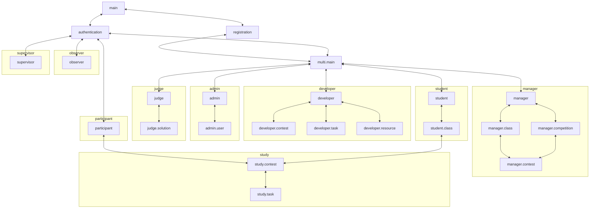

# Фичи

Реестр фич системы TestSys. Документ предназначен для всех, кто так или иначе причастен к разработке TestSys.
Его цель — собрать наиболее полное описание системы в одном месте и упростить коммуникацию.
Документ описывает, *что* делает система; как это реализовано в коде, — в документах из перечня
в [docs.md](../docs.md).
Основной единицей описания системы является *фича* в самом широком смысле этого слова.
Фича может быть описанием функциональности, пользовательского интерфейса и тд.
Конкретные требования к фиче определяются категорией, в которой она находится.
В документе используются определения из [definitions.md](definitions.md).

## Использование документа

Рекомендуется использовать документ следующим образом:
- Использовать в качестве документации к системе
- Использовать кодификаторы фичей в коммуникации для избежания двусмысленности
- Использовать кодификаторы фичей в документации верхнеуровнего кода (контроллеров, web-страниц)
- Использовать кодификаторы фичей в commit message если это применимо

## Работа с документом

Ответственность за актуальность документа лежит на разработчике, который реализует новую фичу или меняет
существующую. Общие правила поддержки документации — в [docs.md](../docs.md).

## Категории

Фичи в данный момент разбиты на следующие категории:
- **testsys.entity** – Фичи, описывающие сущности, представленные в системе
- **testsys.user** – Функциональные фичи, которыми непосредственно пользуется конечный пользователь
- **testsys.web** – Фичи, описывающие представления в web-интерфейсе
- **testsys.docs** – Фичи, описывающие внешнюю пользовательскую документацию
- **testsys.dev** – Фичи, облегчающие разработку/отладку системы, расследование инцидентов


## Структура фичи

Фича имеет кодификатор следующего вида `testsys.префикс.название-фичи`.
Префикс может обладать дополнительной семантикой.

Фичи с суффиксом `authorization` не имеют статуса, поскольку описывают поведение других фичей.

У остальных фич статус указан в скобках рядом с кодификатором:
- **Not implemented** – фича не реализована ни в каком виде
- **Partially implemented** – фича реализована частично
- **Implemented** – фича реализована полностью

В случае если фича имеет статус **Partially implemented**
в ее описании должно быть зафиксировано что уже сделано
и/или что еще необходимо сделать.

## Структура документа

Далее текст документа имеет следующую структуру:

```md
## Название категории

Описание категории
Описание семантики префиксов

### Кодификатор фичи1  (Статус фичи1)

Описание фичи1

### Кодификатор фичи2  (Статус фичи2)

Описание фичи2

...
```

## testsys.entity

Фичи, описывающие сущности в системе.
В данном разделе должны быть описаны *нетривиальные* особенности представления, решения по дизайну связанных фичей, и др, 
которые может быть сложно понять из раздела **testsys.user**. 
Описания вида "Участник определяется уникальным идентификатором и Соревнованием" не требуется вносить в данный раздел.

### testsys.entity.task

Представляет Задачу. Задача хранит не более двух версий:

- Рабочая версия — содержимое Задачи с текущими незафиксированными изменениями Разработчика.
  Она используется при разработке Задачи и может быть неполной.
- Последняя зафиксированная версия — содержимое Задачи, сохранённое при последней фиксации (коммите).
  Доработка рабочей версии не изменяет зафиксированную; следующая фиксация заменяет её рабочей версией.

В зависимости от наличия версий Задача находится в одном из состояний:

1) **New** – Задача ещё ни разу не была зафиксирована: есть только рабочая версия.
2) **Uncommitted** – есть зафиксированная версия и незафиксированные изменения поверх неё.
3) **Committed** – последние изменения зафиксированы, рабочей версии нет.

Изменение Задачи в состоянии **Committed** переводит её в **Uncommitted**; Задача в состоянии **New**
при изменении остаётся в **New**. Фиксация (коммит) переводит Задачу в **Committed**.

Данные состояния прежде всего предназначены для безопасной доработки задачи, при условии, 
что она уже где-то используется. Предполагается использование последней зафиксированной версии задачи 
во всех фичах, кроме фичей непосредственно связанных с разработкой Задач.

Задача хранит набор загруженных в неё Упражнений, Полигонов, Условий и Авторских Решений, включая ещё не
прикреплённые. Цепочки версий этих Ресурсов описаны в **testsys.entity.resource**.

Ресурс считается прикреплённым, если одна из его версий используется в рабочей или последней зафиксированной
версии Задачи. Загрузка Ресурса без прикрепления не меняет состояние Задачи. Удаление Ресурсов пока не
поддерживается.

### testsys.entity.resource

Упражнения, Полигоны, Условия и Авторские Решения, загруженные в Задачу, хранятся как цепочки версий Ресурсов.
Цепочка объединяет версии одного Ресурса и имеет общий уникальный идентификатор, независимый от идентификаторов
отдельных версий. Идентификатор цепочки уникален среди всех четырёх типов. Цепочка принадлежит только одной
Задаче; перенос в другую Задачу запрещён.

Версия Ресурса — отдельная сохранённая запись в цепочке со своим идентификатором, временем создания,
названием, описанием и файлом. Версия Упражнения также содержит язык, а версия Авторского Решения —
ссылку на Решение и ожидаемый балл; файл и язык Авторского Решения хранятся в связанном Решении.
Разные версии могут использовать один и тот же файл или Решение.

Рабочая и зафиксированная версии Задачи ссылаются на конкретные версии Ресурсов, а не на цепочки целиком.
Поэтому создание новой версии Ресурса само по себе не меняет содержимое зафиксированной версии Задачи.
Правила создания новой версии Ресурса, изменения названия на месте и замены версии в рабочей версии Задачи
описаны в **testsys.user.multi.developer.resource.updateResource**.

Версия Ресурса не является неизменяемым снимком всех его данных: метаданные могут изменяться на месте
без создания новой версии. История показывает существующие версии с их текущими метаданными;
правила просмотра — в **testsys.user.multi.developer.resource.viewResource**.
Правило выбора последней версии — в **testsys.user.multi.developer.task.attachResource**.

### testsys.entity.taskValidationRequest (Partially implemented)

Запрос валидации Задачи сохраняет снимок непосредственных входных данных рабочей версии Задачи:
конкретные Полигоны, Авторские Решения с программами и ожидаемыми баллами,
поддерживаемые версии TRIK Studio.
Снимок не меняется после создания.
Условия, Упражнения, метаданные Ресурсов и настройки диагностик в него не входят.

Данные запроса зависят от состояния обработки.

До завершения Диагностик запрос остаётся в одном состоянии.
Сохранённые результаты отдельных Полигонов составляют прогресс.

После завершения Диагностик запрос содержит результат каждого Полигона,
включая пустые списки сообщений.
Error завершает обработку и блокирует Авторские Решения; запрос сохраняет время завершения.
Без Error запрос остаётся активным и ожидает отправки Посылок.

После создания Посылок запрос остаётся активным и хранит завершённые результаты
Диагностик и ссылки на Посылки для тестирования Авторских Решений.
Результаты грейдинга находятся в Посылках.
Список Авторских Посылок сохраняет порядок, соответствующий Авторским Решениям снимка
и версиям TRIK Studio. После завершения всех Посылок запрос сохраняет итог тестирования и время завершения.
Итог — список всех проваленных Посылок в этом порядке с причиной каждой: не совпавшая сумма баллов
с фактической суммой или ошибка проверки либо таймаут. Пустой список означает успех.
Итог фиксируется при завершении и не меняется при последующих изменениях Задачи или Туров.
Копия результатов грейдинга в запросе не хранится.

Техническая остановка хранит описание и время сбоя.
Завершённые результаты Диагностик и созданные ссылки на Посылки сохраняются.
При остановке до завершения Диагностик сохраняется уже записанный прогресс.

Отдельного результата «Проверка неполная» нет.

Повторный запуск того же снимка возвращает активный запрос.
Другой снимок или новый запуск после завершения создают новый запрос.
История сохраняется.

Система обрабатывает запросы по одному. После перезапуска она продолжает обработку активных запросов
и повторно отправляет грейдеру Посылки без результата.
Сохранённые результаты при возобновлении не вычисляются повторно.
Технический сбой обработки фиксируется в запросе и завершает её без автоматических повторов.
Изменение Задачи не меняет снимок.
Полная валидация описана в **testsys.user.multi.developer.task.testTask**.

Реализованы хранение запроса, снимка, диагностик, Авторских Посылок, итога и технической остановки,
обработка запроса и его диспетчер с возобновлением после перезапуска.
Подключение диспетчера при запуске приложения не реализовано.

### testsys.entity.studyEntry

Система сохраняет первый вход Пользователя в Тур отдельно для каждого контекста:

- Для Ученика — Пользователь, Класс и Тур.
- Для Участника — Участник, Соревнование и Тур.

Запись фиксирует только момент первого входа.
Ограничения времени остаются в текущих данных Тура; их снимок не сохраняется.
Повторный вход возвращает исходную запись, в том числе после истечения времени,
если Пользователь по-прежнему имеет доступ к выбранному контексту.
Одновременные входы в один контекст создают одну запись.
Повторный вход не меняет первый момент.

Первый вход в Тур допускается не раньше даты начала и строго раньше даты конца.
Отсутствующая дата снимает соответствующее ограничение.

При просмотре Туров возвращается первый момент входа в выбранном контексте.
Если записи нет, момент входа отсутствует.
Просмотр не создаёт запись входа.

Удаление членства или связи группы с Туром не удаляет запись входа.
При повторном предоставлении доступа в том же контексте сохраняется первый момент.
Удаление Пользователя, контекстного Класса или Соревнования либо самого Тура
удаляет соответствующие записи входа.

### testsys.entity.multi.judge

Представляет Судью, в данный момент Судьи выдаются только Супервайзером крайне ограниченному кругу доверенных лиц.
В связи с этим не требуется дополнительных политик относительно вердиктов Судьи 
(отображать информацию, что вердикт был изменен Судьей, вводить разграничения доступа к задачам и др.).

## testsys.user

Функциональные фичи, которыми непосредственно пользуется конечный пользователь.
Если использование фичи подразумевает использование веб-интерфейса,
фича должна ссылаться на соответствующую страницу.

Префиксы описывают кому доступна Фича:

- **testsys.user** – для любого Пользователя
- **testsys.user.single** – для любого Пользователя c Фиксированной Ролью
- **testsys.user.single.participant** – для любого Участника
- **testsys.user.single.observer** – для любого Наблюдателя
- **testsys.user.single.supervisor** – для любого Супервайзера
- **testsys.user.multi** – для любого Пользователя c Нефиксированными Ролями
- **testsys.user.multi.developer** – для любого Разработчика
- **testsys.user.multi.student** – для любого Ученика
- **testsys.user.multi.judge** – для любого Судьи
- **testsys.user.multi.admin** – для любого Администратора
- **testsys.user.multi.manager** – для любого Организатора
- **testsys.user.study** – для любого Ученика/Участника

Слово "доступно" в **authorization** фичах означает доступно 
в необходимом и достаточном объеме для реализации остальных фичей для данного Пользователя/Роли.

Функциональные фичи должны быть описаны в следующем формате:

Page: **testsys.web.page.[identifier]** 

*Описание*: \
[короткое описание в несколько предложений]

*Вход*:\
[Данные необходимые для выполнения операции bullet списком]

*Отказы*:\
[случаи в которых отказано выполнение операции bullet списком]

*Операция*:\
[описание всех happy-path нумерованным списком] \
[информация характерная для всех happy-path]

*Инварианты*:\
[описание инвариантов операции]

<!-- testsys.user -->

### testsys.user.authentication  (Not implemented)

Page: **testsys.web.page.authentication**

Пользователь имеет возможность войти в Систему по валидному Коду-доступа в Системе.
Код-доступа считается валидным, если был создан при помощи одной из фичей.
При успешной авторизации происходит переход в **testsys.web.page.multi.main** для
пользователя с Нефиксированной Ролью или в:
- **testsys.web.page.participant** – для Участника
- **testsys.web.page.observer** – для Наблюдателя
- **testsys.web.page.supervisor** – для Супервайзера

В противном случае Пользователь уведомляется о том, что Код-доступа не валиден.

<!-- testsys.user.multi -->

### testsys.user.registration (Not implemented)

Page: **testsys.web.page.registration**

Пользователь имеет возможность зарегистрироваться в Системе
указав Псевдоним, почту и Роль (Ученик/Организатор).
Если почта уже привязана, то Пользователь уведомляется об этом, иначе
он получает код для подтверждения привязки письмом на указанную почту.
Далее пользователю необходимо ввести полученный код:

1) В случае, если код совпадает с отправленным, данный пользователь наделяется выбранной Ролью в публичном Сообществе.
После регистрации происходит переход в **testsys.web.page.multi.main**,
а также Пользователю присваивается Код-доступа.

2) В противном случае Пользователь уведомляется о том, что код указан неверно.

### testsys.user.multi.addMail (Not implemented)

Page: **testsys.web.page.multi.main**

Пользователь имеет возможность привязать почту к своему Кабинету.
После указания почты, которую Пользователь желает привязать,
происходит проверка привязана ли эта почта уже к какому-то Кабинету.
Если почта уже привязана, то Пользователь уведомляется об этом, иначе
он получает код для подтверждения привязки письмом на указанную почту.
Далее пользователю необходимо ввести полученный код, в случае, если код
совпадает с отправленным почта привязывается к Кабинету.
В противном случае Пользователь уведомляется о том, что код указан неверно.
В случае, если Пользователь уже имел привязанную к Кабинету почту, она отвязывается
после привязки новой. 

В случае, если у пользователя не привязана почта, он не 
имеет возможности пользоваться другими фичами. 

### testsys.user.multi.restoreAccess (Not implemented)

Page: **testsys.web.page.authentication**

Пользователь ранее привязавший почту имеет возможность восстановить
доступ к своему кабинету указав почту к которой привязан Кабинет.
Если эта почта привязана к какому-либо Кабинету,
для данного Кабинета генерируется ссылка и отправляется на указанную почту,
перейдя по которой на страницу **testsys.web.page.multi.restoreAccess** Пользователь получает новый Код-доступа.
Старый код становится невалидным.

<!-- testsys.user.single.participant -->

### testsys.user.single.participant.authorization

Участнику доступны Туры находящиеся в одном с ним Соревновании,
а также Задачи из этих Туров.

### testsys.user.single.participant.viewContests (Partially implemented)

Page: **testsys.web.page.participant**

*Описание*:\
Участник может просматривать Туры своего Соревнования
и время первого входа в каждый Тур.

*Вход*:

- Пользователь, выполняющий операцию.

*Отказы*:

- Пользователь не является Участником.
- Соревнование Участника не существует.

*Операция*:

1. Выбираются Туры Соревнования Участника независимо от их дат.
2. Возвращается список пар: первый момент входа Участника в Тур своего Соревнования
   и сам Тур. Если записи входа нет, первый элемент пары равен `null`.

Название, даты и индивидуальный лимит доступны в данных Тура.

Для любого доступного Тура Участник может перейти на страницу
**testsys.web.page.study.contest**.

*Инварианты*:

- Просмотр не изменяет Туры и Соревнование.
- Просмотр не сохраняет вход и не начинает прохождение Тура.
- Время входа относится к Участнику, его Соревнованию и выбранному Туру.

Реализована операция просмотра Туров с временем первого входа.
Веб-страница, отображение оставшегося времени и переход на страницу Тура не реализованы.

### testsys.user.single.participant.enterContest (Partially implemented)

Page: **testsys.web.page.study.contest**

*Описание*:\
Участник может начать прохождение Тура своего Соревнования.

*Вход*:

- Пользователь, выполняющий операцию.
- Идентификатор Тура.

*Отказы*:

- Пользователь не является Участником.
- Соревнование Участника не существует.
- Тур не существует.
- Тур не входит в Соревнование Участника.
- Первый вход выполняется до даты начала или начиная с даты конца Тура.

*Операция*:

1. Проверяются существование Соревнования и Тура, а также принадлежность Тура.
2. Если запись первого входа в этом контексте существует, она возвращается.
3. Иначе проверяется временной интервал по **testsys.entity.studyEntry**.
4. Сохраняется и возвращается запись с текущим временем Системы.

*Инварианты*:

- Запись относится к Участнику, его Соревнованию и выбранному Туру.
- Повторный вход не сбрасывает персональное время.
- При сохранённом доступе повтор возвращает исходную запись после истечения времени.
- Тур и его ограничения не изменяются.

Реализована операция сохранения первого входа.
Вызов операции веб-приложением не реализован.

<!-- testsys.user.study -->

### testsys.user.study.viewContest (Partially implemented)

Page: **testsys.web.page.study.contest**

*Описание*:\
Участник может просматривать Тур своего Соревнования.
Ученик может просматривать Тур выбранного Класса.
Доступ определяется фичами **testsys.user.single.participant.authorization**
и **testsys.user.multi.student.authorization**.

По Туру Участник/Ученик может увидеть:

1) Дата начала Тура
2) Дата конца Тура
3) Время на прохождение Тура
4) Сколько времени осталось у Участника/Ученика на прохождение Тура
5) Название Тура
6) Описание Тура
7) Список Задач с их Названиями

Участник/Ученик для выбранной Задачи может перейти на страницу
**testsys.web.page.study.task**.

*Вход*:

- Пользователь, выполняющий операцию.
- Идентификатор Тура.
- Для Ученика — идентификатор выбранного Класса.

*Отказы*:

- Пользователь не является Участником либо не имеет Роли Ученика.
- Соревнование Участника или выбранный Класс не существует.
- Тур не существует.
- Ученик не состоит в выбранном Классе.
- Тур не входит в Соревнование Участника или выбранный Класс.

*Операция*:

1. Проверяются Роль, существование Соревнования или Класса и Тура, а также доступ к ним.
2. Читается первый момент входа в выбранном контексте по **testsys.entity.studyEntry**.
3. Возвращаются первый момент входа и сам Тур. Если записи входа нет, момент входа отсутствует.

Просмотр доступного Тура разрешён до его начала и после окончания.

*Инварианты*:

- Просмотр не изменяет Тур, Задачи и Соревнование или Класс.
- Просмотр не сохраняет вход и не начинает прохождение Тура.
- Для Ученика используется запись входа только в выбранном Классе.
- Другие Роли Пользователя и членство в Сообществах не расширяют доступ.

Реализована операция просмотра Тура с первым моментом входа.
Веб-страница, загрузка и отображение названий Задач, отображение оставшегося времени,
а также переход на страницу Задачи не реализованы.

### testsys.user.study.viewTask (Partially implemented)

Page: **testsys.web.page.study.task**

*Описание*:\
Участник может просматривать Задачу Тура своего Соревнования.
Ученик может просматривать Задачу Тура выбранного Класса.
Доступ определяется фичами **testsys.user.single.participant.authorization**
и **testsys.user.multi.student.authorization**.

По Задаче Участник/Ученик может увидеть:

1) Название
2) Описание
3) Список отправленных им Решений
4) Вердикт лучшего отправленного Решения

По каждому отправленному Решению участник может увидеть:

1) Дату и время отправки
2) Названия файла Решения
3) Вердикт проверки в случае если Решение проверено, иначе статус проверки

По Задаче Участник/Ученик может скачать:

1) Упражнение
2) Условие

*Вход*:

- Пользователь, выполняющий операцию.
- Идентификатор Тура.
- Идентификатор Задачи.
- Для Ученика — идентификатор выбранного Класса.
- Для скачивания — идентификатор версии Условия или Упражнения.

*Отказы*:

- Пользователь не является Участником либо не имеет Роли Ученика.
- Соревнование Участника или выбранный Класс не существует.
- Тур не существует.
- Задача не существует.
- Ученик не состоит в выбранном Классе.
- Тур не входит в Соревнование Участника или выбранный Класс.
- Задача не входит в Тур.
- В выбранном контексте нет записи первого входа в Тур.
- При скачивании указанная версия не является Условием или Упражнением
  последней зафиксированной версии Задачи.

*Операция*:

1. Проверяются Роль, существование Соревнования или Класса, Тура и Задачи, а также доступ к ним.
2. Проверяется запись первого входа в выбранном контексте по **testsys.entity.studyEntry**.
3. При просмотре выбираются Посылки Пользователя по этой Задаче в этом Туре.
   Они упорядочены по времени отправки, а при равенстве — по идентификатору.
4. Для каждой Посылки с текущим успешным Вердиктом вычисляется итоговый балл.
   Это балл последнего Судейского вердикта, а без Судейских вердиктов — сумма баллов Вердикта по Полигонам.
   Последним считается Судейский вердикт с наибольшим временем создания, а при равенстве — с наибольшим идентификатором.
5. Лучшая Посылка имеет наибольший итоговый балл; при равенстве выбирается более ранняя.
   Посылки без успешного Вердикта в выборе не участвуют. Если подходящих Посылок нет, лучшей Посылки нет.
6. Возвращаются Задача, список Посылок и лучшая Посылка.
7. При скачивании возвращается файл указанного Условия или Упражнения последней зафиксированной версии Задачи.

Просмотр и скачивание доступны и после окончания Тура.

*Инварианты*:

- Просмотр и скачивание не изменяют Задачу, Тур, Посылки, Вердикты и Судейские вердикты.
- Просмотр и скачивание не сохраняют вход.
- Посылка не хранит Класс. Поэтому Ученик видит свои Посылки по Задаче в этом Туре
  независимо от Класса, из которого они отправлены.
- Посылки для тестирования Авторских Решений не возвращаются.
- Рабочая версия Задачи для скачивания не используется.
- Другие Роли Пользователя и членство в Сообществах не расширяют доступ.

Реализованы операции просмотра Задачи и скачивания Условия и Упражнения.
Просмотр возвращает Задачу, Посылки и лучшую Посылку без загрузки связанных сущностей.
Названия файлов Решений, Вердикты и итоговые баллы Посылок, в том числе лучшей, операция не возвращает.
Статус проверки доступен только в данных Посылки.
Веб-страница **testsys.web.page.study.task** не реализована.

### testsys.user.study.sendSolution (Partially implemented)

Page: **testsys.web.page.study.task**

*Описание*:\
Участник может отправить Решение для Задачи Тура своего Соревнования.
Ученик может отправить Решение для Задачи Тура выбранного Класса.
Доступ определяется фичами **testsys.user.single.participant.authorization**
и **testsys.user.multi.student.authorization**.
При отправке Участник/Ученик выбирает язык Решения: Python, JavaScript или визуальный язык TRIK Studio.

*Вход*:

- Пользователь, выполняющий операцию.
- Идентификатор Тура.
- Идентификатор Задачи.
- Для Ученика — идентификатор выбранного Класса.
- Файл Решения.
- Язык Решения.

*Отказы*:

- Пользователь не является Участником либо не имеет Роли Ученика.
- Соревнование Участника или выбранный Класс не существует.
- Тур не существует.
- Задача не существует.
- Ученик не состоит в выбранном Классе.
- Тур не входит в Соревнование Участника или выбранный Класс.
- Задача не входит в Тур.
- В выбранном контексте нет записи первого входа в Тур.
- Отправка выполняется начиная с даты конца Тура.
- Отправка выполняется начиная с момента первого входа в выбранном контексте плюс индивидуальный лимит Тура.
- Язык Решения не разрешён Задачей.

*Операция*:

1. Проверяются Роль, существование Соревнования или Класса, Тура и Задачи, а также доступ к ним.
2. Проверяется запись первого входа в выбранном контексте по **testsys.entity.studyEntry**.
3. Текущее время Системы должно быть раньше даты конца Тура и раньше окончания индивидуального лимита.
   Отсутствующая дата конца или отсутствующий лимит снимает соответствующее ограничение.
4. Язык разрешён, если в последней зафиксированной версии Задачи есть Авторское Решение на этом языке.
5. Сохраняются Решение с переданным файлом и языком и Посылка Пользователя по этой Задаче в этом Туре.
   Посылка ожидает проверки.
6. Сохранённая Посылка возвращается. Передачу Посылки на проверку выполняет вызывающая сторона после фиксации изменений.

Проверка выполняется на версии TRIK Studio Тура по **testsys.dev.grading.balancing**.
Формат и содержимое файла не проверяются.

*Инварианты*:

- Каждая отправка создаёт новое Решение и новую Посылку, в том числе для того же файла.
- Задача, Тур, Соревнование или Класс и запись входа не изменяются.
- Рабочая версия Задачи для выбора разрешённых языков не используется.
- Другие Роли Пользователя и членство в Сообществах не расширяют доступ.

Реализована операция отправки Решения.
Передача Посылки на проверку и повторная передача ожидающих Посылок после перезапуска не реализованы.
Веб-страница **testsys.web.page.study.task** не реализована.

<!-- testsys.user.single.observer -->

### testsys.user.single.observer.authorization

Наблюдателю доступны Соревнования,
проходящие в том же сообществе в котором состоит Наблюдатель,
для доступного (определятся при его создании) ему набора Туров.

### testsys.user.single.observer.viewContests (Not implemented)

Page: **testsys.web.page.observer**

Наблюдатель может просматривать доступные ему Туры.
По Туру Наблюдатель может увидеть:
1) Дата начала Тура
2) Дата конца Тура
3) Время на прохождение Тура
4) Название Тура

### testsys.user.single.observer.downloadResult (Not implemented)

Page: **testsys.web.page.observer**

Наблюдатель может скачивать результаты по доступным для него Турам.
Результатом является csv файл с данными где столбцами являются:

TODO: Столбцы

<!-- testsys.user.multi.developer -->

### testsys.user.multi.developer.authorization

Разработчику доступны созданные им Ресурсы, Задачи, Туры, 
а также Задачи и Туры, к которым был предоставлен доступ Сообществам,
в которых он состоит в Роли Разработчика.

### testsys.user.multi.developer.resource.addResource (Partially implemented)

Page: **testsys.web.page.developer**

*Описание*:\
Разработчик может загрузить новый Ресурс в созданную им Задачу. Прикрепление Ресурса к содержимому Задачи
выполняется отдельно.

*Вход*:

- Идентификатор Задачи.
- Файл Ресурса.
- Название Ресурса.
- Тип Ресурса: Упражнение, Полигон, Авторское Решение или Условие.
- Язык — для Упражнения и Авторского Решения.
- Ожидаемый балл — для Авторского Решения.

*Отказы*:

- У Пользователя нет Роли Разработчика.
- Задача не существует.
- Задача создана другим Пользователем.

*Операция*:

1. Создаётся Ресурс указанного типа с загруженным файлом, названием и данными, необходимыми для этого типа.
2. Новый Ресурс добавляется в набор загруженных Ресурсов Задачи.

Проверка формата и содержимого загруженного файла в операции не выполняется.

*Инварианты*:

- Загрузка Ресурса не прикрепляет его к содержимому Задачи.
- Состояние Задачи, её рабочая и последняя зафиксированная версии не изменяются.

Реализованы операции загрузки Условия, Упражнения, Полигона и Авторского Решения.
Страница **testsys.web.page.developer** не реализована.


### testsys.user.multi.developer.resource.updateResource (Partially implemented)

Page: **testsys.web.page.developer.resource**

*Описание*:\
Разработчик может изменить название, файл и, для Авторского Решения, ожидаемый балл Ресурса, загруженного
в созданную им Задачу. Изменение файла или ожидаемого балла создаёт новую версию Ресурса; изменение только
названия сохраняется в последней версии.

*Вход*:

- Идентификатор Задачи.
- Идентификатор последней версии Ресурса. Последняя версия определяется так же, как в
  **testsys.user.multi.developer.task.attachResource**.
- Новое название — необязательно.
- Новый файл — необязательно.
- Новый ожидаемый балл — необязательно, только для Авторского Решения.

Изменяемые значения можно передать вместе или не передать ни одного.

*Отказы*:

- У Пользователя нет Роли Разработчика.
- Задача или указанная версия Ресурса не существует.
- Задача создана другим Пользователем.
- Цепочка версий Ресурса не входит в набор загруженных Ресурсов этой Задачи.
- Указанная версия Ресурса не является последней в цепочке.

*Операция*:

1. Если файл и ожидаемый балл не переданы, метаданные последней версии сохраняются на месте. Если передано
   название, оно заменяет прежнее. Идентификатор версии, ссылки на Ресурс и состояние Задачи сохраняются.
2. Если передан файл или ожидаемый балл, создаётся новая версия Ресурса в той же цепочке:
   - переданные значения заменяют прежние;
   - если ожидаемый балл Авторского Решения передан без файла, новая версия использует прежнее Решение;
   - если передан файл Авторского Решения, сохраняется новое Решение с прежним языком;
   - если передано название, его получает новая версия; прежняя версия не переименовывается.

   После создания новой версии:
   - Если рабочая версия Задачи содержит одну из версий этой цепочки, она заменяется новой версией Ресурса
     ; состояние **New** или **Uncommitted** сохраняется;
   - если Задача находится в состоянии **Committed** и цепочка присутствует в последней зафиксированной
     версии, из неё создаётся рабочая версия, ссылка заменяется ссылкой на новую версию Ресурса, а Задача
     переходит в **Uncommitted**;
   - в остальных случаях новая версия Ресурса сохраняется без изменения Задачи. Это относится и к цепочке,
     которая присутствует только в последней зафиксированной версии, если рабочая версия уже существует.

Перед изменением прикреплённого Ресурса Пользователь должен быть уведомлён о том, что у Задачи появятся
незафиксированные изменения.

Проверка формата и содержимого загруженного файла не выполняется. Переданные значения не сравниваются
с прежними: одинаковый файл или прежний ожидаемый балл также создаёт новую версию. Прежнее название
или отсутствие всех изменяемых значений не отменяет сохранение метаданных на месте.

*Инварианты*:

- Неуказанные значения, описание и язык Ресурса сохраняются.
- Новая версия принадлежит той же цепочке и той же Задаче.
- При создании новой версии прежняя версия Ресурса и её файл сохраняются.
- Изменение названия затрагивает только обновляемую версию; названия других версий цепочки сохраняются.
- Обновление Ресурса не прикрепляет цепочку в рабочую версию Задачи, если её там нет.
- Последняя зафиксированная версия Задачи не изменяется (см. **testsys.entity.task**).

Реализованы операции обновления Условия, Упражнения, Полигона и Авторского Решения.
Страница **testsys.web.page.developer.resource** и уведомление Пользователя не реализованы.

### testsys.user.multi.developer.resource.viewResources (Partially implemented)

Page: **testsys.web.page.developer**

*Описание*:\
Разработчик может просматривать последние версии Ресурсов, загруженных в созданные им Задачи,
включая неприкреплённые Ресурсы, и переходить к подробной информации о каждом из них.

*Вход*:

- Пользователь, выполняющий операцию. Дополнительные данные не требуются.

*Отказы*:

- У Пользователя нет Роли Разработчика.

*Операция*:

1. Для цепочек Ресурсов, загруженных в созданные Разработчиком Задачи, выбираются последние существующие
   версии Условий, Упражнений, Полигонов и Авторских Решений. Последняя версия определяется так же, как
   в **testsys.user.multi.developer.task.attachResource**. Цепочки без существующих версий в список не входят.
2. Разработчику отображается список выбранных версий. Для каждого Ресурса указаны идентификатор версии,
   название, дата и время последнего изменения.
3. Для любого Ресурса из списка Разработчик может перейти на страницу **testsys.web.page.developer.resource**.

Если подходящих Ресурсов нет, возвращается пустой список.
В реализованной операции дата и время последнего изменения — время создания выбранной версии Ресурса.
Переименование версии не меняет это время.

*Инварианты*:

- В списке представлены только Ресурсы, загруженные в созданные Разработчиком Задачи.
- Наличие Ресурса в списке не зависит от его прикрепления к рабочей или зафиксированной версии Задачи.
- Просмотр не изменяет Ресурсы, состояние Задач и их рабочие или зафиксированные версии.

Реализована операция получения списка Ресурсов.
Страница **testsys.web.page.developer** не реализована.

### testsys.user.multi.developer.resource.viewResource (Partially implemented)

Page: **testsys.web.page.developer.resource**

*Описание*:\
Разработчик может просматривать информацию и историю версий Ресурса, загруженного в созданную им Задачу,
и скачивать файл любой существующей версии.

*Вход*:

- Пользователь, выполняющий операцию.
- Идентификатор Задачи.
- Идентификатор цепочки версий Ресурса.
- Идентификатор версии Ресурса — для скачивания файла.

*Отказы*:

- У Пользователя нет Роли Разработчика.
- Задача не существует.
- В указанной цепочке нет существующих версий Ресурса.
- Задача создана другим Пользователем.
- Цепочка не входит в набор загруженных Ресурсов этой Задачи.
- При скачивании указанная версия Ресурса отсутствует в выбранной цепочке либо идентификатор относится
  к другому виду сущностей.

*Операция*:

1. При просмотре возвращаются все существующие версии Ресурса из указанной цепочки.
   Разработчику отображаются идентификатор и название Ресурса, а также таблица с историей изменений.
   Для каждой версии в таблице предусмотрены дата и время изменения, название загруженного файла
   и комментарий изменения.
2. При скачивании Разработчик выбирает запись в истории и получает файл соответствующей версии.
   Выбранная версия не обязана быть последней в цепочке.

В реализованной операции дата и время изменения — время создания версии Ресурса.
История содержит существующие версии с их текущими метаданными и файлами; изменение метаданных
на месте не создаёт отдельную запись в истории.

*Инварианты*:

- Просмотр и скачивание доступны независимо от состояния Задачи: **New**, **Uncommitted** или **Committed**.
- Просмотр и скачивание не изменяют Ресурсы, состояние Задачи и её рабочую или зафиксированную версию.

Реализованы операции просмотра Ресурса и скачивания его версий.
Комментарий изменения не реализован.
Страница **testsys.web.page.developer.resource** не реализована.

### testsys.user.multi.developer.task.createTask (Partially implemented)

Page: **testsys.web.page.developer**

*Описание*:\
Разработчик может создать новую Задачу с указанными названием и описанием для последующей разработки.

*Вход*:

- Пользователь, выполняющий операцию.
- Название Задачи.
- Описание Задачи; может быть пустым.

*Отказы*:

- У Пользователя нет Роли Разработчика.

*Операция*:

1. Создаётся и сохраняется новая Задача с переданными названием и описанием. Её владельцем становится
   Пользователь, выполняющий операцию.
2. Возвращается созданная Задача.

*Инварианты*:

- Новая Задача находится в состоянии **New**: есть только рабочая версия, зафиксированной версии нет
  (см. **testsys.entity.task**).
- Набор загруженных Ресурсов пуст. В рабочей версии нет Условия, Упражнений, Полигонов и Авторских Решений.
- Список поддерживаемых версий TRIK Studio пуст.
- Доступ к новой Задаче не предоставлен ни одному Сообществу.

Реализована операция; страница **testsys.web.page.developer** не реализована.

### testsys.user.multi.developer.task.attachResource (Partially implemented)

Page: **testsys.web.page.developer.task**

*Описание*:\
Разработчик может прикрепить последнюю версию загруженного Ресурса к рабочей версии созданной им Задачи.
Прикрепить можно Условие, Упражнение, Полигон или Авторское Решение.

*Вход*:

- Пользователь, выполняющий операцию.
- Идентификатор Задачи.
- Идентификатор версии Ресурса.

*Отказы*:

- У Пользователя нет Роли Разработчика.
- Задача или указанная версия Ресурса не существует.
- Задача создана другим Пользователем.
- Цепочка версий Ресурса не входит в набор загруженных Ресурсов этой Задачи.
- Указанная версия не является последней в цепочке.
- Одна из версий этой цепочки уже прикреплена к рабочей версии Задачи.
- При прикреплении Условия в рабочей версии уже есть Условие.
- При прикреплении Упражнения в рабочей версии уже есть Упражнение для того же языка.

Для Задачи в состоянии **Committed** ограничения на прикреплённые Ресурсы проверяются по последней
зафиксированной версии, из которой будет создана рабочая версия.

*Операция*:

1. Если Задача находится в состоянии **Committed**, рабочая версия создаётся из последней зафиксированной.
   Для **New** и **Uncommitted** используется существующая рабочая версия.
2. Указанная версия Ресурса прикрепляется к рабочей версии Задачи. Изменённая Задача сохраняется.
3. Возвращается изменённая Задача.

Последняя версия Ресурса определяется по времени создания; при совпадении времени выбирается версия
с большим идентификатором. Изменение названия или описания не меняет порядок версий.
Доступ к Ресурсу проверяется по владению Задачей и принадлежности ей цепочки.
Отдельного ограничения на число Полигонов и Авторских Решений нет.

*Инварианты*:

- Прикрепление является изменением Задачи: **New** остаётся в **New**, **Uncommitted** — в **Uncommitted**,
  **Committed** переходит в **Uncommitted** (см. **testsys.entity.task**).
- Последняя зафиксированная версия Задачи не изменяется.
- Прикрепление не заменяет ранее прикреплённые Ресурсы и не изменяет остальные данные рабочей версии.
- Метаданные Задачи, доступ Сообществ и набор загруженных цепочек сохраняются.
- Версии Ресурсов и их файлы не изменяются.

Реализованы операции прикрепления Условия, Упражнения, Полигона и Авторского Решения.
Страница **testsys.web.page.developer.task** не реализована.

### testsys.user.multi.developer.task.detachResource (Partially implemented)

Page: **testsys.web.page.developer.task**

*Описание*:\
Разработчик может открепить указанную версию Ресурса от рабочей версии созданной им Задачи.
Открепить можно Условие, Упражнение, Полигон или Авторское Решение.

*Вход*:

- Пользователь, выполняющий операцию.
- Идентификатор Задачи.
- Идентификатор прикреплённой версии Ресурса.

*Отказы*:

- У Пользователя нет Роли Разработчика.
- Задача или указанная версия Ресурса не существует.
- Задача создана другим Пользователем.
- Цепочка версий Ресурса не входит в набор загруженных Ресурсов этой Задачи.
- Указанная версия не прикреплена к рабочей версии Задачи. Наличие другой версии той же цепочки
  не позволяет открепить указанную. Если рабочая версия уже существует, наличие указанной версии
  только в последней зафиксированной версии также не позволяет её открепить.

Для Задачи в состоянии **Committed** наличие указанной версии проверяется в последней зафиксированной
версии до создания рабочей версии.

*Операция*:

1. Если Задача находится в состоянии **Committed**, рабочая версия создаётся из последней зафиксированной.
   Для **New** и **Uncommitted** используется существующая рабочая версия.
2. Из рабочей версии удаляется ссылка на указанную версию Ресурса. Изменённая Задача сохраняется.
3. Возвращается изменённая Задача.

Указанная версия Ресурса не обязана быть последней в цепочке. Другая версия той же цепочки не заменяет
указанную при откреплении. Доступ к Ресурсу проверяется по владению Задачей и принадлежности ей цепочки.
Можно открепить единственное Условие, последнее Упражнение, последний Полигон или последнее Авторское Решение.
Рабочая версия Задачи может быть неполной.

*Инварианты*:

- Открепление является изменением Задачи: **New** остаётся в **New**, **Uncommitted** — в **Uncommitted**,
  **Committed** переходит в **Uncommitted** (см. **testsys.entity.task**).
- Последняя зафиксированная версия и остальные данные рабочей версии Задачи не изменяются.
- Метаданные Задачи, доступ Сообществ и набор загруженных цепочек сохраняются.
- Цепочка откреплённого Ресурса остаётся в наборе загруженных Ресурсов Задачи.
- Версии Ресурсов, их файлы и связанные Решения не изменяются и не удаляются.

Реализованы операции открепления Условия, Упражнения, Полигона и Авторского Решения.
Страница **testsys.web.page.developer.task** не реализована.

### testsys.user.multi.developer.task.testTask (Partially implemented)

Page: **testsys.web.page.developer.task**

*Описание*:\
Разработчик может протестировать рабочую версию созданной им Задачи.
Система сохраняет запрос валидации и возвращает его без ожидания результатов.
Диагностики выполняются как первый этап тестирования.

*Вход*:

- Пользователь, выполняющий операцию.
- Идентификатор Задачи.

*Отказы*:

- У Пользователя нет Роли Разработчика.
- Задача не существует.
- Задача создана другим Пользователем.
- У Задачи нет рабочей версии: она находится в состоянии **Committed**.
- К Задаче не прикреплено Условие.
- К Задаче не прикреплён хотя бы один Полигон или хотя бы одно Авторское Решение.
- Набор поддерживаемых версий TRIK Studio пуст.
- Для языка Авторского Решения не прикреплено Упражнение.
- Задача не поддерживает версию TRIK Studio одного из прикреплённых Туров.

*Операция*:

Перед созданием запроса система проверяет наличие Условия, Полигонов, Авторских Решений,
поддерживаемых версий TRIK Studio и Упражнений для языков Авторских Решений,
а также совместимость с прикреплёнными Турами.
После успешных проверок система сохраняет или возвращает активный запрос с тем же снимком
и ставит его в обработку, не дожидаясь результатов.
Обработка сначала выполняет Диагностики, затем Авторские проверки.

1. Система сохраняет снимок непосредственных входных данных рабочей версии Задачи.
   Активный запрос с тем же снимком используется повторно; другой снимок или запуск после завершения
   создаёт новый запрос.
2. Система выполняет Диагностики всех Полигонов снимка по
   **testsys.user.multi.developer.task.runDiagnostics**. Error блокирует Авторские Решения
   и означает неуспех; Warning и Info не блокируют.
3. Для каждого Авторского Решения и каждой поддерживаемой версии TRIK Studio
   создаётся отдельная Посылка. Она проверяется на всех Полигонах снимка.
   Список Посылок сохраняется в порядке, соответствующем Авторским Решениям и версиям,
   до отправки грейдеру.
4. Система дожидается результатов всех созданных Посылок.
   Для каждой Посылки сумма баллов всех Полигонов должна совпасть с ожидаемым баллом
   соответствующего Авторского Решения.
   Несовпадение, ошибка грейдинга или таймаут означает неуспех.
5. Запрос сохраняет итог тестирования и время завершения.
   Итог неуспеха перечисляет все проваленные Посылки: с несовпавшей суммой баллов
   или с ошибкой грейдинга либо таймаутом.
   Если Диагностики нашли Error, запрос завершается на их этапе, и причину показывают их результаты.

Разработчик может просмотреть историю запросов тестирования своей Задачи в любом её состоянии:
состояние каждого запроса, результаты Диагностик, Посылки и итог.
Отказы просмотра — отсутствие Роли Разработчика, отсутствие Задачи и Задача другого Пользователя.

Успех разрешает коммит проверенной версии по **testsys.user.multi.developer.task.commitTask**.

*Инварианты*:

- Тестирование не меняет содержимое и состояние Задачи.
- Результат относится только к непосредственным входным данным сохранённого снимка.
- Повторная обработка не создаёт дубликаты Посылок для пары Авторского Решения и версии TRIK Studio.
- Завершённый запрос остаётся завершённым, его итог не меняется.
- Условие и нужные Упражнения проверяются перед созданием запроса.

Реализованы операции запуска тестирования и просмотра истории, обработка запросов с диспетчером,
хранение итога и использование Полигонов снимка грейдером.
Страница и подключение диспетчера при запуске приложения не реализованы.

### testsys.user.multi.developer.task.runDiagnostics (Partially implemented)

Page: **testsys.web.page.developer.task**

*Описание*:\
Диагностики проверяют прикреплённые Полигоны при тестировании рабочей версии созданной Разработчиком Задачи.
Отдельного пользовательского запуска Диагностик нет; этап используется в **testsys.user.multi.developer.task.testTask**.

*Вход*:

- Идентификатор сохранённого запроса валидации.

*Операция*:

Диагностический этап принимает идентификатор сохранённого запроса валидации.
Создание запроса и предварительные проверки выполняются в **testsys.user.multi.developer.task.testTask**.
Этап анализирует Полигоны снимка и сохраняет результаты; Error блокирует Авторские проверки.

1. Выполняются Диагностики всех Полигонов снимка.
   Записанные результаты не вычисляются повторно.
   Результат каждого Полигона сохраняется, включая пустой список сообщений.
2. После завершения этапа заполняется результат диагностик.
   Error завершает обработку и блокирует Авторские Решения; Warning и Info не блокируют.
3. При отсутствии Error запрос остаётся активным для Авторских проверок.

Запрос и возобновление описаны в **testsys.entity.taskValidationRequest**.
Диагностический этап не создаёт Посылки. При отсутствии Error запрос продолжает полную проверку по **testsys.user.multi.developer.task.testTask**.
Конфигурация диагностик не входит в снимок или сравнение запросов.
Неизвестная конструкция корректного XML даёт Info, её содержимое не анализируется.

*Инварианты*:

- Запуск не меняет содержимое и состояние Задачи.
- Результаты относятся к конкретным Полигонам снимка.
- Ошибка одного Полигона не препятствует диагностике остальных.
- Успешные Диагностики не означают успешную валидацию всей Задачи.

Реализован диагностический этап сохранённого запроса.
Страница **testsys.web.page.developer.task** и подключение диспетчера при запуске приложения не реализованы.

### testsys.user.multi.developer.task.commitTask (Partially implemented)

Page: **testsys.web.page.developer.task**

*Описание*:\
Разработчик может зафиксировать рабочую версию созданной им Задачи, если она успешно прошла тестирование.
Зафиксированная версия используется везде, где прикреплена Задача.

*Вход*:

- Пользователь, выполняющий операцию.
- Идентификатор Задачи.
- Признак повторной проверки Посылок: нужно ли отправить Посылки по Задаче на повторную проверку
  при изменении набора Полигонов.

*Отказы*:

- У Пользователя нет Роли Разработчика.
- Задача не существует.
- Задача создана другим Пользователем.
- У Задачи нет рабочей версии: она находится в состоянии **Committed**.
- Рабочая версия не прошла тестирование успешно: нет завершённого запроса валидации без проваленных Посылок,
  снимок которого совпадает с непосредственными входными данными рабочей версии.
- К Задаче не прикреплено Условие.
- Для языка Авторского Решения не прикреплено Упражнение.
- Задача не поддерживает версию TRIK Studio одного из прикреплённых Туров.

Снимок тестирования не включает Условие, Упражнения и прикрепления к Турам. Поэтому эти условия
**testsys.user.multi.developer.task.testTask** повторно проверяются по текущей рабочей версии.

*Операция*:

1. Рабочая версия сравнивается со снимками успешно завершённых запросов валидации Задачи:
   наборы Полигонов, Авторских Решений и поддерживаемых версий TRIK Studio должны совпасть без учёта порядка.
   Подходит любой такой запрос, не обязательно последний.
2. Рабочая версия становится последней зафиксированной и заменяет прежнюю. Задача переходит
   из **New** или **Uncommitted** в **Committed**. Изменённая Задача сохраняется.
3. Если повторная проверка Посылок запрошена, Задача была в состоянии **Uncommitted** и набор Полигонов
   новой зафиксированной версии отличается от прежнего, все Посылки по этой Задаче в Турах отправляются
   на повторную проверку. Новая версия Полигона также считается изменением набора.
   Авторские Посылки повторно не проверяются.
4. Возвращается зафиксированная Задача.

Туры ссылаются на Задачу, а не на её версию, поэтому новая зафиксированная версия используется во всех Турах,
к которым прикреплена Задача. Успешная повторная проверка создаёт новый Вердикт
(см. **testsys.dev.grading.balancing**); Судейские вердикты сохраняются.

*Инварианты*:

- Название, описание, владелец Задачи, доступ Сообществ и набор загруженных цепочек сохраняются.
- Версии Ресурсов, их файлы и Решения не изменяются.
- Запросы валидации и их итоги не изменяются.
- Туры, к которым прикреплена Задача, не изменяются.

Реализована операция фиксации и отправка Посылок на повторную проверку. Повторная отправка не возобновляется
после перезапуска приложения. Страница **testsys.web.page.developer.task** не реализована.

### testsys.user.multi.developer.task.revertTask (Partially implemented)

Page: **testsys.web.page.developer.task**

*Описание*:\
Разработчик может отменить незафиксированные изменения созданной им Задачи. Откат восстанавливает состав
Ресурсов и поддерживаемые версии TRIK Studio из последней зафиксированной версии.

*Вход*:

- Пользователь, выполняющий операцию.
- Идентификатор Задачи.

*Отказы*:

- У Пользователя нет Роли Разработчика.
- Задача не существует.
- Задача создана другим Пользователем.
- Задача находится в состоянии **New**: зафиксированной версии ещё нет.
- Задача находится в состоянии **Committed**: незафиксированных изменений нет.

*Операция*:

1. Для каждого Ресурса из последней зафиксированной версии Задачи выбирается версия для восстановления:
   - если зафиксированная версия Ресурса является последней в своей цепочке, используется она;
   - иначе в той же цепочке создаётся новая версия с зафиксированным содержимым и названием и описанием
     последней версии Ресурса. Для Упражнения восстанавливаются файл и язык; для Авторского Решения —
     ссылка на зафиксированное Решение и ожидаемый балл. Новое Решение при этом не создаётся.
2. Зафиксированное содержимое Задачи заменяется восстановленным: состав Ресурсов соответствует последней
   зафиксированной версии до отката, но ссылки ведут на версии, выбранные или созданные на первом шаге.
   Поддерживаемые версии TRIK Studio восстанавливаются из последней зафиксированной версии.
   Рабочая версия удаляется; Задача переходит из **Uncommitted** в **Committed**.
3. Восстановленная Задача сохраняется и возвращается.

Ресурсы, отсутствовавшие в последней зафиксированной версии Задачи, открепляются; ранее прикреплённые
восстанавливаются. Последняя версия Ресурса определяется так же, как
в **testsys.user.multi.developer.task.attachResource**. Если зафиксированная версия не последняя,
новая создаётся независимо от совпадения содержимого версий. Комментарий отката не добавляется.

*Инварианты*:

- Название, описание, владелец Задачи и доступ Сообществ сохраняются.
- Набор загруженных цепочек не изменяется, включая цепочки Ресурсов, откреплённых при откате.
- Существующие версии Ресурсов, их названия, описания, файлы и связанные Решения не изменяются и не удаляются.
- Новые версии Ресурсов сохраняются в прежних цепочках и используют названия и описания последних версий.

Реализована операция. Комментарии отката и страница **testsys.web.page.developer.task** не реализованы.

### testsys.user.multi.developer.task.viewTasks (Partially implemented)

Page: **testsys.web.page.developer**

*Описание*:\
Разработчик может постранично просматривать созданные им Задачи и Задачи, доступные через Сообщества.
Для созданных им Задач доступен переход к подробной информации.

*Вход*:

- Пользователь, выполняющий операцию.
- Номер и размер страницы.
- Параметры сортировки — необязательно.
- Часть названия — необязательно.
- Идентификатор владельца — необязательно.
- Идентификатор Сообщества — необязательно.
- Состояние Задачи: New, Uncommitted или Committed — необязательно.

*Отказы*:

- У Пользователя нет Роли Разработчика.

*Операция*:

1. Выбираются созданные Пользователем Задачи и Задачи, доступ к которым предоставлен хотя бы одному
   Сообществу, в котором Пользователь состоит в Роли Разработчика.

   Указанные фильтры применяются к доступным Пользователю Задачам. Все указанные условия должны выполняться
   одновременно. Название должно содержать указанную строку без учёта регистра; символы строки трактуются буквально,
   пробелы сохраняются. Пустая строка соответствует любому названию. При указанном владельце выбираются только его
   Задачи. При указанном состоянии выбираются только Задачи в этом состоянии.

   При указанном Сообществе:

   - В выборку входят только сущности, к которым этому Сообществу предоставлен доступ.
   - Фильтр применяется и к собственным сущностям Разработчика.
   - Собственная сущность без предоставленного доступа Сообществу исключается.
   - Членство Разработчика в выбранном Сообществе не требуется, если сущность уже доступна ему по другому основанию.
   - Фильтр не предоставляет дополнительного доступа.
   - Несуществующий идентификатор Сообщества даёт пустую выборку.

2. Возвращается страница выбранных Задач без повторов и общее число Задач, соответствующих фильтрам. Для каждой Задачи
   Разработчику отображаются идентификатор, название и состояние.
3. Для созданной им Задачи Разработчик может перейти на страницу **testsys.web.page.developer.task**.

Если подходящих Задач нет или номер страницы выходит за пределы выборки, возвращается пустая страница с общим числом
подходящих Задач. Без параметров сортировки Задачи упорядочиваются по идентификатору по возрастанию. При равенстве
указанных полей сортировки порядок определяется идентификатором по возрастанию, если сортировка по идентификатору не
задана явно.

*Инварианты*:

- Для доступа через Сообщества учитывается только членство в Роли Разработчика.
  Членство в других Ролях не предоставляет доступ через эту операцию.
- Одна Задача появляется в выборке один раз, даже если доступна по нескольким основаниям.
- Просмотр не изменяет состояние Задач, их данные и рабочие или зафиксированные версии.

Реализована операция получения страницы доступных Задач с фильтрацией. Страницы
**testsys.web.page.developer**, **testsys.web.page.developer.task** и переход между ними не реализованы.

### testsys.user.multi.developer.task.viewTask (Partially implemented)

Page: **testsys.web.page.developer.task**

*Описание*:\
Разработчик может просматривать подробную информацию о созданной им Задаче, её прикреплённых Ресурсах
и истории тестирований.

*Вход*:

- Пользователь, выполняющий операцию.
- Идентификатор Задачи.

*Отказы*:

- У Пользователя нет Роли Разработчика.
- Задача не существует.
- Задача создана другим Пользователем. Доступ к ней через Сообщество не даёт права просмотра через эту фичу.

*Операция*:

1. Возвращается указанная Задача с её данными и ссылками на прикреплённые Ресурсы в существующих рабочей
   и последней зафиксированной версиях.
2. Разработчику отображаются:
   - идентификатор, название, состояние и описание Задачи;
   - список поддерживаемых версий TRIK Studio;
   - история тестирований: дата и время каждого тестирования и найденные ошибки;
   - прикреплённые файлы.

Для просмотра достаточно владения Задачей; наличие её идентификатора в списке Задач Роли Разработчика
не проверяется.

*Инварианты*:

- Просмотр доступен в состояниях **New**, **Uncommitted** и **Committed**.
- Просмотр не изменяет состояние Задачи, её данные и рабочую или зафиксированную версию.

Реализована операция получения Задачи с её данными и ссылками на прикреплённые Ресурсы в обеих версиях.
История тестирований и страница **testsys.web.page.developer.task** не реализованы.

### testsys.user.multi.developer.task.editTaskInfo (Partially implemented)

Page: **testsys.web.page.developer.task**

*Описание*:\
Разработчик может изменить название, описание и список поддерживаемых версий TRIK Studio созданной им Задачи.
Значения можно передать по отдельности или вместе; неуказанные значения сохраняются.

*Вход*:

- Пользователь, выполняющий операцию.
- Идентификатор Задачи.
- Новое название — необязательно.
- Новое описание — необязательно; пустая строка очищает описание.
- Новый список поддерживаемых версий TRIK Studio — необязательно; пустой список удаляет все поддерживаемые
  версии из рабочей версии Задачи.

*Отказы*:

- У Пользователя нет Роли Разработчика.
- Задача не существует.
- Задача создана другим Пользователем. Доступ через Сообщество не даёт права редактирования.

*Операция*:

1. Определяется, изменились ли название, описание или набор поддерживаемых версий TRIK Studio.
   Дубликаты в переданном списке удаляются; порядок версий при сравнении наборов не учитывается.
   Сравнение выполняется с рабочей версией Задачи, а для **Committed** — с последней зафиксированной.
2. Если значения не изменились или ни одно новое значение не передано, возвращается исходная Задача
   без сохранения.
3. Если набор поддерживаемых версий изменился, список в рабочей версии полностью заменяется переданным
   списком без дубликатов. Для **Committed** рабочая версия сначала создаётся из последней зафиксированной.
   Если набор совпадает с прежним, существующий список сохраняется, в том числе при изменении названия
   или описания.
4. Переданные название и описание применяются к Задаче. Изменённая Задача сохраняется и возвращается.

*Инварианты*:

- Добавление или удаление поддерживаемой версии TRIK Studio является изменением Задачи:
  **New** остаётся в **New**, **Uncommitted** — в **Uncommitted**, **Committed** переходит в **Uncommitted**
  (см. **testsys.entity.task**).
- Изменение только названия или описания не меняет состояние и версии содержимого Задачи.
  Передача прежнего набора поддерживаемых версий также не меняет состояние.
- Последняя зафиксированная версия содержимого и прикреплённые Ресурсы сохраняются.
- Владелец, доступ Сообществ и набор загруженных цепочек не изменяются.

Реализована операция редактирования информации о Задаче.
Страница **testsys.web.page.developer.task** не реализована.

### testsys.user.multi.developer.task.shareTask (Partially implemented)

Page: **testsys.web.page.developer.task**

*Описание*:\
Разработчик может предоставить выбранным Сообществам доступ к созданной им Задаче, имеющей зафиксированную
версию. Выбранные Сообщества добавляются к тем, которым доступ был предоставлен ранее; отозвать доступ нельзя.

*Вход*:

- Пользователь, выполняющий операцию.
- Идентификатор Задачи.
- Набор идентификаторов Сообществ; может быть пустым.

*Отказы*:

- У Пользователя нет Роли Разработчика.
- Задача не существует.
- Хотя бы одно указанное Сообщество не существует, в том числе если ему уже был предоставлен доступ.
- Задача создана другим Пользователем.
- Пользователь не состоит в Роли Разработчика хотя бы в одном выбранном Сообществе, которому доступ
  ещё не предоставлен.
- Задача находится в состоянии **New**: зафиксированной версии ещё нет.

*Операция*:

1. Выбранные Сообщества добавляются к набору Сообществ, которым предоставлен доступ к Задаче.
   Повторяющиеся Сообщества в итоговом наборе отсутствуют.
2. Задача сохраняется и возвращается.

Ранее добавленные Сообщества можно указать повторно, даже если Пользователь больше не состоит в них
в Роли Разработчика. При пустом наборе или повторном указании только ранее добавленных Сообществ доступ
не меняется, но Задача всё равно сохраняется.

*Инварианты*:

- Ранее предоставленный доступ сохраняется; выбранный набор не заменяет прежний.
- Предоставление доступа не является изменением содержимого Задачи: состояния **Committed**
  и **Uncommitted**, рабочая и последняя зафиксированная версии сохраняются (см. **testsys.entity.task**).
- Владелец, название, описание Задачи и набор загруженных цепочек не изменяются.
- Ресурсы и их файлы не изменяются.

Реализована операция; страница **testsys.web.page.developer.task** не реализована.

### testsys.user.multi.developer.contest.createContest (Partially implemented)

Page: **testsys.web.page.developer**

*Описание*:\
Разработчик может создать новый Тур с названием, версией TRIK Studio и необязательными ограничениями времени.
Задачи и доступ Сообществ добавляются отдельно.

*Вход*:

- Пользователь, выполняющий операцию.
- Название Тура.
- Версия TRIK Studio.
- Описание — необязательно; по умолчанию пустая строка.
- Дата и время начала — необязательно.
- Дата и время конца — необязательно.
- Индивидуальный лимит времени — необязательно.

Общий интервал Тура и индивидуальный лимит должны точно представляться целым числом миллисекунд
в диапазоне `Long`. Нарушение этого контракта входных данных приводит к `IllegalArgumentException`
без сохранения Тура.

*Отказы*:

- У Пользователя нет Роли Разработчика.
- Дата конца указана без даты начала.
- Дата конца не позже даты начала.
- Индивидуальный лимит равен нулю или отрицателен.
- Индивидуальный лимит превышает общий интервал Тура, если указана дата конца.

*Операция*:

1. Если указана дата конца, общий интервал Тура определяется как разница между датами конца и начала.
   Без даты конца общий интервал не ограничен.
2. Создаётся и сохраняется Тур с переданными данными. Его владельцем становится выполняющий операцию
   Пользователь.
3. Возвращается созданный Тур.

Дата начала может находиться в прошлом. Индивидуальный лимит может быть равен общему интервалу Тура.
Без индивидуального лимита время Пользователя ограничивается только общим интервалом Тура.
Индивидуальный лимит отсчитывается с открытия Тура Пользователем.

*Инварианты*:

- Новый Тур не содержит Задач.
- Доступ к новому Туру не предоставлен ни одному Сообществу.
- Неуказанные даты и индивидуальный лимит остаются отсутствующими.

Реализована операция; страница **testsys.web.page.developer** не реализована.

### testsys.user.multi.developer.contest.editContest (Partially implemented)

Page: **testsys.web.page.developer.contest**

*Описание*:\
Разработчик может изменить название, дату начала и дату конца созданного им Тура,
если доступ к Туру ещё не предоставлен ни одному Сообществу.

*Вход*:

- Пользователь, выполняющий операцию.
- Идентификатор Тура.
- Итоговое название Тура.
- Итоговые дата и время начала либо отсутствие даты.
- Итоговые дата и время конца либо отсутствие даты.

Название и обе даты передаются при каждом вызове. Чтобы сохранить прежнее значение, его передают повторно.
Отсутствие даты очищает её, а не сохраняет прежнее значение.
Требование к точному представлению общего интервала в миллисекундах —
в **testsys.user.multi.developer.contest.createContest**. Его нарушение приводит к `IllegalArgumentException`
без сохранения Тура.

*Отказы*:

- У Пользователя нет Роли Разработчика.
- Тур не существует.
- Тур создан другим Пользователем.
- Доступ к Туру предоставлен хотя бы одному Сообществу.
- Дата конца передана без даты начала.
- Дата конца не позже даты начала.
- Существующий индивидуальный лимит превышает новый общий интервал Тура, если указана дата конца.

Проверки доступа и допустимости дат выполняются и при передаче прежних значений.

*Операция*:

1. По переданным датам определяется новый общий интервал Тура. Если дата конца указана, интервал равен
   разнице между датами конца и начала; иначе общий интервал не ограничен.
2. Если название и обе даты совпадают с прежними, возвращается исходный Тур без сохранения.
3. Иначе название и дата начала заменяются переданными значениями, а общий интервал — вычисленным.
   Тур сохраняется и возвращается.

При изменении даты начала переданная дата конца остаётся абсолютным моментом времени.
Обе даты можно очистить; без даты начала дата конца должна отсутствовать.
Индивидуальный лимит может быть равен новому общему интервалу.

*Инварианты*:

- Владелец, описание, набор Задач, индивидуальный лимит и версия TRIK Studio сохраняются.
- Набор Сообществ, которым предоставлен доступ, остаётся пустым.
- Редактирование Тура не изменяет входящие в него Задачи и их Ресурсы.

Реализована операция редактирования Тура.
Страница **testsys.web.page.developer.contest** не реализована.

### testsys.user.multi.developer.contest.viewContests (Partially implemented)

Page: **testsys.web.page.developer**

*Описание*:\
Разработчик может постранично просматривать созданные им Туры и Туры, доступные через Сообщества,
и переходить к подробной информации о каждом из них.

*Вход*:

- Пользователь, выполняющий операцию.
- Номер и размер страницы.
- Параметры сортировки — необязательно.
- Часть названия — необязательно.
- Идентификатор владельца — необязательно.
- Идентификатор Сообщества — необязательно.

*Отказы*:

- У Пользователя нет Роли Разработчика.

*Операция*:

1. Выбираются созданные Пользователем Туры и Туры, доступ к которым предоставлен хотя бы одному
   Сообществу, в котором Пользователь состоит в Роли Разработчика.

   Указанные фильтры применяются к доступным Пользователю Турам. Все указанные условия должны выполняться одновременно.
   Название должно содержать указанную строку без учёта регистра; символы строки трактуются буквально, пробелы
   сохраняются. Пустая строка соответствует любому названию. При указанном владельце выбираются только его Туры.

   При указанном Сообществе:

   - В выборку входят только сущности, к которым этому Сообществу предоставлен доступ.
   - Фильтр применяется и к собственным сущностям Разработчика.
   - Собственная сущность без предоставленного доступа Сообществу исключается.
   - Членство Разработчика в выбранном Сообществе не требуется, если сущность уже доступна ему по другому основанию.
   - Фильтр не предоставляет дополнительного доступа.
   - Несуществующий идентификатор Сообщества даёт пустую выборку.

2. Возвращается страница выбранных Туров без повторов и общее число Туров, соответствующих фильтрам. Для каждого Тура
   Разработчику отображаются идентификатор, название, количество Задач и Сообщества, которым предоставлен доступ.
3. Для любого Тура со страницы Разработчик может перейти на страницу **testsys.web.page.developer.contest**.

Если подходящих Туров нет или номер страницы выходит за пределы выборки, возвращается пустая страница с общим числом
подходящих Туров. Без параметров сортировки Туры упорядочиваются по идентификатору по возрастанию. При равенстве
указанных полей сортировки порядок определяется идентификатором по возрастанию, если сортировка по идентификатору не
задана явно.

*Инварианты*:

- Для доступа через Сообщества учитывается только членство в Роли Разработчика.
  Членство в других Ролях не предоставляет доступ через эту операцию.
- Один Тур появляется в выборке один раз, даже если доступен по нескольким основаниям.
- Просмотр не изменяет Туры, входящие в них Задачи и предоставленный доступ.

Реализована операция просмотра страницы доступных Разработчику Туров с фильтрацией.
Страница **testsys.web.page.developer** не реализована.

### testsys.user.multi.developer.contest.viewContest (Partially implemented)

Page: **testsys.web.page.developer.contest**

*Описание*:\
Разработчик может просматривать подробную информацию о созданном им Туре или Туре, доступном через
Сообщество, в котором он состоит в Роли Разработчика.

*Вход*:

- Пользователь, выполняющий операцию.
- Идентификатор Тура.

*Отказы*:

- У Пользователя нет Роли Разработчика.
- Тур не существует.
- Тур создан другим Пользователем и доступ к нему не предоставлен ни одному Сообществу,
  в котором выполняющий операцию Пользователь состоит в Роли Разработчика.

*Операция*:

1. Возвращается указанный Тур с его данными, ссылками на прикреплённые Задачи и Сообществами,
   которым предоставлен доступ.
2. Разработчику отображаются:
   - идентификатор и название Тура;
   - список прикреплённых Задач с идентификатором и названием каждой;
   - Сообщества, которым предоставлен доступ к Туру.

Наличие Тура в списке Туров Роли Разработчика не проверяется: доступ определяется владением Туром
или предоставлением доступа Сообществу.

*Инварианты*:

- Для доступа через Сообщества учитывается только членство в Роли Разработчика.
  Членство в других Ролях не предоставляет доступ через эту операцию.
- Просмотр не изменяет данные Тура, список прикреплённых Задач и предоставленный доступ.
- Прикреплённые Задачи и их Ресурсы не изменяются.

Реализована операция просмотра доступного Разработчику Тура.
Страница **testsys.web.page.developer.contest** не реализована.

### testsys.user.multi.developer.contest.attachTask (Partially implemented)

Page: **testsys.web.page.developer.contest**

*Описание*:\
Разработчик может прикрепить доступную ему Задачу к созданному им Туру, пока доступ к Туру
не предоставлен ни одному Сообществу. В Туре используется последняя зафиксированная версия Задачи.

*Вход*:

- Пользователь, выполняющий операцию.
- Идентификатор Тура.
- Идентификатор Задачи.

*Отказы*:

- У Пользователя нет Роли Разработчика.
- Тур или Задача не существует.
- Тур создан другим Пользователем.
- Задача создана другим Пользователем и доступ к ней не предоставлен ни одному Сообществу,
  в котором выполняющий операцию Пользователь состоит в Роли Разработчика.
- Доступ к Туру предоставлен хотя бы одному Сообществу.
- У Задачи нет зафиксированной версии: она находится в состоянии **New**.
- Версия TRIK Studio Тура не входит в список поддерживаемых версий последней зафиксированной версии Задачи.
- Задача уже прикреплена к Туру.

*Операция*:

1. Задача добавляется в список прикреплённых Задач Тура.
2. Изменённый Тур сохраняется и возвращается.

Доступ к Задаче определяется фичей **testsys.user.multi.developer.authorization**: доступны собственные
Задачи и Задачи, предоставленные Сообществам, в которых Пользователь состоит в Роли Разработчика.
Членство в других Ролях не предоставляет доступ через эту операцию.

Для проверки совместимости используется только последняя зафиксированная версия Задачи;
рабочая версия не учитывается. Версия TRIK Studio Тура должна точно совпадать с одной из поддерживаемых.
Допускается прикрепление Задачи в состоянии **Committed** или **Uncommitted**.
Последующие коммиты используются согласно **testsys.user.multi.developer.task.commitTask**.

*Инварианты*:

- Состояние Задачи, её данные, рабочая и последняя зафиксированная версии не изменяются.
- Ранее прикреплённые Задачи сохраняются.
- Владелец, название, описание, даты, индивидуальный лимит и версия TRIK Studio Тура сохраняются.
- Набор Сообществ, которым предоставлен доступ к Туру, остаётся пустым.
- Ресурсы Задач и их файлы не изменяются.

Реализована операция прикрепления Задачи к Туру.
Страница **testsys.web.page.developer.contest** не реализована.

### testsys.user.multi.developer.contest.detachTask (Partially implemented)

Page: **testsys.web.page.developer.contest**

*Описание*:\
Разработчик может открепить Задачу от созданного им Тура, пока доступ к Туру
не предоставлен ни одному Сообществу.

*Вход*:

- Пользователь, выполняющий операцию.
- Идентификатор Тура.
- Идентификатор Задачи.

*Отказы*:

- У Пользователя нет Роли Разработчика.
- Тур или Задача не существует.
- Тур создан другим Пользователем.
- Доступ к Туру предоставлен хотя бы одному Сообществу.
- Задача не прикреплена к Туру.

*Операция*:

1. Задача удаляется из списка прикреплённых Задач Тура.
2. Изменённый Тур сохраняется и возвращается.

Доступ к самой Задаче не проверяется: открепление изменяет только Тур. Можно открепить Задачу другого
Пользователя, даже если она больше не доступна Разработчику через Сообщества.
Можно открепить последнюю Задачу Тура.

*Инварианты*:

- Остальные прикреплённые Задачи сохраняются.
- Владелец, название, описание, даты, индивидуальный лимит и версия TRIK Studio Тура сохраняются.
- Набор Сообществ, которым предоставлен доступ к Туру, остаётся пустым.
- Состояние откреплённой Задачи, её данные, версии и Ресурсы не изменяются.

Реализована операция открепления Задачи от Тура.
Страница **testsys.web.page.developer.contest** не реализована.

### testsys.user.multi.developer.contest.deleteContest (Partially implemented)

Page: **testsys.web.page.developer.contest**

TODO: фичи для удаления всего к чему не предоставлен доступ/не используется

*Описание*:\
Разработчик может удалить созданный им Тур, пока доступ к Туру не предоставлен ни одному Сообществу.

*Вход*:

- Пользователь, выполняющий операцию.
- Идентификатор Тура.

*Отказы*:

- У Пользователя нет Роли Разработчика.
- Тур не существует.
- Тур создан другим Пользователем.
- Доступ к Туру предоставлен хотя бы одному Сообществу.

*Операция*:

1. Тур удаляется вместе со списком прикреплённых к нему Задач.
2. Возвращается Тур в состоянии до удаления.

Отозвать доступ к Туру нельзя (см. **testsys.user.multi.developer.contest.shareContest**), поэтому Тур,
к которому доступ был предоставлен хотя бы раз, удалить нельзя.
Можно удалить Тур с прикреплёнными Задачами, а также Тур без Задач или расписания.
Доступ к прикреплённым Задачам не проверяется.

*Инварианты*:

- Прикреплённые Задачи, их состояние, данные, версии и Ресурсы не изменяются.
- Удалённый Тур больше не входит в выборку **testsys.user.multi.developer.contest.viewContests**.

Реализована операция удаления Тура.
Страница **testsys.web.page.developer.contest** не реализована.

### testsys.user.multi.developer.contest.shareContest (Partially implemented)

Page: **testsys.web.page.developer.contest**

*Описание*:\
Разработчик может предоставить выбранным Сообществам доступ к созданному им Туру.
Выбранные Сообщества добавляются к тем, которым доступ был предоставлен ранее; отозвать доступ нельзя.

*Вход*:

- Пользователь, выполняющий операцию.
- Идентификатор Тура.
- Набор идентификаторов Сообществ; может быть пустым.

*Отказы*:

- У Пользователя нет Роли Разработчика.
- Тур не существует.
- Хотя бы одно указанное Сообщество не существует, в том числе если ему уже был предоставлен доступ.
- Тур создан другим Пользователем.
- Пользователь не состоит в Роли Разработчика хотя бы в одном выбранном Сообществе, которому доступ
  ещё не предоставлен. Членство в других Ролях не заменяет это требование.

Проверки выполняются и при пустом наборе или отсутствии новых получателей.

*Операция*:

1. Если новых получателей нет, возвращается исходный Тур без сохранения.
2. Иначе выбранные Сообщества добавляются к набору Сообществ, которым предоставлен доступ к Туру.
   Повторяющиеся Сообщества в итоговом наборе отсутствуют.
3. Изменённый Тур сохраняется и возвращается.

Ранее выданный доступ сохраняется после выхода владельца Тура из Сообщества; такое Сообщество можно
указать повторно без текущего членства в нём в Роли Разработчика.
Доступ можно предоставить к Туру без Задач или расписания, а также добавить получателей Туру,
к которому доступ уже предоставлен.

*Инварианты*:

- Ранее предоставленный доступ сохраняется; выбранный набор не заменяет прежний.
- Владелец, название, описание, набор Задач, даты, индивидуальный лимит и версия TRIK Studio Тура не изменяются.
- Задачи Тура и их Ресурсы не изменяются.

Реализована операция предоставления доступа к Туру.
Страница **testsys.web.page.developer.contest** не реализована.

<!-- testsys.user.multi.student -->

### testsys.user.multi.student.authorization

Ученику доступны:
1) Классы в которых он состоит
2) Туры находящиеся в этих Классах
3) Задачи находящиеся в этих Турах

### testsys.user.multi.student.viewContests (Partially implemented)

Page: **testsys.web.page.student.class**

*Описание*:\
Ученик может просматривать Туры выбранного Класса
и время первого входа в каждый Тур.

*Вход*:

- Пользователь, выполняющий операцию.
- Идентификатор Класса.

*Отказы*:

- У Пользователя нет Роли Ученика.
- Выбранный Класс не существует.
- Ученик не состоит в выбранном Классе.

*Операция*:

1. Выбираются Туры выбранного Класса независимо от их дат.
2. Возвращается список пар: первый момент входа Ученика в Тур выбранного Класса
   и сам Тур. Если записи входа нет, первый элемент пары равен `null`.

Название, даты и индивидуальный лимит доступны в данных Тура.

Для любого доступного Тура Ученик может перейти на страницу
**testsys.web.page.study.contest**.

*Инварианты*:

- Просмотр не изменяет Туры и Класс.
- Просмотр не сохраняет вход и не начинает прохождение Тура.
- Другие Роли Пользователя и его членство в Сообществах не расширяют список.
- Время входа относится к Пользователю, выбранному Классу и Туру.
- Время входа в тот же Тур другого Класса не используется.

Реализована операция просмотра Туров с временем первого входа.
Веб-страница, отображение оставшегося времени и переход на страницу Тура не реализованы.

### testsys.user.multi.student.enterContest (Partially implemented)

Page: **testsys.web.page.study.contest**

*Описание*:\
Ученик может начать прохождение Тура выбранного Класса.

*Вход*:

- Пользователь, выполняющий операцию.
- Идентификатор Класса.
- Идентификатор Тура.

*Отказы*:

- У Пользователя нет Роли Ученика.
- Класс не существует.
- Тур не существует.
- Ученик не состоит в Классе.
- Тур не входит в выбранный Класс.
- Первый вход выполняется до даты начала или начиная с даты конца Тура.

*Операция*:

1. Проверяются существование Класса и Тура, членство Ученика
   и принадлежность Тура выбранному Классу.
2. Если запись первого входа в этом контексте существует, она возвращается.
3. Иначе проверяется временной интервал по **testsys.entity.studyEntry**.
4. Сохраняется и возвращается запись с текущим временем Системы.

*Инварианты*:

- Запись относится к Пользователю, выбранному Классу и Туру.
- Тот же Тур в другом Классе имеет самостоятельную запись входа.
- Повторный вход не сбрасывает персональное время.
- При сохранённом доступе повтор возвращает исходную запись после истечения времени.
- Тур и его ограничения не изменяются.

Реализована операция сохранения первого входа.
Вызов операции веб-приложением не реализован.

### testsys.user.multi.student.joinClass (Not implemented)

Page: **testsys.web.page.student**

Ученик может присоединиться к Классу по коду-приглашению от Организатора, введя 
его в соответствующую форму.

### testsys.user.multi.student.viewClasses (Not implemented)

Page: **testsys.web.page.student**

TODO: description

<!-- testsys.user.multi.judge -->

### testsys.user.multi.judge.authorization

Судье доступна информация о всех Решениях отправленных:
1) Учениками
2) Участниками

### testsys.user.multi.judge.viewResults (Partially implemented)

Page: **testsys.web.page.judge**

*Описание*: \
Судья может просматривать Вердикты Решений, доступных ему по
**testsys.user.multi.judge.authorization**.

*Вход*:\
- Пользователь, выполняющий операцию.
- Номер и размер страницы.
- Идентификатор Ученика или Участника — необязательно.
- Идентификатор Посылки — необязательно.
- Идентификатор Класса — необязательно.
- Идентификатор Соревнования — необязательно.
- Параметры сортировки — необязательно.

*Отказы*:\
- Пользователь не имеет Роли Судьи.

*Операция*:\
1) Система возвращает страницу текущих успешных Вердиктов и общее число
Вердиктов, соответствующих фильтру.

Правила фильтрации:

- Фильтры автора, Посылки, Класса и Соревнования необязательны.
- Все заданные фильтры применяются одновременно, до пагинации и подсчёта.
- Фильтр автора выбирает только Вердикты его Посылок.
- Фильтр Посылки выбирает только её текущий успешный Вердикт.
- Фильтр Класса требует, чтобы автор сейчас состоял в этом Классе в Роли Ученика и Тур Посылки входил в этот Класс.
- Фильтр Соревнования требует, чтобы автор сейчас был его Участником и Тур Посылки входил в это Соревнование.
- Членство автора и принадлежность Тура проверяются на момент просмотра.
- Фильтры не расширяют доступ Судьи.
- Несуществующие идентификаторы и сочетания без совпадений дают пустую выборку.
- Страница за пределами выборки возвращается пустой, с общим числом подходящих Вердиктов.

*Инварианты*:\
- Просмотр не изменяет данные.
- Получение страницы не загружает содержимое файлов.

Реализована операция. Веб-страница пока не реализована.

### testsys.user.multi.judge.changeVerdict (Partially implemented)

Page: **testsys.web.page.judge**

*Описание*: \
Судья может выставить Судейский вердикт для Посылки, доступной ему по
**testsys.user.multi.judge.authorization**.

*Вход*:\
- Пользователь, выполняющий операцию.
- Идентификатор Посылки.
- Новый неотрицательный целочисленный балл.
- Обоснование, содержащее хотя бы один непробельный символ.

*Отказы*:\
- Пользователь не имеет Роли Судьи.
- Посылка не существует.
- Автор Посылки сейчас не имеет Роли Ученика или Участника.
- Посылка создана для тестирования Авторского Решения.
- Проверка Посылки не завершена успешным Вердиктом.
- Новый балл отрицательный.
- Обоснование пустое или состоит только из пробельных символов.

*Операция*:\
1) Система создаёт и возвращает новый Судейский вердикт для указанной Посылки.
   Он содержит Судью, новый балл, обоснование, идентификатор и время создания.
2) Каждый успешный вызов создаёт отдельный Судейский вердикт, в том числе
   при повторном выставлении того же балла.

*Инварианты*:\
- Ранее выставленные Судейские вердикты сохраняются без изменений.
- Посылка и автоматический Вердикт не изменяются.
- Судейский вердикт относится только к указанной Посылке.
- Содержание файлов не загружается.

Реализована операция. Веб-страница пока не реализована.

<!-- testsys.user.multi.admin -->

### testsys.user.multi.admin.authorization

Администратору доступна информация о Пользователях, 
находящихся с ним в одном Сообществе.

### testsys.user.multi.admin.createUser (Not implemented)

Page: **testsys.web.page.admin**

TODO: Пока не делать, надо все таки обсудить

Администратор имеет возможность создавать Пользователей
со следующими Ролями:
1) Организатор
2) Разработчик

Созданные Пользователи обладают Ролью в рамках Сообщества
принадлежащего Администратору, который их создал. 

### testsys.user.multi.admin.inviteUser (Not implemented)

Page: **testsys.web.page.admin**

Администратор имеет возможность приглашать Пользователей
в сообщество в следующих Ролях:
1) Организатор
2) Разработчик

Приглашенные Пользователи обладают Ролью в рамках Сообщества
принадлежащего Администратору, который их пригласил.

TODO: Как именно происходит приглашение? -> Так же как и с участником, расписать в соответствующих фичах

### testsys.user.multi.admin.viewUsers (Not implemented)

Page: **testsys.web.page.admin**

Администратор имеет возможность просматривать информацию о всех
доступных ему Пользователях:
1) Идентификатор
2) Псевдоним
3) Дата и время последнего входа в Систему

Для каждого из этих пользователей он может перейти на страницу **testsys.web.page.admin.user**

### testsys.user.multi.admin.viewUser (Not implemented)

Page: **testsys.web.page.admin.user**

Администратор имеет возможность просматривать информацию о доступном ему пользователе.
Доступная информация зависит от набора Ролей которыми обладает данный Пользователь в
Сообществе Администратора.

Независимо от Роли:
1) Идентификатор
2) Псевдоним
3) Дата и время последнего входа в Систему
4) Код-Доступа (для созданных им Пользователей) TODO: разрешить скрывать потом?

Если Пользователь является Разработчиком:
1) Созданные Задачи 
   - Название
   - Статус проверки
   - Для каких Групп доступна
2) Созданные Туры
   - Название
   - Количество Задач
   - Количество Решений по каждой Задаче в Туре

Если Пользователь является Организатором:
1) Созданные Классы
    - Название
    - Количество Учеников
    - Количество отправленных Решений
2) Созданные Cоревнования
    - Название
    - Количество Участников
    - Количество отправленных Решений

Если Пользователь является Судьей:
1) Судейские вердикты
   - Идентификатор Решения
   - Дата и время выставления
   - Предыдущий результат
   - Новый результат

Предыдущий результат — это балл предыдущего по времени Судейского вердикта той же Посылки,
а для первого Судейского вердикта — сумма баллов по Полигонам из Вердикта Посылки.

<!-- testsys.user.multi.manager -->

### testsys.user.multi.manager.authorization

Организатору доступны Классы, Соревнования, Участники
которых он создал. Организатору также доступны Туры, доступ к которым был предоставлен
Сообществам в которых он состоит.

### testsys.user.multi.manager.class.viewClasses (Not implemented)

Page: **testsys.web.page.manager**

Организатор имеет возможность просматривать информацию о всех
доступных ему Классах:
1) Идентификатор
2) Название
3) Количество Учеников

Для каждого из этих Классов он может перейти на страницу **testsys.web.page.manager.class**

### testsys.user.multi.manager.class.viewClass (Not implemented)

Page: **testsys.web.page.manager.class**

Организатор имеет возможность просматривать информацию о
доступном ему Классе:
1) Идентификатор
2) Название
3) Количество Учеников
4) Список Учеников
   - Идентификатор
   - Псевдоним
   - Дата и время последнего входа
5) Список добавленных Туров
   - Название
   - Время начала Тура
   - Время конца Тура
   - Время на прохождение Тура

Для каждого Тура он может перейти на страницу **testsys.web.page.manager.contest**.

### testsys.user.multi.manager.class.createClass (Not implemented)

Page: **testsys.web.page.manager**

Организатор имеет возможность создать Класс, указав название нового Класса.

### testsys.user.multi.manager.class.createInvite (Not implemented)

Page: **testsys.web.page.manager.class**

Организатор имеет возможность создать код-приглашение в Класс.
Если код был создан ранее, генерируется новый код, 
при этом по старом коду становится невозможно присоединится.

### testsys.user.multi.manager.viewContest (Not implemented)

Page: **testsys.web.page.manager.contest**

Организатор имеет возможность просматривать результаты Тура
для выбранного Класса/Соревнования, а также информацию о нем.

Доступная информация:
1) Название 
2) Время начала Тура
3) Время конца Тура
4) Время на прохождение Тура

Вердикты представляются в виде сводной таблице, где столбцами являются задачи данного Тура 
(ее идентификатор и название), а строками Ученики/Участники (идентификатор и псевдоним). 
На пересечении отображается лучший результат и количество отправленных решений.
Также Организатор имеет возможность скачать данную таблицу в csv формате.

### testsys.user.multi.manager.addContest (Not implemented)

Page: **testsys.web.page.manager.class**, **testsys.web.page.manager.competition**

Организатор имеет возможность добавить доступный ему Тур в Класс/Соревнование.

### testsys.user.multi.manager.competition.viewCompetitions (Not implemented)

Page: **testsys.web.page.manager**

Организатор имеет возможность просматривать информацию о всех
доступных ему Соревнованиях:
1) Идентификатор
2) Название
3) Количество Участников

Для каждого из этих Соревнований он может перейти на страницу **testsys.web.page.manager.competition**

### testsys.user.multi.manager.competition.viewCompetition (Not implemented)

Page: **testsys.web.page.manager.competition**

Организатор имеет возможность просматривать информацию о
доступном ему Соревновании:
1) Идентификатор
2) Название
3) Количество Участников
4) Список Участников
    - Идентификатор
    - Псевдоним
    - Дата и время последнего входа
    - Код-доступа
5) Список добавленных Туров
    - Название
    - Время начала Тура
    - Время конца Тура
    - Время на прохождение Тура

Для каждого Тура он может перейти на страницу **testsys.web.page.manager.contest**.

### testsys.user.multi.manager.competition.createCompetition (Not implemented)

Page: **testsys.web.page.manager**

Организатор имеет возможность создать Соревнование указав название нового Соревнования.

### testsys.user.multi.manager.competition.createParticipants (Not implemented)

Page: **testsys.web.page.manager.competition**

Организатор имеет возможность сгенерировать новых Участников в существующем соревновании.
При этом общее количество Участников в Соревновании не должно превышать TODO.

<!-- testsys.user.single.supervisor -->

TODO: section supervisor

## testsys.web

Фичи описывающие представления в web-интерфейсе.

Подразделы:
- **testsys.web.component** – фичи описывающие базовые компоненты web-интерфейса
- **testsys.web.page** – фичи описывающие страницы web-интерфейса

Граф иерархии страниц (без префикса **testsys.web.page**):



### testsys.web.page.main (Not implemented)

TODO: page description

### testsys.web.page.authentication (Not implemented)

TODO: page description

### testsys.web.page.registration (Not implemented)

TODO: page description

### testsys.web.page.supervisor (Not implemented)

TODO: page description

### testsys.web.page.observer (Not implemented)

TODO: page description

### testsys.web.page.participant (Not implemented)

TODO: page description

### testsys.web.page.study.contest (Not implemented)

TODO: page description

### testsys.web.page.study.task (Not implemented)

TODO: page description

### testsys.web.page.judge (Not implemented)

TODO: page description

### testsys.web.page.judge.solution (Not implemented)

TODO: page description

### testsys.web.page.admin (Not implemented)

TODO: page description

### testsys.web.page.admin.user (Not implemented)

TODO: page description

### testsys.web.page.developer (Not implemented)

TODO: page description

### testsys.web.page.developer.resource (Not implemented)

TODO: page description

### testsys.web.page.developer.task (Not implemented)

TODO: page description

### testsys.web.page.developer.contest (Not implemented)

TODO: page description

### testsys.web.page.student (Not implemented)

TODO: page description

### testsys.web.page.student.class (Not implemented)

TODO: page description

### testsys.web.page.manager (Not implemented)

TODO: page description

### testsys.web.page.manager.class (Not implemented)

TODO: page description

### testsys.web.page.manager.competition (Not implemented)

TODO: page description

### testsys.web.page.manager.contest (Not implemented)

TODO: page description

## testsys.docs

Фичи, описывающие пользовательскую документацию.

TODO: sections

## testsys.dev

Фичи, облегчающие разработку/отладку системы, расследование инцидентов

Подразделы:
- **testsys.dev.logging** – фичи, описывающие логирование
- **testsys.dev.deployment** – фичи, описывающие разворачивание системы
- **testsys.dev.env** – фичи, описывающие окружение системы
- **testsys.dev.metric** – фичи, описывающие собираемые метрики
- **testsys.dev.notification** – фичи, описывающие уведомления, посылаемые системой

TODO: sections

### testsys.dev.grading.balancing (Implemented)

Система распределяет Посылки между доступными Проверяющими узлами с учётом их загрузки. Проверяющие узлы можно добавлять
и удалять во время работы. Система предоставляет их последнее известное состояние. Удалённый узел не получает новых
Посылок; его незавершённые проверки допускают повторную отправку.

Для обычной проверки грейдер использует версию TRIK Studio соответствующего Тура. Для проверки Авторского Решения
версия хранится в Посылке. Запись видео задаётся настройкой грейдера и по умолчанию включена. Грейдер загружает Решение
и Полигоны по ссылкам Посылки. Для обычной проверки используются Полигоны последней зафиксированной версии Задачи.
Авторские Посылки проверяются на Полигонах сохранённого снимка запроса валидации.
Отсутствие связанного запроса валидации — ошибка; содержимое текущей Задачи вместо снимка не используется.
Подготовленные данные остаются одинаковыми при транспортных повторах одного запуска.

Повторный запрос незавершённой проверки Посылки с тем же идентификатором возвращает «уже проверяется» и не заменяет
принятую проверку. После завершения новый запрос разрешён; успешная перепроверка создаёт новый Вердикт.

Общий срок проверки и предельное время отдельного запроса к Проверяющему узлу задаются в конфигурации грейдера.
Свойства и значения по умолчанию приведены в разделе
[«Настройки»](../../testsys-infra/grpc/README.md#настройки).

Транспортные сбои допускают повторную отправку в пределах настроенных лимитов попыток и времени. При недоступности
Проверяющего узла во время отправки проверки он исключается из выбора до успешного опроса состояния, начатого после
отказа. При отсутствии подходящего узла Посылка ожидает восстановления в пределах общего срока проверки. Поздние
ответы предыдущих попыток и дублированные ответы не изменяют сохранённый результат.

Вердикт создаётся после получения результатов всех ожидаемых Полигонов. Для каждого Полигона сохраняются балл,
обязательные логи и опциональная видеозапись. Запись уровня error в корректных логах или отсутствие сообщения с баллом
означает нулевой балл по Полигону; логи сохраняются.

Пустой, неполный, несоответствующий или дублированный набор результатов, некорректные логи и недопустимое числовое
значение завершают проверку ошибкой без Вердикта.

Если общий срок проверки истёк до принятия результата, проверка завершается таймаутом без Вердикта.
Превышение предельного времени отдельного запроса допускает повторную отправку, пока остаются попытки и время
в пределах общего срока проверки. Если после такого превышения лимит попыток исчерпан, проверка также завершается
таймаутом без Вердикта.
