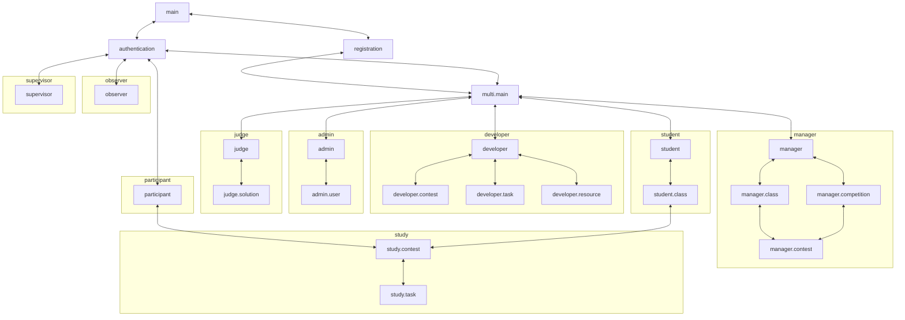

# Features

Данный документ предназначен для людей так или иначе причастных
к разработке TestSys.
Целью документа является собрать наиболее полное описание системы в одном месте,
а также упростить коммуникацию.
Основной единицей описания системы является *фича* в самом широком смысле этого слова.
Фича может быть описанием функциональности, пользовательского интерфейса и тд.
Конкретные требования к фиче определяются категорией, в которой она находится.
В документе используются определения из [definitions.md](definitions.md).

## Использование документа

Рекомендуется использовать документ следующим образом:
- Использовать в качестве документации к системе
- Использовать кодификаторы фичей в коммуникации для избежания двусмысленности
- Использовать кодификаторы фичей в документации верхнеуровнего кода (контроллеров, web-страниц)
- Использовать кодификаторы фичей в commit message если это применимо

## Работа с документом

Документ должен поддерживаться в актуальном состоянии.
Ответственность за это лежит на разработчике, вносящем изменения, связанные с содержанием документа,
например, изменения реализующие новую фичу, изменяющие уже существующую и тд.

## Категории

Фичи в данный момент разбиты на следующие категории:
- **testsys.entity** – Фичи, описывающие сущности, представленные в системе
- **testsys.user** – Функциональные фичи, которыми непосредственно пользуется конечный пользователь
- **testsys.web** – Фичи, описывающие представления в web-интерфейсе
- **testsys.docs** – Фичи, описывающие внешнюю пользовательскую документацию
- **testsys.dev** – Фичи, облегчающие разработку/отладку системы, расследование инцидентов


## Структура фичи

Фича имеет кодификатор следующего вида `testsys.префикс.название-фичи`.
Префикс может обладать дополнительной семантикой.

Фича имеет статус, который написан в скобках рядом с ней:
- **Not implemented** – фича не реализована ни в каком виде
- **Partially implemented** – фича реализована частично
- **Implemented** – фича реализована полностью

В случае если фича имеет статус **Partially implemented**
в ее описании должно быть зафиксировано что уже сделано
и/или что еще необходимо сделать.

## Структура документа

Далее текст документа имеет следующую структуру:

```md
## Название категории

Описание категории
Описание семантики префиксов

### Кодификатор фичи1  (Статус фичи1)

Описание фичи1

### Кодификатор фичи2  (Статус фичи2)

Описание фичи2

...
```

## testsys.entity

Фичи, описывающие сущности в системе.
В данном разделе должны быть описаны *нетривиальные* особенности представления, решения по дизайну связанных фичей, и др, 
которые может быть сложно понять из раздела **testsys.user**. 
Описания вида "Участник определяется уникальным идентификатором и Соревнованием" не требуется вносить в данный раздел.

### testsys.entity.task

Представляет Задачу, Задача может находиться в нескольких состояниях:

1) **Uncommited** – Задача находится в активной фазе изменений.
2) **Tested** – Задача прошла все необходимые проверки, для того, чтобы считаться "готовой".
3) **Commited** – Изменения Задачи "зафиксированы".

Данные состояния прежде всего предназначены для безопасной доработки задачи, при условии, 
что она уже где-то используется. Предполагается использование последней **commited** версии задачи 
во всех фичах, кроме фичей непосредственно связанных с разработкой Задач.

### testsys.entity.multi.judge

Представляет Судью, в данный момент Судьи выдаются только Супервайзером крайне ограниченному кругу доверенных лиц.
В связи с этим не требуется дополнительных политик относительно вердиктов Судьи 
(отображать информацию, что вердикт был изменен Судьей, вводить разграничения доступа к задачам и др.).

## testsys.user

Функциональные фичи, которыми непосредственно пользуется конечный пользователь.
Если использование фичи подразумевает использование веб-интерфейса,
фича должна ссылаться на соответствующую страницу.

Префиксы описывают кому доступна Фича:

- **testsys.user** – для любого Пользователя
- **testsys.user.single** – для любого Пользователя c Фиксированной Ролью
- **testsys.user.single.participant** – для любого Участника
- **testsys.user.single.observer** – для любого Наблюдателя
- **testsys.user.single.supervisor** – для любого Супервайзера
- **testsys.user.multi** – для любого Пользователя c Нефиксированными Ролями
- **testsys.user.multi.developer** – для любого Разработчика
- **testsys.user.multi.student** – для любого Ученика
- **testsys.user.multi.judge** – для любого Судьи
- **testsys.user.multi.admin** – для любого Администратора
- **testsys.user.multi.manager** – для любого Организатора
- **testsys.user.study** – для любого Ученика/Участника

Слово "доступно" в **authorization** фичах означает доступно 
в необходимом и достаточном объеме для реализации остальных фичей для данного Пользователя/Роли.

<!-- testsys.user -->

### testsys.user.authentication  (Not implemented)

Page: **testsys.web.page.authentication**

Пользователь имеет возможность войти в Систему по валидному Коду-доступа в Системе.
Код-доступа считается валидным, если был создан при помощи одной из фичей.
При успешной авторизации происходит переход в **testsys.web.page.multi.main** для
пользователя с Нефиксированной Ролью или в:
- **testsys.web.page.participant** – для Участника
- **testsys.web.page.observer** – для Наблюдателя
- **testsys.web.page.supervisor** – для Супервайзера

В противном случае Пользователь уведомляется о том, что Код-доступа не валиден.

<!-- testsys.user.multi -->

### testsys.user.registration (Not implemented)

Page: **testsys.web.page.registration**

Пользователь имеет возможность зарегистрироваться в Системе
указав Псевдоним, почту и Роль (Ученик/Организатор).
Если почта уже привязана, то Пользователь уведомляется об этом, иначе
он получает код для подтверждения привязки письмом на указанную почту.
Далее пользователю необходимо ввести полученный код:

1) В случае, если код совпадает с отправленным, данный пользователь наделяется выбранной Ролью в публичном Сообществе.
После регистрации происходит переход в **testsys.web.page.multi.main**,
а также Пользователю присваивается Код-доступа.

2) В противном случае Пользователь уведомляется о том, что код указан неверно.

### testsys.user.multi.addMail (Not implemented)

Page: **testsys.web.page.multi.main**

Пользователь имеет возможность привязать почту к своему Кабинету.
После указания почты, которую Пользователь желает привязать,
происходит проверка привязана ли эта почта уже к какому-то Кабинету.
Если почта уже привязана, то Пользователь уведомляется об этом, иначе
он получает код для подтверждения привязки письмом на указанную почту.
Далее пользователю необходимо ввести полученный код, в случае, если код
совпадает с отправленным почта привязывается к Кабинету.
В противном случае Пользователь уведомляется о том, что код указан неверно.
В случае, если Пользователь уже имел привязанную к Кабинету почту, она отвязывается
после привязки новой. 

В случае, если у пользователя не привязана почта, он не 
имеет возможности пользоваться другими фичами. 

### testsys.user.multi.restoreAccess (Not implemented)

Page: **testsys.web.page.authentication**

Пользователь ранее привязавший почту имеет возможность восстановить
доступ к своему кабинету указав почту к которой привязан Кабинет.
Если эта почта привязана к какому-либо Кабинету,
для данного Кабинета генерируется ссылка и отправляется на указанную почту,
перейдя по которой на страницу **testsys.web.page.multi.restoreAccess** Пользователь получает новый Код-доступа.
Старый код становится невалидным.

<!-- testsys.user.single.participant -->

### testsys.user.single.participant.authorization (Not implemented)

Участнику доступны Туры находящиеся в одном с ним Соревновании,
а также Задачи из этих Туров.

### testsys.user.single.participant.viewContests, testsys.user.multi.student.viewContests (Not implemented)

Page: **testsys.web.page.participant**, **testsys.web.page.student.class**

Участник/Ученик имеет возможность просматривать доступные ему Туры.
По каждому Туру Участник/Ученик может увидеть:
1) Дата начала Тура
2) Дата конца Тура
3) Время на прохождение Тура
4) Сколько времени осталось у Участника/Ученика на прохождение Тура
5) Название Тура

Участник/Ученик для любого доступного Тура может перейти на страницу
**testsys.web.page.study.contest**.

<!-- testsys.user.study --> 

### testsys.user.study.viewContest (Not implemented)

Page: **testsys.web.page.study.contest**

Участник/Ученик имеет возможность просматривать доступный ему Тур.
По Туру Участник/Ученик может увидеть:
1) Дата начала Тура
2) Дата конца Тура
3) Время на прохождение Тура
4) Сколько времени осталось у Участника/Ученика на прохождение Тура
5) Название Тура
6) Описание Тура
7) Список Задач с их Названиями

Участник/Ученик для выбранной Задачи может перейти на страницу
**testsys.web.page.study.task**.

### testsys.user.study.viewTask (Not implemented)

Page: **testsys.web.page.study.task**

Участник/Ученик имеет возможность просматривать доступную ему Задачу.
По Задаче Участник/Ученик может увидеть:
1) Название
2) Описание
3) Список отправленных им Решений
4) Вердикт лучшего отправленного Решения

По каждому отправленному Решению участник может увидеть:
1) Дату и время отправки
2) Названия файла Решения
3) Вердикт проверки в случае если Решение проверено, иначе статус проверки

По Задаче Участник/Ученик может скачать:
1) Упражнение
2) Условие

### testsys.user.study.sendSolution (Not implemented)

Page: **testsys.web.page.study.task**

Участник/Ученик имеет возможность отправить файл с Решением для доступной ему Задачи.
При отправке Участник/Ученик может выбрать вид отправляемого Решения (Python, JavaScript, Visual language (TODO: название?)).
Вид Решения разрешен Задачей, если для этой Задачи существует авторское Решение такого же вида.
Проверка Решения должна осуществляться на версии TRIK Studio указанной в соответствующем Туре. 

<!-- testsys.user.single.observer -->

### testsys.user.single.observer.authorization (Not implemented)

Наблюдателю доступны Соревнования,
проходящие в том же сообществе в котором состоит Наблюдатель,
для доступного (определятся при его создании) ему набора Туров.

### testsys.user.single.observer.viewContests (Not implemented)

Page: **testsys.web.page.observer**

Наблюдатель может просматривать доступные ему Туры.
По Туру Наблюдатель может увидеть:
1) Дата начала Тура
2) Дата конца Тура
3) Время на прохождение Тура
4) Название Тура

### testsys.user.single.observer.downloadResult (Not implemented)

Page: **testsys.web.page.observer**

Наблюдатель может скачивать результаты по доступным для него Турам.
Результатом является csv файл с данными где столбцами являются:

TODO: Столбцы

<!-- testsys.user.multi.developer -->

### testsys.user.multi.developer.authorization (Not implemented)

Разработчику доступны созданные им Ресурсы, Задачи, Туры, 
а также Задачи, к которым был предоставлен доступ Сообществам (в которых состоит Разработчик). 

### testsys.user.multi.developer.resource.addResource (Not implemented)

Page: **testsys.web.page.developer**

Разработчик имеет возможность создать новый Ресурс в рамках Задачи, прикрепив файл, указав название и его тип:
1) Упражнение
2) Полигон
3) Авторское Решение
4) Условие

В случае авторского Решения, Пользователь также должен указать ожидаемый Вердикт.
В случае Упражнения, Пользователь также должен указать язык.

### testsys.user.multi.developer.resource.updateResource (Not implemented)

Page: **testsys.web.page.developer.resource**

Разработчик имеет возможность изменять существующий Ресурс,
загружая новый файл, изменяя название или изменяя ожидаемый Вердикт проверки авторского Решения. 
Загрузка нового файла или изменение ожидаемого Вердикта проверки авторского Решения переводит Задачу, 
к которой он прикреплен, в состояние *uncommited*. Пользователь должен быть 
уведомлен о том, что Задача перейдет в состояние *uncommited*.

### testsys.user.multi.developer.resource.viewResources (Not implemented)

Page: **testsys.web.page.developer**

Разработчик имеет возможность просматривать информацию о доступных ему Ресурсах:

1) Идентификатор
2) Название
3) Дата и время последнего изменения

Для каждого из этих Ресурсов он может перейти на страницу **testsys.web.page.developer.resource**

### testsys.user.multi.developer.resource.viewResource (Not implemented)

Page: **testsys.web.page.developer.resource**

Разработчик имеет возможность просматривать информацию о доступном ему Ресурсе:
1) Идентификатор
2) Название
3) Таблица с историей изменений

В таблице с историей изменений представлена следующая информация:
1) Дата и время изменения
2) Названия файла который был загружен
3) Комментарий изменения

Для каждой записи об изменениях в таблице, Разработчик может скачать соответствующую версию файла.

### testsys.user.multi.developer.task.createTask (Not implemented)

Page: **testsys.web.page.developer**

Разработчик имеет возможность создать новую Задачу, указав её название.
Изначально задача находится в состоянии *uncommited*. 

### testsys.user.multi.developer.task.attachResource (Not implemented)

Page: **testsys.web.page.developer.task**

Разработчик имеет возможность прикреплять Ресурсы к созданной им Задаче, учитывая следующие ограничения:
1) К Задаче должно быть прикреплено не более 1 Условия
2) К Задаче должно быть прикреплено не более 1 Упражнения для 1 языка

Прикрепление к Задаче Полигона или авторского Решения переводит ее в состояние *uncommited*.

### testsys.user.multi.developer.task.detachResource (Not implemented)

Page: **testsys.web.page.developer.task**

Разработчик имеет возможность откреплять Ресурсы от созданной им Задачи.

Открепление от Задачи Ресурса переводит ее в состояние *uncommited*.

### testsys.user.multi.developer.task.testTask (Not implemented)

Page: **testsys.web.page.developer.task**

Разработчик имеет возможность протестировать созданную им Задачу.
Тестирование задачи подразумевает: 
1) Запуск всех прикрепленных авторских Решений 
на всех прикрепленных Полигонах и всех поддерживаемых данной Задачей версиях TRIK Studio. 
Если результат проверки хотя бы одного авторского Решения не совпадает с ожидаемым результатом, 
то тестирование считается проваленным.
2) Запуск Диагностик прикрепленных Полигонов.
В случае наличия сообщений уровня Error тестирование считается проваленным.
3) Проверку следующих условий на истинность:
    - К Задаче прикреплен хотя бы один Полигон
    - К Задаче прикреплено хотя бы одно авторское Решение
    - Если присутствует авторское Решение на языке X, то присутствует упражнение для языка X 
    - Текущий набор поддерживаемых версий TRIK Studio позволяет использовать Задачу во всех Турах, где она уже прикреплена

Если тестирование провалилось Разработчику сообщается причина провала тестирования. 
Если тестирование прошло успешно Задача переходит в состояние *tested*. 
Все необходимые проверки должны выполнятся в рамках этой фичи.

TODO: Фича для Диагностик

### testsys.user.multi.developer.task.commitTask (Not implemented)

Page: **testsys.web.page.developer.task**

Разработчик имеет возможность закоммитить Задачу:
1) Новая версия Задачи будет использоваться везде, где она прикреплена.
2) В случае изменения набора Полей, все отправленные решения по этой Задаче будут проверены заново.

Для того, чтобы закоммитить Задачу, она должна находиться в состоянии *tested*.
Данное действие переводит Задачу в состояние *commited*.

### testsys.user.multi.developer.task.revertTask (Not implemented)

Page: **testsys.web.page.developer.task**

Разработчик имеет возможность отменить все изменения Задачи, примененные к ней после последнего коммита:
1) Все ранее не прикрепленные Ресурсы будут откреплены от Задачи.
2) Все ранее прикрепленные Ресурсы, но открепленные в данный момент, будут прикреплены обратно.
3) В случае если версии ранее прикрепленных Ресурсов отличны от текущих,
они будут изменены на их ранние версии. Данное изменение должно отображаться в истории изменений Ресурса, 
с соответствующим комментарием.

Данное действие переводит Задачу в состояние *commited*.

### testsys.user.multi.developer.task.viewTasks (Not implemented)

Page: **testsys.web.page.developer**

Разработчик имеет возможность просматривать информацию о всех
доступных ему Задачах:
1) Идентификатор
2) Название
3) Состояние

Для созданных им Задач он может перейти на страницу **testsys.web.page.developer.task**

### testsys.user.multi.developer.task.viewTask (Not implemented)

Page: **testsys.web.page.developer.task**

Разработчик имеет возможность просматривать информацию о всех
созданных им Задачах:
1) Идентификатор
2) Название
3) Состояние
4) Описание
5) Список поддерживаемых версий TRIK Studio
6) Историю тестирований
   - Дата и время тестирования
   - Найденные ошибки
7) Прикрепленные файлы

### testsys.user.multi.developer.task.editTaskInfo (Not implemented)

Page: **testsys.web.page.developer.task**

Разработчик имеет возможность редактировать информацию о всех
созданных им Задачах:
1) Название
2) Описание
3) Список поддерживаемых версий TRIK Studio

Добавление новой поддерживаемой версии TRIK Studio переводит Задачу в состояние **uncommited**.

### testsys.user.multi.developer.task.shareTask (Not implemented)

Page: **testsys.web.page.developer.task**

Разработчик имеет возможность предоставить доступ к Задаче для выбранного им
набора Сообществ.

### testsys.user.multi.developer.contest.createContest (Not implemented)

Page: **testsys.web.page.developer**

Разработчик имеет возможность создать новый Тур, указав его название, время на выполнение, версию TRIK Studio
и, опционально:
1) Дату начала Тура
2) Дату конца Тура

### testsys.user.multi.developer.contest.editContest (Not implemented)

Page: **testsys.web.page.developer.contest**

Разработчик имеет возможность редактировать следующую информацию в созданном им Туре, 
если к нему не был предоставлен доступ:
1) Дату начала Тура
2) Дату конца Тура
3) Название

### testsys.user.multi.developer.contest.viewContests (Not implemented)

Page: **testsys.web.page.developer**

Разработчик имеет возможность просматривать информацию о всех
доступных ему Турах:
1) Идентификатор
2) Название
3) Количество Задач
4) Сообщества для которых доступен

Для каждого из этих Туров он может перейти на страницу **testsys.web.page.developer.contest**

### testsys.user.multi.developer.contest.viewContest (Not implemented)

Page: **testsys.web.page.developer.contest**

Разработчик имеет возможность просматривать информацию о
доступном ему Туре:
1) Идентификатор
2) Название
3) Список прикрепленных Задач:
    - Идентификатор
    - Название
4) Сообщества для которых доступен

### testsys.user.multi.developer.contest.attachTask (Not implemented)

Page: **testsys.web.page.developer.contest**

Разработчик имеет возможность прикрепить доступную ему Задачу, 
находящуюся в статусе *commited* к Туру, если к нему не был предоставлен доступ 
и Задача поддерживает версию TRIK Studio указанную в Туре.
В Туре будет использована последняя *commited* версия Задачи (условия, полигоны при проверке и так далее).

### testsys.user.multi.developer.contest.detachTask (Not implemented)

Page: **testsys.web.page.developer.contest**

Разработчик имеет возможность открепить Задачу от Тура, 
если доступ к данному Туру еще не был никому предоставлен.

### testsys.user.multi.developer.contest.deleteContest (Not implemented)

Page: **testsys.web.page.developer.contest**

TODO: фичи для удаления всего к чему не предоставлен доступ/не используется

Разработчик имеет возможность удалить Тур,
если доступ к данному Туру еще не был никому предоставлен.

### testsys.user.multi.developer.contest.shareContest (Not implemented)

Page: **testsys.web.page.developer.contest**

Разработчик имеет возможность предоставить доступ к Туру для выбранного им
набора Групп.

<!-- testsys.user.multi.student -->

### testsys.user.multi.student.authorization (Not implemented)

Ученику доступны:
1) Классы в которых он состоит
2) Туры находящиеся в этих Классах
3) Задачи находящиеся в этих Турах

### testsys.user.multi.student.joinClass (Not implemented)

Page: **testsys.web.page.student**

Ученик может присоединиться к Классу по коду-приглашению от Организатора, введя 
его в соответствующую форму.

### testsys.user.multi.student.viewClasses (Not implemented)

Page: **testsys.web.page.student**

TODO: description

<!-- testsys.user.multi.judge -->

### testsys.user.multi.judge.authorization (Not implemented)

Судье доступна информация о всех Решениях отправленных:
1) Учениками
2) Участниками

### testsys.user.multi.judge.viewResults (Not implemented)

Page: **testsys.web.page.judge**

Судья имеет возможность просматривать информацию о всех
доступных ему Решениях:
1) Идентификатор
2) Вердикт
3) Логи проверки
4) Видеозапись прохождения

### testsys.user.multi.judge.changeVerdict (Not implemented)

Page: **testsys.web.page.judge**

Судья имеет возможность изменять Вердикты у всех
доступных ему Решений.

<!-- testsys.user.multi.admin -->

### testsys.user.multi.admin.authorization (Not implemented)

Администратору доступна информация о Пользователях, 
находящихся с ним в одном Сообществе.

### testsys.user.multi.admin.createUser (Not implemented)

Page: **testsys.web.page.admin**

TODO: Пока не делать, надо все таки обсудить

Администратор имеет возможность создавать Пользователей
со следующими Ролями:
1) Организатор
2) Разработчик

Созданные Пользователи обладают Ролью в рамках Сообщества
принадлежащего Администратору, который их создал. 

### testsys.user.multi.admin.inviteUser (Not implemented)

Page: **testsys.web.page.admin**

Администратор имеет возможность приглашать Пользователей
в сообщество в следующих Ролях:
1) Организатор
2) Разработчик

Приглашенные Пользователи обладают Ролью в рамках Сообщества
принадлежащего Администратору, который их пригласил.

TODO: Как именно происходит приглашение? -> Так же как и с участником, расписать в соответствующих фичах

### testsys.user.multi.admin.viewUsers (Not implemented)

Page: **testsys.web.page.admin**

Администратор имеет возможность просматривать информацию о всех
доступных ему Пользователях:
1) Идентификатор
2) Псевдоним
3) Дата и время последнего входа в Систему

Для каждого из этих пользователей он может перейти на страницу **testsys.web.page.admin.user**

### testsys.user.multi.admin.viewUser (Not implemented)

Page: **testsys.web.page.admin.user**

Администратор имеет возможность просматривать информацию о доступном ему пользователе.
Доступная информация зависит от набора Ролей которыми обладает данный Пользователь в
Сообществе Администратора.

Независимо от Роли:
1) Идентификатор
2) Псевдоним
3) Дата и время последнего входа в Систему
4) Код-Доступа (для созданных им Пользователей) TODO: разрешить скрывать потом?

Если Пользователь является Разработчиком:
1) Созданные Задачи 
   - Название
   - Статус проверки
   - Для каких Групп доступна
2) Созданные Туры
   - Название
   - Количество Задач
   - Количество Решений по каждой Задаче в Туре

Если Пользователь является Организатором:
1) Созданные Классы
    - Название
    - Количество Учеников
    - Количество отправленных Решений
2) Созданные Cоревнования
    - Название
    - Количество Участников
    - Количество отправленных Решений

Если Пользователь является Судьей:
1) Измененные Вердикты
   - Идентификатор измененного Вердикта
   - Дата и время изменения
   - Предыдущий результат
   - Новый результат

<!-- testsys.user.multi.manager -->

### testsys.user.multi.manager.authorization (Not implemented)

Организатору доступны Классы, Соревнования, Участники
которых он создал. Организатору также доступны Туры, доступ к которым был предоставлен
Сообществам в которых он состоит.

### testsys.user.multi.manager.class.viewClasses (Not implemented)

Page: **testsys.web.page.manager**

Организатор имеет возможность просматривать информацию о всех
доступных ему Классах:
1) Идентификатор
2) Название
3) Количество Учеников

Для каждого из этих Классов он может перейти на страницу **testsys.web.page.manager.class**

### testsys.user.multi.manager.class.viewClass (Not implemented)

Page: **testsys.web.page.manager.class**

Организатор имеет возможность просматривать информацию о
доступном ему Классе:
1) Идентификатор
2) Название
3) Количество Учеников
4) Список Учеников
   - Идентификатор
   - Псевдоним
   - Дата и время последнего входа
5) Список добавленных Туров
   - Название
   - Время начала Тура
   - Время конца Тура
   - Время на прохождение Тура

Для каждого Тура он может перейти на страницу **testsys.web.page.manager.contest**.

### testsys.user.multi.manager.class.createClass (Not implemented)

Page: **testsys.web.page.manager**

Организатор имеет возможность создать Класс, указав название нового Класса.

### testsys.user.multi.manager.class.createInvite (Not implemented)

Page: **testsys.web.page.manager.class**

Организатор имеет возможность создать код-приглашение в Класс.
Если код был создан ранее, генерируется новый код, 
при этом по старом коду становится невозможно присоединится.

### testsys.user.multi.manager.viewContest (Not implemented)

Page: **testsys.web.page.manager.contest**

Организатор имеет возможность просматривать результаты Тура
для выбранного Класса/Соревнования, а также информацию о нем.

Доступная информация:
1) Название 
2) Время начала Тура
3) Время конца Тура
4) Время на прохождение Тура

Вердикты представляются в виде сводной таблице, где столбцами являются задачи данного Тура 
(ее идентификатор и название), а строками Ученики/Участники (идентификатор и псевдоним). 
На пересечении отображается лучший результат и количество отправленных решений.
Также Организатор имеет возможность скачать данную таблицу в csv формате.

### testsys.user.multi.manager.addContest (Not implemented)

Page: **testsys.web.page.manager.class**, **testsys.web.page.manager.competition**

Организатор имеет возможность добавить доступный ему Тур в Класс/Соревнование.

### testsys.user.multi.manager.competition.viewCompetitions (Not implemented)

Page: **testsys.web.page.manager**

Организатор имеет возможность просматривать информацию о всех
доступных ему Соревнованиях:
1) Идентификатор
2) Название
3) Количество Участников

Для каждого из этих Соревнований он может перейти на страницу **testsys.web.page.manager.competition**

### testsys.user.multi.manager.competition.viewCompetition (Not implemented)

Page: **testsys.web.page.manager.competition**

Организатор имеет возможность просматривать информацию о
доступном ему Соревновании:
1) Идентификатор
2) Название
3) Количество Участников
4) Список Участников
    - Идентификатор
    - Псевдоним
    - Дата и время последнего входа
    - Код-доступа
5) Список добавленных Туров
    - Название
    - Время начала Тура
    - Время конца Тура
    - Время на прохождение Тура

Для каждого Тура он может перейти на страницу **testsys.web.page.manager.contest**.

### testsys.user.multi.manager.competition.createCompetition (Not implemented)

Page: **testsys.web.page.manager**

Организатор имеет возможность создать Соревнование указав название нового Соревнования.

### testsys.user.multi.manager.competition.createParticipants (Not implemented)

Page: **testsys.web.page.manager.competition**

Организатор имеет возможность сгенерировать новых Участников в существующем соревновании.
При этом общее количество Участников в Соревновании не должно превышать TODO.

<!-- testsys.user.single.supervisor -->

TODO: section supervisor

## testsys.web

Фичи описывающие представления в web-интерфейсе.

Подразделы:
- **testsys.web.component** – фичи описывающие базовые компоненты web-интерфейса
- **testsys.web.page** – фичи описывающие страницы web-интерфейса

Граф иерархии страниц (без префикса **testsys.web.page**):



### testsys.web.page.main (Not implemented)

TODO: page description

### testsys.web.page.authentication (Not implemented)

TODO: page description

### testsys.web.page.registration (Not implemented)

TODO: page description

### testsys.web.page.supervisor (Not implemented)

TODO: page description

### testsys.web.page.observer (Not implemented)

TODO: page description

### testsys.web.page.participant (Not implemented)

TODO: page description

### testsys.web.page.study.contest (Not implemented)

TODO: page description

### testsys.web.page.study.task (Not implemented)

TODO: page description

### testsys.web.page.judge (Not implemented)

TODO: page description

### testsys.web.page.judge.solution (Not implemented)

TODO: page description

### testsys.web.page.admin (Not implemented)

TODO: page description

### testsys.web.page.admin.user (Not implemented)

TODO: page description

### testsys.web.page.developer (Not implemented)

TODO: page description

### testsys.web.page.developer.resource (Not implemented)

TODO: page description

### testsys.web.page.developer.task (Not implemented)

TODO: page description

### testsys.web.page.developer.contest (Not implemented)

TODO: page description

### testsys.web.page.student (Not implemented)

TODO: page description

### testsys.web.page.student.class (Not implemented)

TODO: page description

### testsys.web.page.manager (Not implemented)

TODO: page description

### testsys.web.page.manager.class (Not implemented)

TODO: page description

### testsys.web.page.manager.competition (Not implemented)

TODO: page description

### testsys.web.page.manager.contest (Not implemented)

TODO: page description

## testsys.docs

Фичи, описывающие пользовательскую документацию.

TODO: sections

## testsys.dev

Фичи, облегчающие разработку/отладку системы, расследование инцидентов

Подразделы:
- **testsys.dev.logging** – фичи, описывающие логирование
- **testsys.dev.deployment** – фичи, описывающие разворачивание системы
- **testsys.dev.env** – фичи, описывающие окружение системы
- **testsys.dev.metric** – фичи, описывающие собираемые метрики
- **testsys.dev.notification** – фичи, описывающие уведомления, посылаемые системой

TODO: sections
